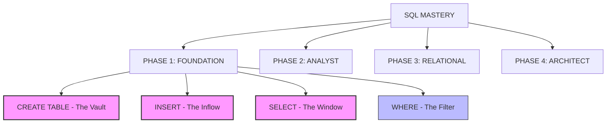

# 🗺️ Sol's Map of SQL Explored
*A Visual Topology of Data Mastery*

---

## 📍 Current Location: **Phase 1.2: Insertion**
*We are here: Learning how to populate the vault.*
*Next Destination: Data Filtering (WHERE clause).*
