# TCS NQT CLARITY MAP: MASTER HIERARCHY

This map provides a multi-layered breakdown of the TCS NQT curriculum. It is structured to guide you from high-level clusters down to specific sub-cluster tactics.

```mermaid
graph TD
    %% Main Goal
    Goal["TCS NQT EXAM"] --> R1["ROUND 1: NQT TEST"]
    
    %% R1 Structure
    R1 --> Foundation["FOUNDATION SECTION (Ninja Qualifier)"]
    R1 --> Advanced["ADVANCED SECTION (Digital/Prime Qualifier)"]

    %% Foundation Clusters
    subgraph Foundation_Section ["FOUNDATION FLOW (Speed & Accuracy)"]
    Foundation --> NA["Numerical Ability"]
    Foundation --> RA["Reasoning Ability"]
    Foundation --> VA["Verbal Ability"]
    
        %% Numerical Sub-Clusters & Topics
        NA --> NA1["Core Arithmetic (Critical)"]
            NA1 --> T1["Percentages / Profit & Loss"]
            NA1 --> T2["Ratio / Averages / SI-CI"]
        NA --> NA2["Speed, Time & Work"]
            NA2 --> T3["Time & Work / Pipes"]
            NA2 --> T4["Speed-Distance / Trains"]
        NA --> NA3["Number Systems & Data"]
            NA3 --> T5["Divisibility / HCF-LCM"]
            NA3 --> T6["Statistics / DI (Trap)"]
        
        %% Reasoning Sub-Clusters & Topics
        RA --> RA1["Logical Deductions (High Yield)"]
            RA1 --> T7["Coding-Decoding"]
            RA1 --> T8["Blood Relations / Directions"]
        RA --> RA2["Pattern Recognition"]
            RA2 --> T9["Series / Symbol Logic"]
            RA2 --> T10["Syllogisms / Venn"]
        RA --> RA3["Analytical Puzzles (TRAP)"]
            RA3 --> T11["Seating Arrangements"]
            RA3 --> T12["Data Sufficiency"]
        
        %% Verbal Sub-Clusters & Topics
        VA --> VA1["Grammar & Syntax"]
            VA1 --> T13["Error Spotting / Tenses"]
            VA1 --> T14["Articles / Prepositions"]
        VA --> VA2["Context & Paragraphs"]
            VA2 --> T15["Sentence Completion"]
            VA2 --> T16["Para Jumbles / Reading Comp"]
    end

    %% Advanced Clusters
    subgraph Advanced_Section ["ADVANCED FLOW (Higher Package)"]
    Advanced --> AQ["Advanced Quant & Reasoning (FUB Format)"]
    Advanced --> AC["Advanced Coding"]
    
        %% Quant Topics
        AQ --> AQ1["Higher Math (Critical)"]
            AQ1 --> T17["P & C / Probability"]
            AQ1 --> T18["Logarithms / Progressions"]
        AQ --> AQ2["Advanced Logic"]
            AQ2 --> T19["Mixed Partnerships"]
            AQ2 --> T20["Critical Reasoning"]
        
        %% Coding Topics
        AC --> AC1["Strings & Arrays (90% Weight)"]
            AC1 --> T21["Matrix / Palindromes"]
            AC1 --> T22["Sub-arrays / Sorting"]
        AC --> AC2["Mathematical Algorithms"]
            AC2 --> T23["Prime Sieve / GCD"]
            AC2 --> T24["Fibonacci / Pattern Logic"]
    end

    %% Priority Indicators
    style NA1 fill:#f96,stroke:#333,stroke-width:2px
    style RA1 fill:#f96,stroke:#333,stroke-width:2px
    style VA1 fill:#f96,stroke:#333,stroke-width:2px
    style AC1 fill:#f96,stroke:#333,stroke-width:2px
    style AQ1 fill:#f96,stroke:#333,stroke-width:2px
    style RA3 fill:#f66,stroke:#333,stroke-width:2px
    style T11 fill:#f66,stroke:#333,stroke-width:1px
    style T6 fill:#f66,stroke:#333,stroke-width:1px
```

---

## 🗺️ LEVEL 1: FOUNDATION FLOW (R1 ELIMINATION)

### 1.1 NUMERICAL ABILITY MAP
**Goal:** Speed-based Arithmetic and Precise Statistics.

#### Sub-Cluster: Core Arithmetic (The Marks Engine)
| Topic | Difficulty | Weightage | Strategic Importance | TCS Trap Level | Shortcut Key |
| :--- | :--- | :--- | :--- | :--- | :--- |
| Percentages | Medium | Very High | **Critical** | Low | Fractional conversion |
| Profit & Loss | Medium | Very High | **Critical** | Medium | Single-line CP/SP ratios |
| Ratio & Proportion | Easy | High | **High** | Low | Variable balancing |
| Simple & Compound Interest | Hard | Medium | **High** | High | Effective Rate (%) method |
| Averages & Mixtures | Medium | High | **High** | Medium | Alligation Cross |

#### Sub-Cluster: Speed, Time & Work
| Topic | Difficulty | Weightage | Strategic Importance | TCS Trap Level | Shortcut Key |
| :--- | :--- | :--- | :--- | :--- | :--- |
| Time & Work | Medium | High | **Critical** | Medium | LCM / Efficiency units |
| Pipes & Cisterns | Medium | Medium | **High** | Medium | Negative work logic |
| Speed Time & Distance | Medium | High | **Critical** | Low | Relative speed ratios |
| Trains & Boats | Medium | Medium | **High** | Medium | Length/Stream offsets |

#### Sub-Cluster: Number Systems & Data
| Topic | Difficulty | Weightage | Strategic Importance | TCS Trap Level | Shortcut Key |
| :--- | :--- | :--- | :--- | :--- | :--- |
| Divisibility Rules | Easy | High | **High** | Low | Digit summation/pairs |
| HCF & LCM | Easy | High | **High** | Low | Product of numbers rule |
| Statistics (Mean/SD/Var)| Hard | Medium | **Medium** | High | Deviated Mean method |
| Data Interpretation | Medium | Medium | **High** | **CRITICAL TRAP** | Visual approximation |

---

### 1.2 REASONING ABILITY MAP
**Goal:** Pattern Extraction and Spatial Logic.

#### Sub-Cluster: Logical Deductions
| Topic | Difficulty | Weightage | Strategic Importance | TCS Trap Level | Shortcut Key |
| :--- | :--- | :--- | :--- | :--- | :--- |
| Coding-Decoding | Medium | Very High | **Critical** | Low | A-Z Positional Mapping |
| Blood Relations | Easy | High | **High** | Medium | Generation Tree Mapping |
| Directional Sense | Easy | High | **High** | Low | NSEW Diagram / Pythagoras |

#### Sub-Cluster: Pattern Recognition & Analytical
| Topic | Difficulty | Weightage | Strategic Importance | TCS Trap Level | Shortcut Key |
| :--- | :--- | :--- | :--- | :--- | :--- |
| Number/Letter Series | Medium | High | **Critical** | Low | Difference of Differences |
| Syllogisms | Medium | High | **High** | Medium | Venn Intersection Matrix |
| Seating Arrangements | Hard | Medium | **Medium** | **CRITICAL TRAP** | Relative position fix |
| Data Sufficiency | Hard | Medium | **High** | High | Logic redundancy check |

---

### 1.3 VERBAL ABILITY MAP
**Goal:** Fast Grammar Scanning and Contextual Placement.

#### Sub-Cluster: Grammar & Sentence Construction
| Topic | Difficulty | Weightage | Strategic Importance | TCS Trap Level | Shortcut Key |
| :--- | :--- | :--- | :--- | :--- | :--- |
| Error Identification | Medium | Very High | **Critical** | Low | Subject-Verb check |
| Tenses & Articles | Easy | High | **High** | Low | Timeline mapping |
| Active/Passive & Speech | Easy | Medium | **Medium** | Low | Object-Subject flip |

#### Sub-Cluster: Context & Paragraphs
| Topic | Difficulty | Weightage | Strategic Importance | TCS Trap Level | Shortcut Key |
| :--- | :--- | :--- | :--- | :--- | :--- |
| Sentence Completion | Medium | High | **High** | Medium | Contextual tone matching |
| Paragraph Ordering | Hard | Medium | **High** | High | Pronoun-Antecedent link |
| Reading Comprehend. | Medium | Medium | **Medium** | High | Keywords scanning |

---

## 💎 LEVEL 2: ADVANCED FLOW (DIGITAL/PRIME QUALIFIER)

### 2.1 ADVANCED QUANT & REASONING (FUB HEAVY)
| Topic | Difficulty | Weightage | Strategic Importance | Format | Focus |
| :--- | :--- | :--- | :--- | :--- | :--- |
| Permutation & Combin. | Hard | Very High | **Critical** | FUB | Arrangement Constraints |
| Probability | Hard | High | **Critical** | FUB | Conditional/Bayes logic |
| Logarithms | Medium | Medium | **High** | FUB | Base conversion identities |
| Partnerships | Medium | Medium | **High** | FUB | Profit-Capital-Time rati |

---

### 2.2 ADVANCED CODING MAP
**Goal:** Algorithmic Efficiency and Edge-Case Handling.

| Sub-Cluster | Topics | Difficulty | Weightage | Importance | Core Tactics |
| :--- | :--- | :--- | :--- | :--- | :--- |
| **String Ops** | Palindromes, Rotation, Substrings | Medium | Very High | **Critical** | Hashing / Two-pointer |
| **Array Logic** | Subsets, Matrix Ops, Sorting | Hard | Very High | **Critical** | Sliding window / Prefix sum |
| **Math Algorithms**| Primes, Fibonacci, GCD | Easy-Med | High | **High** | Sieve of Eratosthenes |

