# TCS NQT MASTER ARCHITECTURE MAP

This visual diagram provides a high-speed overview of the entire TCS NQT pipeline, from the Foundation filters to the Advanced Digital/Prime qualifiers.

```mermaid
graph TD
    %% Main Goal
    Goal["TCS NQT EXAM"] --> R1["ROUND 1: NQT TEST"]
    
    %% R1 Structure
    R1 --> Foundation["FOUNDATION SECTION (Ninja Qualifier)"]
    R1 --> Advanced["ADVANCED SECTION (Digital/Prime Qualifier)"]

    %% Foundation Clusters
    subgraph Foundation_Section ["FOUNDATION FLOW (Speed & Accuracy)"]
    Foundation --> NA["Numerical Ability"]
    Foundation --> RA["Reasoning Ability"]
    Foundation --> VA["Verbal Ability"]
    
        %% Numerical Sub-Clusters & Topics
        NA --> NA1["Core Arithmetic (Critical)"]
            NA1 --> T1["Percentages / Profit & Loss"]
            NA1 --> T2["Ratio / Averages / SI-CI"]
        NA --> NA2["Speed, Time & Work"]
            NA2 --> T3["Time & Work / Pipes"]
            NA2 --> T4["Speed-Distance / Trains"]
        NA --> NA3["Number Systems & Data"]
            NA3 --> T5["Divisibility / HCF-LCM"]
            NA3 --> T6["Statistics / DI (Trap)"]
        
        %% Reasoning Sub-Clusters & Topics
        RA --> RA1["Logical Deductions (High Yield)"]
            RA1 --> T7["Coding-Decoding"]
            RA1 --> T8["Blood Relations / Directions"]
        RA --> RA2["Pattern Recognition"]
            RA2 --> T9["Series / Symbol Logic"]
            RA2 --> T10["Syllogisms / Venn"]
        RA --> RA3["Analytical Puzzles (TRAP)"]
            RA3 --> T11["Seating Arrangements"]
            RA3 --> T12["Data Sufficiency"]
        
        %% Verbal Sub-Clusters & Topics
        VA --> VA1["Grammar & Syntax"]
            VA1 --> T13["Error Spotting / Tenses"]
            VA1 --> T14["Articles / Prepositions"]
        VA --> VA2["Context & Paragraphs"]
            VA2 --> T15["Sentence Completion"]
            VA2 --> T16["Para Jumbles / Reading Comp"]
    end

    %% Advanced Clusters
    subgraph Advanced_Section ["ADVANCED FLOW (Higher Package)"]
    Advanced --> AQ["Advanced Quant & Reasoning (FUB Format)"]
    Advanced --> AC["Advanced Coding"]
    
        %% Quant Topics
        AQ --> AQ1["Higher Math (Critical)"]
            AQ1 --> T17["P & C / Probability"]
            AQ1 --> T18["Logarithms / Progressions"]
        AQ --> AQ2["Advanced Logic"]
            AQ2 --> T19["Mixed Partnerships"]
            AQ2 --> T20["Critical Reasoning"]
        
        %% Coding Topics
        AC --> AC1["Strings & Arrays (90% Weight)"]
            AC1 --> T21["Matrix / Palindromes"]
            AC1 --> T22["Sub-arrays / Sorting"]
        AC --> AC2["Mathematical Algorithms"]
            AC2 --> T23["Prime Sieve / GCD"]
            AC2 --> T24["Fibonacci / Pattern Logic"]
    end

    %% Priority Indicators
    style NA1 fill:#f96,stroke:#333,stroke-width:2px
    style RA1 fill:#f96,stroke:#333,stroke-width:2px
    style VA1 fill:#f96,stroke:#333,stroke-width:2px
    style AC1 fill:#f96,stroke:#333,stroke-width:2px
    style AQ1 fill:#f96,stroke:#333,stroke-width:2px
    style RA3 fill:#f66,stroke:#333,stroke-width:2px
    style T11 fill:#f66,stroke:#333,stroke-width:1px
    style T6 fill:#f66,stroke:#333,stroke-width:1px
```

### 🧭 How to Read the Map
*   **Orange Nodes:** These are your **Critical High-Yield Zones**. Master these first to unlock the Foundation cutoff and the highest pay packages.
*   **Red Node:** This is the **Time Trap Zone**. Do not get stuck here; solve these only if you have extra time at the end of the section.
*   **FUB Format:** Remember that the nodes under "Advanced Quant" require manual entry of the answer—no options to help you.

**Would you like me to add this Mermaid diagram directly into your `TCS_NQT_Clarity_Map.md` as well?**
