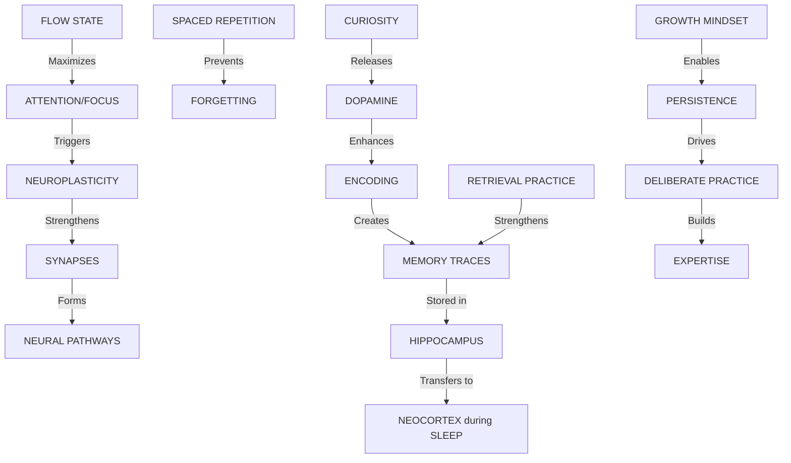

# 🎓 Learning Science Mastery System

> **Your Personal Learning Operating System**  
> Synthesized from 32 research documents covering neuroscience, cognitive psychology, and evidence-based learning strategies

---

## 🎯 Quick Start: Your Daily Learning Protocol

### Morning Routine (15 minutes)
1. **Review Spaced Repetition Cards** (10 min) → [Jump to SR System](#spaced-repetition-system)
2. **Set Learning Goal** (2 min) → Use SMART + Process Goals
3. **Prime Your Brain** (3 min) → 2-min walk + physiological sigh

### Learning Session (90-120 minutes)
1. **Pomodoro Setup** → 25 min focus + 5 min break (4 cycles)
2. **Active Encoding** → Use Feynman Technique + Dual Coding
3. **Retrieval Practice** → Close book, recall from memory
4. **Break Protocol** → Nature exposure or movement

### Evening Routine (10 minutes)
1. **Brain Dump** (5 min) → Write everything you learned today
2. **Update SR System** (3 min) → Add new cards
3. **Sleep Prep** (2 min) → Review tomorrow's goal

---

## 📚 The 7 Pillars of Learning Mastery

### 1. **Neuroplasticity Foundation**
> "Neurons that fire together, wire together"

**Core Mechanism:**
- Every skill = physical brain change
- Focused attention triggers neuroplasticity
- Repetition strengthens synaptic connections (LTP)
- Sleep consolidates changes

**Action Protocol:**
- ✅ Focus intensely for 90-min blocks
- ✅ Sleep 7-9 hours (memory consolidation)
- ✅ Exercise before learning (BDNF boost)
- ❌ Avoid multitasking (prevents deep encoding)

---

### 2. **Memory Encoding Mastery**

#### **The 5 Encoding Techniques**

| Technique | How It Works | When to Use |
|-----------|--------------|-------------|
| **Active Recall** | Close book, retrieve from memory | After every learning session |
| **Elaboration** | Ask "Why?" and connect to prior knowledge | Complex concepts |
| **Dual Coding** | Combine words + visuals | Abstract ideas |
| **Chunking** | Group info into meaningful patterns | Large amounts of data |
| **Emotional Tagging** | Use surprise, curiosity, storytelling | Hard-to-remember facts |

#### **Daily Practice:**
```
1. Read for 10 minutes
2. STOP → Close the material
3. Write a 1-sentence summary
4. Draw a simple diagram
5. Explain it out loud (Feynman)
6. Check accuracy → Correct errors
```

---

### 3. **Retrieval Practice System**

**The Testing Effect:** Testing > Re-reading (50-60% better retention)

#### **Implementation:**
- **Daily:** Self-quiz before reviewing notes
- **Weekly:** Practice test on all material
- **Monthly:** Comprehensive retrieval session

#### **Retrieval Ladder:**
1. **Free Recall** → Blank page, write everything
2. **Cued Recall** → Use prompts/questions
3. **Recognition** → Multiple choice (least effective)

**Rule:** Always start with free recall (hardest = best learning)

---

### 4. **Spaced Repetition System**

**The Forgetting Curve:** Without review, you forget 70% within 24 hours

#### **Optimal Review Schedule:**
| Review # | Interval | Example |
|----------|----------|---------|
| 1st | Day 1 | Learn Monday → Review Tuesday |
| 2nd | Day 3 | Review Friday |
| 3rd | Week 1 | Review next Monday |
| 4th | Week 2 | Review 2 weeks later |
| 5th | Month 1 | Review 1 month later |

#### **Tools:**
- **Anki** (digital flashcards with algorithm)
- **Physical cards** (Leitner box system)
- **Notion database** (custom SR tracker)

---

### 5. **Attention Management**

#### **Flow State Triggers:**
1. **Challenge-Skill Balance** → Task difficulty = Current skill + 4%
2. **Clear Goals** → Know exactly what to accomplish
3. **Immediate Feedback** → See progress in real-time
4. **Eliminate Distractions** → Phone in another room
5. **90-120 min blocks** → Align with ultradian rhythms

#### **Deep Work Protocol:**
```
Morning (4 hours):
├─ 90 min Deep Work Block 1
├─ 15 min Nature Break
├─ 90 min Deep Work Block 2
└─ Shutdown Ritual

Afternoon (Shallow Work):
└─ Email, admin, social media
```

#### **Distraction Mitigation:**
- **Physical:** Dedicated workspace, noise-canceling headphones
- **Digital:** Freedom app, grayscale phone, notification blocking
- **Behavioral:** Scheduled checking (email 3x/day)

---

### 6. **Motivation & Emotion**

#### **Self-Determination Theory (SDT):**
Maximize these 3 needs:
1. **Autonomy** → Choose what/when/how to learn
2. **Competence** → Set achievable challenges
3. **Relatedness** → Join learning communities

#### **Growth Mindset Language:**
- ❌ "I can't do this"
- ✅ "I can't do this **yet**"
- ❌ "I'm bad at math"
- ✅ "I haven't mastered this **strategy** yet"

#### **Curiosity Activation:**
1. Start with a question/mystery
2. Create an "information gap"
3. Let curiosity drive exploration

---

### 7. **Execution System**

#### **Habit Stacking Formula:**
```
After [EXISTING HABIT], I will [NEW TINY HABIT], then I will [CELEBRATE]

Example:
After I pour my morning coffee,
I will review 5 flashcards,
then I will say "Victory!"
```

#### **Progressive Overload:**
- Week 1: 10 problems
- Week 2: 11 problems (+10%)
- Week 3: 12 problems
- Week 4: Deload → 8 problems (recovery)

#### **Consistency Mechanisms:**
- **Streaks:** Track daily learning (don't break the chain)
- **Accountability:** Partner check-ins weekly
- **Stakes:** $5 penalty for missed sessions

---

## 🧠 The Master Learning Protocol

### **Phase 1: Preparation (5 min)**
1. **Clear Environment** → Remove distractions
2. **Set Specific Goal** → "Master X concept"
3. **Prime State** → 2-min breathing exercise

### **Phase 2: Encoding (25-50 min)**
1. **Scan Structure** → Headings, summaries first
2. **Ask Questions** → What do I expect to learn?
3. **Active Reading** → Highlight + annotate
4. **Dual Code** → Draw diagrams alongside notes

### **Phase 3: Processing (10 min)**
1. **Feynman Technique** → Explain in simple terms
2. **Analogies** → "This is like..."
3. **Connections** → Link to prior knowledge

### **Phase 4: Practice (25 min)**
1. **Close the Book** → No peeking
2. **Retrieval Practice** → Write from memory
3. **Check Accuracy** → Correct errors immediately
4. **Interleave** → Mix different problem types

### **Phase 5: Consolidation (5 min)**
1. **Spaced Repetition** → Add to SR system
2. **Reflection** → What worked? What didn't?
3. **Plan Next Session** → Set tomorrow's goal

---

## 🗺️ Knowledge Map: How Everything Connects



---

## 📊 Spaced Repetition System

### **How to Create Effective Flashcards:**

#### ❌ **Bad Card:**
Q: What is neuroplasticity?  
A: The brain's ability to change

#### ✅ **Good Card:**
Q: Why does focused attention trigger neuroplasticity?  
A: Acetylcholine + norepinephrine release marks neural circuits for strengthening via LTP

#### **Card Creation Rules:**
1. **One concept per card**
2. **Use cloze deletions** → "The {{c1::hippocampus}} transfers memories to cortex during {{c2::sleep}}"
3. **Add context** → Include why it matters
4. **Use images** → Dual coding effect

### **Daily SR Routine:**
- **Morning:** 20 new cards + 50 review cards (15 min)
- **Evening:** Review any failed cards (5 min)

---

## 🎯 Domain-Specific Application

### **For Learning Programming:**
1. **Encoding:** Read code + explain each line (Feynman)
2. **Practice:** Code without looking at examples
3. **Interleaving:** Mix algorithms, data structures, syntax
4. **Projects:** Build something that combines 3+ concepts

### **For Learning Languages:**
1. **Encoding:** Dual code (word + image + audio)
2. **Retrieval:** Speak without translating in head
3. **Spaced Repetition:** Anki for vocabulary
4. **Immersion:** Consume native content daily

### **For Learning Math:**
1. **Encoding:** Understand the "why" behind formulas
2. **Practice:** Solve problems without formula sheet
3. **Interleaving:** Mix problem types (don't block)
4. **Teach:** Explain solutions to others

---

## 🔬 The Science Behind Each Technique

### **Why Retrieval Practice Works:**
- **Mechanism:** Reactivates neural pathways → strengthens synapses
- **Research:** 50-60% better retention vs. re-reading
- **Brain Regions:** Hippocampus + prefrontal cortex

### **Why Spaced Repetition Works:**
- **Mechanism:** Forces effortful retrieval → deeper encoding
- **Research:** 10-30% better long-term retention
- **Optimal Timing:** Just before you forget

### **Why Sleep Matters:**
- **Deep Sleep:** Hippocampus → cortex transfer (facts)
- **REM Sleep:** Pattern integration (skills, creativity)
- **Research:** 40% better retention with sleep

---

## 🚀 30-Day Mastery Challenge

### **Week 1: Foundation**
- [ ] Set up spaced repetition system (Anki)
- [ ] Create dedicated learning space
- [ ] Establish morning/evening routines
- [ ] Track: 7-day learning streak

### **Week 2: Encoding Mastery**
- [ ] Practice Feynman Technique daily
- [ ] Create dual-coded notes (text + diagrams)
- [ ] Use elaborative interrogation ("Why?")
- [ ] Track: Quality of understanding (1-10 scale)

### **Week 3: Retrieval Mastery**
- [ ] Daily retrieval practice (no notes)
- [ ] Weekly practice test
- [ ] Interleave different topics
- [ ] Track: Retrieval success rate

### **Week 4: Integration**
- [ ] Combine all techniques
- [ ] Enter flow state 3x this week
- [ ] Teach someone what you learned
- [ ] Track: Hours in deep work

---

## 📖 Essential Reading List

| Priority | Book | Author | Focus |
|----------|------|--------|-------|
| 🔥 | *Make It Stick* | Brown, Roediger, McDaniel | Retrieval practice, spacing |
| 🔥 | *A Mind for Numbers* | Barbara Oakley | Meta-learning |
| 🔥 | *Deep Work* | Cal Newport | Attention management |
| ⭐ | *Peak* | Anders Ericsson | Deliberate practice |
| ⭐ | *Why We Sleep* | Matthew Walker | Sleep & memory |
| ⭐ | *Atomic Habits* | James Clear | Habit formation |

---

## 🎓 Your Personalized Learning Stack

### **Daily Tools:**
- **Anki** → Spaced repetition
- **Notion** → Knowledge base
- **Forest App** → Focus timer
- **Freedom** → Distraction blocker

### **Weekly Review:**
1. What did I learn? (Retrieval practice)
2. What worked well? (Metacognition)
3. What needs adjustment? (Optimization)
4. Next week's focus? (Goal setting)

---

## 🧪 Self-Assessment Quiz

Test your mastery of learning science:

1. **What is the optimal spacing for the 3rd review?**
   - Answer: 1 week after initial learning

2. **Which encoding technique creates the most retrieval pathways?**
   - Answer: Elaboration (connecting to prior knowledge)

3. **What brain region transfers memories during sleep?**
   - Answer: Hippocampus → Neocortex

4. **What is the "testing effect"?**
   - Answer: Retrieval practice > re-reading for retention

5. **What triggers neuroplasticity?**
   - Answer: Focused attention + repetition

---

## 🎯 Next Steps

1. **Choose ONE technique** to master this week
2. **Set up your spaced repetition system** (Anki or physical cards)
3. **Block 90 minutes** for deep work tomorrow
4. **Join a learning community** (accountability)
5. **Track your progress** (what gets measured gets improved)

---

> **Remember:** Learning is not about working harder—it's about working smarter. Your brain is plastic. You can master anything with the right system.

**Start small. Stay consistent. Trust the process.** 🚀
