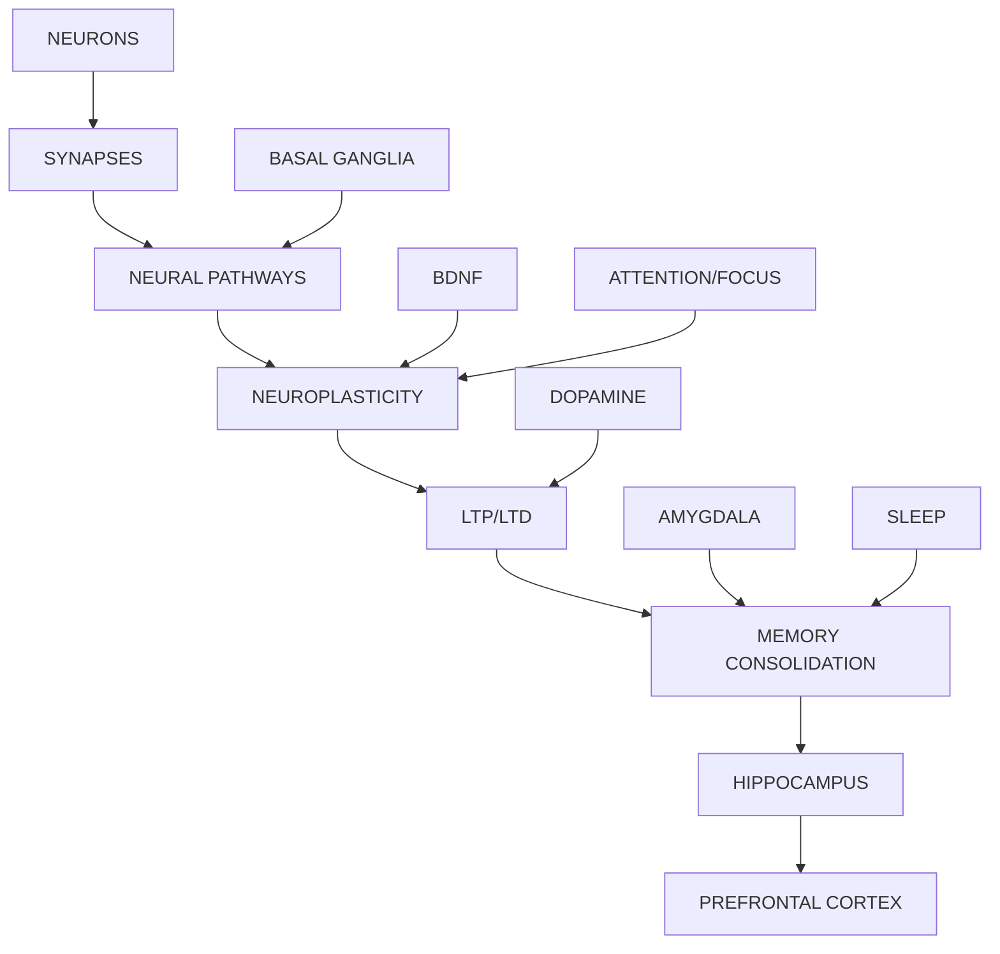

# Neuroscience of Learning: Deep Keyword Research

> In-depth exploration of every keyword — mechanisms, learning connections, key questions, and teaching applications.

---

## 1. NEURONS

### What Are They?
Neurons are the fundamental information-processing cells of the brain. The human brain contains ~100 billion neurons.

### Structure
| Component | Function |
|-----------|----------|
| **Soma (Cell Body)** | Contains nucleus; maintains cell life |
| **Dendrites** | Receive signals from other neurons |
| **Axon** | Transmits electrical signals away from soma |
| **Myelin Sheath** | Insulates axon; speeds signal transmission |
| **Axon Terminals** | Release neurotransmitters at synapses |

### Types
- **Sensory Neurons** — Carry info from senses → brain
- **Motor Neurons** — Carry commands from brain → muscles
- **Interneurons** — Connect neurons within CNS; enable complex processing

### Role in Learning & Thinking
- Learning = forming/strengthening connections between neurons
- Thinking = coordinated firing of neuron networks
- Memory = patterns of neural activation that can be reactivated

### Key Questions
1. How do neurons decide whether to "fire" or not?
2. What determines which neurons connect to form a memory?
3. How does repeated activation strengthen neural pathways?
4. How do different neuron types contribute to different memory systems?

---

## 2. SYNAPSES

### What Are They?
Junctions where neurons communicate via chemical or electrical signals.

### Structure
- **Presynaptic Terminal** — Contains vesicles with neurotransmitters
- **Synaptic Cleft** — Gap between neurons (~20nm)
- **Postsynaptic Membrane** — Contains receptors for neurotransmitters

### Types
| Type | Mechanism | Speed |
|------|-----------|-------|
| **Chemical** | Neurotransmitter release | Slower, modifiable |
| **Electrical** | Gap junctions (ion flow) | Faster, synchronizing |

### Synaptic Plasticity
The ability of synapses to strengthen (LTP) or weaken (LTD) over time — the cellular basis of learning.

### Role in Learning
- Every memory is a pattern of strengthened synaptic connections
- "Neurons that fire together, wire together"
- Learning difficulty = building new synaptic patterns

### Key Questions
1. How do synapses "know" to strengthen or weaken?
2. What's the minimum repetition needed to make a synapse permanent?
3. How do drugs/sleep affect synaptic function?

---

## 3. NEURAL PATHWAYS

### What Are They?
Networks of connected neurons that transmit specific types of information.

### How They Form
1. **Experience** — New activity creates new connections
2. **Repetition** — Repeated use strengthens pathways
3. **Pruning** — Unused pathways are eliminated

### Myelination
With practice, pathways get wrapped in myelin → 100x faster signal transmission.

### Role in Learning
- Skills = well-myelinated neural pathways
- Habits = automatic pathways in basal ganglia
- Expertise = highly efficient, specialized pathways

### Key Questions
1. How long does it take to "hard-wire" a new pathway?
2. Can old pathways be completely erased?
3. How does interleaving affect pathway formation?

---

## 4. NEUROPLASTICITY

### What Is It?
The brain's ability to reorganize itself by forming new neural connections throughout life.

### Types
| Type | Definition |
|------|------------|
| **Structural** | Physical changes (new synapses, dendrite growth) |
| **Functional** | Reorganization of function (e.g., after injury) |

### Mechanisms
- Synaptogenesis (new synapses)
- Synaptic pruning (removing unused connections)
- Neurogenesis (new neurons in hippocampus)
- Myelination (faster signal transmission)

### Factors That Enhance Neuroplasticity
- Focused attention
- Deliberate practice
- Novelty and challenge
- Exercise (BDNF release)
- Sleep
- Emotional engagement

### Role in Learning
- **Neuroplasticity = learning capacity**
- Every skill change requires physical brain change
- Adults can learn anything (slower but possible)

### Key Questions
1. At what age does neuroplasticity decline most?
2. Can damaged brain regions regrow?
3. How does chronic stress harm plasticity?

---

## 5. LONG-TERM POTENTIATION (LTP)

### What Is It?
A persistent strengthening of synapses based on repeated, correlated activity — the cellular mechanism of memory formation.

### Mechanism (Simplified)
1. Strong/repeated stimulation releases glutamate
2. AMPA receptors depolarize the postsynaptic neuron
3. Depolarization removes Mg²⁺ block from NMDA receptors
4. Ca²⁺ floods in through NMDA receptors
5. Ca²⁺ activates kinases (CaMKII, PKC)
6. More AMPA receptors inserted → stronger synapse

### Role in Learning
- LTP is the "write" operation for memory
- Stronger LTP = faster learning
- Sleep consolidates LTP into long-term storage

### Key Questions
1. How many repetitions trigger LTP?
2. Can LTP be artificially induced?
3. What blocks LTP (stress, sleep deprivation)?

---

## 6. LONG-TERM DEPRESSION (LTD)

### What Is It?
A persistent weakening of synaptic connections — the mechanism for forgetting and refinement.

### Mechanism
- Low-frequency stimulation → modest Ca²⁺ influx
- Activates phosphatases (calcineurin)
- AMPA receptors removed from membrane → weaker synapse

### Role in Learning
- LTD is **not** just "forgetting" — it's **refinement**
- Removes irrelevant connections → sharpens memories
- Prevents saturation → enables new learning
- Essential for motor learning (cerebellum)

### LTP vs LTD Balance
| LTP | LTD |
|-----|-----|
| Strengthens useful connections | Weakens unused connections |
| High Ca²⁺ | Low Ca²⁺ |
| Learning | Forgetting/refinement |

---

## 7. BDNF (Brain-Derived Neurotrophic Factor)

### What Is It?
A protein that supports neuron survival, growth, differentiation, and synaptic plasticity.

### Functions
- Promotes neurogenesis in hippocampus
- Enhances LTP and memory formation
- Supports dendritic spine growth
- Protects against cognitive decline

### How to Increase BDNF
| Activity | Effect on BDNF |
|----------|----------------|
| **Aerobic exercise** | ↑↑↑ Strong increase |
| **HIIT training** | ↑↑ Moderate increase |
| **Learning new skills** | ↑ Increase |
| **Fasting** | ↑ Increase |
| **Sleep** | ↑ Consolidation |
| **Chronic stress** | ↓ Decrease |

### Role in Learning
- Higher BDNF = better memory and learning capacity
- Exercise before learning → enhanced retention
- BDNF is the molecular link between exercise and cognition

---

## 8. DOPAMINE

### What Is It?
A neurotransmitter involved in reward, motivation, learning, and movement.

### Brain Pathways
- **Mesolimbic** (VTA → Nucleus Accumbens) — Reward, motivation
- **Mesocortical** (VTA → Prefrontal Cortex) — Cognition, working memory
- **Nigrostriatal** (Substantia Nigra → Striatum) — Motor control

### Reward Prediction Error
Dopamine signals the **difference** between expected and actual reward:
| Situation | Dopamine Response |
|-----------|-------------------|
| Better than expected | ↑ Surge |
| As expected | Baseline |
| Worse than expected | ↓ Dip |

### Role in Learning
- Dopamine = "learning signal"
- Reinforces successful behaviors
- Drives motivation to persist
- Novelty triggers dopamine release

### Teaching Applications
- Use surprise and novelty
- Celebrate small wins
- Create achievable challenges
- Avoid excessive extrinsic rewards

---

## 9. BASAL GANGLIA

### What Are They?
A group of subcortical nuclei (striatum, globus pallidus, substantia nigra, subthalamic nucleus) involved in motor control, habits, and procedural learning.

### Functions
- **Motor control** — Initiate/inhibit movements
- **Habit formation** — Automate repeated behaviors
- **Procedural learning** — "how to" memory

### The Habit Loop
```
CUE → ROUTINE → REWARD
 ↑         ↓
 ←←← DOPAMINE ←←←
```

### Role in Learning
- Procedural skills (riding bike, typing) → basal ganglia
- Habits reduce cognitive load
- Takes ~66 days to form new habit

### Key Questions
1. How do we break bad habits encoded in basal ganglia?
2. Why is procedural memory preserved in Alzheimer's?

---

## 10. HIPPOCAMPUS

### What Is It?
A seahorse-shaped structure in the temporal lobe; critical for memory formation.

### Functions
| Function | Description |
|----------|-------------|
| **Memory formation** | Encodes new explicit memories |
| **Spatial navigation** | Contains "place cells" |
| **Memory consolidation** | Transfers to cortex during sleep |

### Neurogenesis
The hippocampus is one of the few brain areas where new neurons are born in adulthood.

### Role in Learning
- Initial encoding of all declarative memories
- Without hippocampus → cannot form new long-term memories
- Sleep consolidates hippocampal memories to cortex

### Key Questions
1. Why does stress shrink the hippocampus?
2. How do London taxi drivers have larger hippocampi?
3. What protects hippocampal function in aging?

---

## 11. PREFRONTAL CORTEX (PFC)

### What Is It?
The front part of the frontal lobe; the "CEO" of the brain.

### Functions
- **Executive function** — Planning, decision-making
- **Working memory** — Hold and manipulate info
- **Attention control** — Filter distractions
- **Inhibition** — Suppress impulses
- **Cognitive flexibility** — Adapt to new situations

### Subregions
| Region | Function |
|--------|----------|
| **Dorsolateral PFC** | Planning, working memory |
| **Ventrolateral PFC** | Inhibition, response selection |
| **Medial PFC** | Self-awareness, motivation |
| **Orbitofrontal** | Decision-making, reward evaluation |

### Role in Learning
- Directs attention to relevant information
- Manages cognitive load
- Last to mature (mid-20s) — explains adolescent impulsivity

---

## 12. AMYGDALA

### What Is It?
An almond-shaped structure in the limbic system; the brain's emotional sentinel.

### Functions
- **Fear processing** — Detect threats
- **Emotional memory** — Tag memories with emotions
- **Fight-or-flight** — Trigger stress response

### Role in Learning
- Emotional memories are stronger (amygdala activation)
- High stress → amygdala blocks learning
- Curiosity → amygdala quiets → better learning

### Teaching Applications
- Create emotionally safe environments
- Use storytelling to engage emotions
- Avoid excessive fear/stress in learning

---

## 13. ATTENTION TYPES

### Four Main Types

| Type | Definition | Brain Region |
|------|------------|--------------|
| **Selective** | Focus on one stimulus, ignore others | Parietal, PFC |
| **Sustained** | Maintain focus over time | PFC, parietal |
| **Divided** | Multitask (limited capacity) | PFC |
| **Executive** | Control and regulate attention | Anterior cingulate, PFC |

### Role in Learning
- Attention is the gateway to memory
- No attention = no learning
- Training can improve attention capacity

---

## 14. FOCUS

### Brain Mechanisms
- **Acetylcholine** — Focuses attention on specific targets
- **Norepinephrine** — Increases alertness
- **Dopamine** — Enhances flexible focus

### Enhancement Strategies
- Eliminate distractions
- Use Pomodoro technique
- Narrow visual focus to trigger neurochemicals
- Exercise, sleep, meditation

### Role in Learning
- Focused attention triggers neuroplasticity
- 90-minute focus blocks are optimal
- Breaks allow diffuse mode processing

---

## 15. SLEEP STAGES

### Overview
| Stage | Brain Waves | Function |
|-------|-------------|----------|
| **NREM Stage 1** | Alpha → Theta | Transition |
| **NREM Stage 2** | Theta, spindles | Memory processing |
| **NREM Stage 3 (Deep)** | Delta (slow wave) | Declarative memory consolidation |
| **REM** | Theta | Procedural, emotional, associative memory |

### Key Oscillations
- **Slow oscillations** — Organize consolidation
- **Sleep spindles** — Transfer hippocampus → cortex
- **Sharp-wave ripples** — Replay memories

---

## 16. MEMORY CONSOLIDATION

### What Is It?
The process of stabilizing memories from fragile short-term to stable long-term storage.

### Stages
1. **Encoding** (hippocampus) — Initial capture
2. **Consolidation** (sleep) — Strengthen and transfer
3. **Storage** (neocortex) — Long-term repository
4. **Retrieval** — Reactivate stored patterns

### Role of Sleep
- NREM: Reactivation and strengthening
- REM: Integration and emotional processing
- Without sleep: Memories decay

---

## 🔗 Interconnections Map



---

## 📚 Teaching Applications Summary

| Concept | Teaching Strategy |
|---------|-------------------|
| **Neurons** | Explain brain change to build growth mindset |
| **Synapses** | Use spaced repetition to strengthen connections |
| **LTP** | Ensure active engagement, not passive reading |
| **BDNF** | Incorporate movement before learning sessions |
| **Dopamine** | Use novelty, gamification, small wins |
| **Hippocampus** | Connect new info to spatial/contextual cues |
| **PFC** | Minimize distractions, use chunking |
| **Amygdala** | Create safe, curious environments |
| **Attention** | Teach focus techniques, limit multitasking |
| **Sleep** | Emphasize sleep hygiene for learners |
