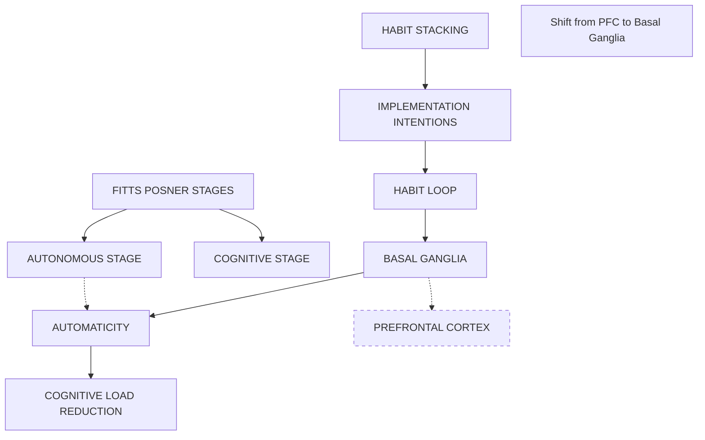

# Habit & Skill Formation: Deep Keyword Research

> In-depth exploration of how the brain automates behaviors and acquires new motor and cognitive skills.

---

## 1. THE HABIT LOOP (Duhigg)

### What Is It?
A neurological loop that governs any habit. The brain converts a sequence of actions into an automatic routine to save effort.

### The 3 Components
1.  **Cue (Trigger)**: The signal that tells your brain to go into automatic mode and which habit to use.
    *   *Types*: Location, Time, Emotional State, Other People, Immediately preceding action.
2.  **Routine (Behavior)**: The physical, mental, or emotional action you perform.
3.  **Reward (Feedback)**: The reason your brain remembers this loop. It reinforces the behavior.

### Mechanism
Over time, this loop—Cue, Routine, Reward; Cue, Routine, Reward—becomes more and more automatic. The cue and reward become intertwined until a powerful sense of anticipation and craving emerges.

---

## 2. BASAL GANGLIA CIRCUITRY

### What Is It?
A group of subcortical nuclei in the brain responsible for voluntary motor control, procedural learning, and habit formation.

### The Shift (Goal-Directed vs. Habitual)
- **Goal-Directed Behavior**: Relies on the **Prefrontal Cortex** (planning/decision making). It is flexible but effortful (requires working memory).
- **Habitual Behavior**: Relies on the **Basal Ganglia** (specifically the **Striatum**). It is automatic, fast, and relatively inflexible.

### Key Insight
As a behavior is repeated, neural activity shifts from the Prefrontal Cortex to the Basal Ganglia. This "chunking" process allows the brain to perform complex actions without thinking (e.g., backing a car out of a driveway).

---

## 3. HABIT STACKING (James Clear) & IMPLEMENTATION INTENTIONS

### What Is It?
A strategy to build new habits by identifying a current habit you already do each day and stacking your new behavior on top of it.
*   **Formula**: "After I [CURRENT HABIT], I will [NEW HABIT]."

### Why It Works
It leverages **Implementation Intentions** ("If X, then Y" plans).
Instead of pairing a new habit with a vague time ("I'll exercise in the afternoon"), you pair it with a specific implementation trigger ("After I take off my work shoes").

### Implementation Intentions
A plan you make beforehand about when and where to act.
*   *Research*: People who write down "During the next week, I will partake in at least 20 minutes of vigorous exercise on [DAY] at [TIME] in [PLACE]" are 2x to 3x more likely to exercise compared to control groups.

---

## 4. FITTS & POSNER'S 3 STAGES OF LEARNING

### What Is It?
The classic model (1967) describing the stages learners go through when acquiring motor skills.

### Stage 1: Cognitive Stage (Novice)
- **Characteristics**: "What do I do?" High cognitive load. Large, inconsistent errors. Relies heavily on visual cues and verbal instruction.
- **Teaching**: Needs clear demonstration and immediate feedback.

### Stage 2: Associative Stage (Intermediate)
- **Characteristics**: "How do I do it?" Errors become smaller and less frequent. Learner begins to detect and correct their own errors. Refining the motor program.
- **Teaching**: Needs reduced feedback (fading) to encourage self-correction.

### Stage 3: Autonomous Stage (Expert)
- **Characteristics**: "Automatic." The skill requires little to no attention. Can dual-task (e.g., talk while driving). Performance is consistent and efficient.
- **Teaching**: Focus on strategy and high-level stressors.

---

## 5. AUTOMATICITY

### What Is It?
The ability to do things without occupying the mind with the low-level details required, allowing it to become an automatic response pattern or habit.

### The Benefit: Cognitive Load Reduction
Because working memory is limited (Cognitive Load Theory), automaticity is essential for higher-order thinking.
*   *Example*: If you have to consciously think about sounding out every letter (decoding), you cannot focus on the meaning of the sentence (comprehension).

### The Pitfall
**The "OK Plateau"**: Once you reach automaticity, improvement often stops. You are "good enough" to perform the task without thinking, but you stop getting better. To improve further, you must break automaticity (see *Deliberate Practice*).

---

## 🔗 Interconnections Map

---

## 📚 Teaching Applications Summary

| Concept | Application |
|---------|-------------|
| **Habit Loop** | To change a bad habit, keep the *Cue* and *Reward* the same, but change the *Routine*. |
| **Habit Stacking** | Tell students: "When you sit down at your desk (cue), open your textbook immediately (routine)." |
| **Stages of Learning** | Don't give detailed verbal feedback to an expert; don't leave a novice alone to "figure it out." |
| **Automaticity** | Drill fundamental skills (math facts, vocabulary) until automatic to free up brain power for complex problems. |
| **Implementation Intentions** | Have students write down exactly *when* and *where* they will study. |
