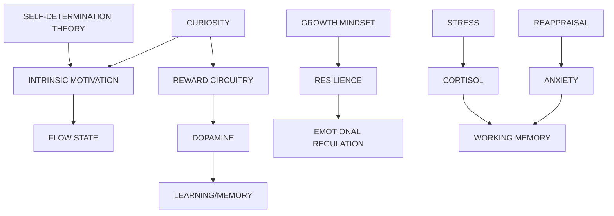

# Motivation & Emotion in Learning: Deep Keyword Research

> In-depth exploration of every motivation and emotion keyword — mechanisms, learning connections, key questions, and teaching applications.

---

## 1. INTRINSIC VS EXTRINSIC MOTIVATION

### Definitions
- **Intrinsic Motivation**: Engaging in activity for inherent satisfaction (e.g., curiosity, fun, challenge).
- **Extrinsic Motivation**: Engaging to earn a reward or avoid punishment (e.g., grades, money, praise).

### The Overjustification Effect
When an expected external incentive decreases a person's intrinsic motivation to perform a task they previously enjoyed. The "play" becomes "work."

### Effects on Learning
| Intrinsic | Extrinsic |
|-----------|-----------|
| Deeper conceptual understanding | Surface processing |
| Longer retention | Short-term compliance |
| Higher creativity | Lower creativity |
| Persistent in face of failure | Gives up easily |

### Teaching Applications
- Use extrinsic rewards sparingly (e.g., for boring tasks).
- Transition to intrinsic by highlighting value/interest.
- Avoid rewarding behaviors that are already interesting.

---

## 2. SELF-DETERMINATION THEORY (SDT)

### What Is It?
A macro theory of human motivation (Deci & Ryan) that focuses on the degree to which behavior is self-motivated and self-determined.

### Three Basic Psychological Needs
For optimal motivation, well-being, and growth, three needs must be met:

1.  **Autonomy**: Feeling in control of one's own behaviors and goals. (Choice, volition).
2.  **Competence**: Feeling effective and capable of mastering tasks. (Optimal challenge).
3.  **Relatedness**: Feeling a sense of belonging and connection to others. (Care, significance).

### Role in Learning
- When learning environments support these three needs, students show higher intrinsic motivation and better performance.
- Controlling environments (low autonomy) undermine motivation.

### Key Questions
1. How can we offer autonomy in a rigid curriculum?
2. Does competence precede motivation, or vice versa?

---

## 3. REWARD CIRCUITRY

### The Dopamine System
- **Mesolimbic Pathway**: VTA → Nucleus Accumbens (The "Wanting" system).
- **Function**: Motivation, reward prediction, reinforcement learning.

### Anticipation vs. Receipt
- Dopamine spikes during **anticipation** of the reward, not necessarily the receipt.
- It drives the *pursuit* (seeking behavior).
- **Uncertainty** increases dopamine (50% chance > 100% chance).

### Reward Prediction Error (RPE)
- **Better than expected** → Dopamine surge (Learning occurs).
- **As expected** → No change.
- **Worse than expected** → Dopamine dip (Extinction of behavior).

### Role in Learning
- Dopamine signals "pay attention, this is important."
- Makes learning effortless and "sticky."

---

## 4. GROWTH MINDSET

### What Is It?
The belief that abilities and intelligence can be developed through dedication and effort (Carol Dweck).

### vs. Fixed Mindset
- **Fixed**: "I'm either smart or I'm not." (Avoids challenge, gives up easily).
- **Growth**: "I can get smarter." (Embraces challenge, persists).

### Neuroplasticity Connection
Growth mindset is the correct understanding of brain physiology. The brain *does* physically change with effort and practice.

### Teaching Applications
- Praise **process** (effort, strategy), not **traits** (intelligence, talent).
- "You haven't mastered it **yet**."
- Frame failure as data for improvement.

---

## 5. FLOW STATE

### What Is It?
A state of optimal experience where one is completely absorbed in an activity (Mihaly Csikszentmihalyi).

### Conditions for Flow
1.  **Clear Goals**: Knowing exactly what to do.
2.  **Immediate Feedback**: Knowing how you are doing.
3.  **Challenge-Skill Balance**: Challenge level is just slightly above skill level (~4% stretch).

### Characteristics
- Loss of self-consciousness.
- Distorted sense of time.
- Intense concentration.
- Autotelic (activity is its own reward).

### Benefits
- Massively increased productivity and learning speed.
- Deep enjoyment and satisfaction.

---

## 6. CURIOSITY

### What Is It?
A drive to know, triggered by an information gap.

### Types
| Type | Description |
|------|-------------|
| **Epistemic** | Desire for knowledge/understanding (Pleasurable). |
| **Perceptual** | Response to novel sensory stimuli (e.g., weird sound). |
| **Diversive** | Seeking stimulation to avoid boredom. |
| **Specific** | Seeking a specific answer to a puzzle. |

### The "Information Gap" Theory
Curiosity is felt when we notice a gap in our knowledge. This feels like a mental "itch" (low-level anxiety) that we are motivated to scratch.

### Role in Memory
- Curiosity puts the brain in a state to learn.
- High curiosity states enhance memory for *all* information presented (even incidental).
- Triggers dopamine release in hippocampus.

---

## 7. STRESS & LEARNING

### The U-Shaped Curve (Yerkes-Dodson)
- **Low Stress (Boredom)**: Low performance.
- **Moderate Stress (Alertness)**: Optimal performance/learning.
- **High Stress (Anxiety)**: Impaired performance/learning.

### Acute vs. Chronic Stress
- **Acute (Short-term)**: Can enhance memory encoding (flashheading), especially for emotional events. Mobilizes energy.
- **Chronic (Long-term)**: Toxic to the brain.
    - Shrinks **Hippocampus** (memory).
    - Shrinks **Prefrontal Cortex** (executive function).
    - Enlarges **Amygdala** (fear center).

### Cortisol
High levels of cortisol impair memory retrieval ("going blank" on a test) and shut down the prefrontal cortex ("fight or flight").

---

## 8. ANXIETY & MEMORY

### Impact on Working Memory
- Anxiety consumes working memory capacity.
- **Worry** takes up cognitive "slots," leaving fewer resources for the task at hand.
- This creates a vicious cycle: Anxiety → Lower Performance → More Anxiety.

### Test Anxiety
- Performance deficit is often due to "cognitive interference" (worrying thoughts) rather than lack of knowledge.
- Avoidance learning: Students learn to avoid the anxiety-provoking task (studying), which leads to worse failure.

---

## 9. EMOTIONAL REGULATION

### Definition
The ability to monitor and modify emotional reactions.

### Strategies
| Strategy | Description | Effectiveness |
|----------|-------------|---------------|
| **Reappraisal** | Changing how you think about a situation (e.g., "This test is a challenge, not a threat"). | Adaptive (Good) |
| **Suppression** | Hiding emotional expression. | Maladaptive (Bad) |

### Reappraisal in Learning
- Reinterpreting physical stress signals (racing heart) as "excitement" or "readiness" rather than "fear" improves performance.
- Essential skill for resilience and persistence.

---

## 🔗 Interconnections Map

---

## 📚 Teaching Applications Summary

| Concept | Teaching Strategy |
|---------|-------------------|
| **Intrinsic Motivation** | Connect content to student interests. |
| **SDT** | Give choices (Autonomy), scaffold tasks (Competence). |
| **Reward Circuitry** | Use prediction/surprise; celebrate "better than expected" results. |
| **Growth Mindset** | Praise effort/strategy; use "not yet." |
| **Flow** | Match task difficulty to student skill level. |
| **Curiosity** | Start with a mystery or a question; highlight info gaps. |
| **Stress** | Create low-stakes practice; reduce social threat. |
| **Anxiety** | Teach "worry dumps" (writing worries) before tests to clear WM. |
| **Emotional Regulation** | Teach reappraisal (stress = energy). |
