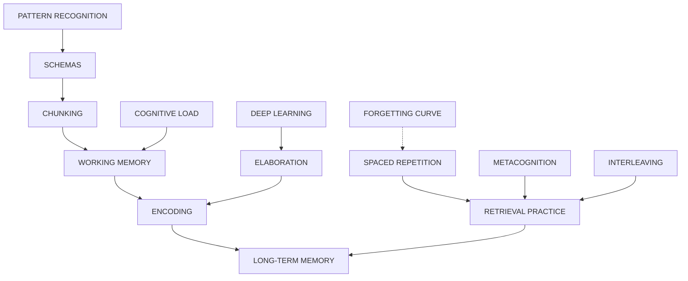

# Cognitive Psychology of Learning: Deep Keyword Research

> In-depth exploration of every cognitive psychology keyword — mechanisms, learning connections, key questions, and teaching applications.

---

## 1. WORKING MEMORY (Baddeley Model)

### What Is It?
A cognitive system for temporarily holding and manipulating information during complex tasks like learning, reasoning, and comprehension.

### Components (Baddeley & Hitch, 1974)
| Component | Function |
|-----------|----------|
| **Central Executive** | Directs attention, coordinates info, connects to long-term memory |
| **Phonological Loop** | Handles verbal/auditory info (inner voice + inner ear) |
| **Visuospatial Sketchpad** | Handles visual/spatial info (mental imagery) |
| **Episodic Buffer** | Integrates info from all systems into coherent episodes |

### Capacity Limits
- Holds ~4 items (updated from Miller's 7±2)
- Duration: ~15-30 seconds without rehearsal
- Easily overwhelmed by complex information

### Role in Learning
- Gateway to long-term memory — all learning passes through WM
- Limited capacity = need for chunking and scaffolding
- Overload → learning failure

### Key Questions
1. How can instruction reduce WM overload?
2. Why do experts handle more info than novices?
3. How does anxiety affect WM capacity?

---

## 2. ENCODING

### What Is It?
The process of transforming sensory information into a memory trace that can be stored.

### Types of Encoding
| Type | Processed | Depth |
|------|-----------|-------|
| **Visual** | Appearance, images | Shallow |
| **Acoustic** | Sounds, pronunciation | Shallow |
| **Semantic** | Meaning, context | Deep |
| **Elaborative** | Connections to prior knowledge | Deepest |

### Levels of Processing (Craik & Lockhart, 1972)
- **Shallow** → Focus on surface features (font, sound)
- **Deep** → Focus on meaning and connections
- **Deeper processing = stronger memory traces**

### Role in Learning
- How you encode determines how well you remember
- Meaning-based encoding >> rote memorization
- Prior knowledge enhances encoding quality

### Teaching Applications
- Encourage semantic processing (explain meaning)
- Connect new info to prior knowledge
- Use elaborative interrogation ("Why is this true?")

---

## 3. RETRIEVAL PRACTICE (Testing Effect)

### What Is It?
Actively recalling information from memory, which strengthens the memory trace more than re-studying.

### Why It Works
1. Strengthens memory traces with each retrieval
2. Creates multiple retrieval pathways
3. Identifies knowledge gaps
4. Introduces "desirable difficulty"

### Research Findings
- Testing > re-reading for long-term retention
- Testing > concept mapping in many contexts
- Works even without feedback (though feedback helps)
- Benefits transfer to new contexts

### Practical Techniques
- Low-stakes quizzes
- Flashcards
- "Brain dumps" (write everything you know)
- Self-testing
- Teaching others

### Key Questions
1. How often should you test yourself?
2. Does retrieval practice work for all content types?
3. How does spacing interact with testing?

---

## 4. SPACED REPETITION (Spacing Effect)

### What Is It?
Distributing practice/review sessions over time rather than cramming.

### Why It Works
- Forces effortful retrieval
- Interrupts forgetting at optimal moments
- Creates varied encoding contexts
- Strengthens long-term memory consolidation

### Optimal Intervals (Examples)
| Session | Suggested Interval |
|---------|-------------------|
| Initial | Day 0 |
| 1st Review | Day 1 |
| 2nd Review | Day 3 |
| 3rd Review | Day 7 |
| 4th Review | Day 14 |
| 5th Review | Day 30 |

### Research
- Ebbinghaus (1885) first demonstrated
- 10-30% better retention vs. massed practice
- Effect persists across ages, content types

### Teaching Applications
- Schedule cumulative reviews
- Use spaced repetition software (Anki, SuperMemo)
- Return to material periodically throughout course

---

## 5. FORGETTING CURVE (Ebbinghaus)

### What Is It?
The exponential decline in memory retention over time without review.

### Key Findings (Ebbinghaus, 1885)
| Time After Learning | Retention |
|--------------------|-----------|
| 20 minutes | ~58% |
| 1 hour | ~44% |
| 9 hours | ~36% |
| 1 day | ~33% |
| 2 days | ~28% |
| 6 days | ~25% |
| 31 days | ~21% |

### Factors Affecting Forgetting Rate
- Strength of original encoding
- Emotional significance
- Meaningfulness of material
- Sleep quality
- Stress levels
- Number of reviews

### Combating the Curve
- Spaced repetition
- Retrieval practice
- Sleep after learning
- Emotional engagement
- Semantic encoding

---

## 6. CHUNKING

### What Is It?
Grouping individual pieces of information into larger, meaningful units to overcome working memory limits.

### Miller's Magical Number 7±2 (1956)
- WM can hold ~7 items (now revised to ~4)
- But each "item" can be a **chunk**
- Chunking effectively expands WM capacity

### Examples
- Phone number: 1234567890 → 123-456-7890
- Chess: Experts see patterns, not pieces
- Language: Letters → words → phrases

### How Chunking Works
1. Reduces cognitive load
2. Leverages prior knowledge
3. Creates meaningful patterns
4. Facilitates transfer to long-term memory

### Role in Learning
- Experts chunk automatically (schema)
- Break complex topics into digestible units
- Build knowledge hierarchically

---

## 7. PATTERN RECOGNITION & SCHEMAS

### What Is It?
- **Pattern Recognition**: Identifying regularities in information
- **Schema**: Mental framework organizing knowledge

### How Schemas Work
- Provide structure for new information
- Enable rapid pattern matching
- Guide attention and interpretation
- Facilitate efficient retrieval

### Expert vs Novice Differences
| Experts | Novices |
|---------|---------|
| Rich, interconnected schemas | Fragmented knowledge |
| See deep patterns | See surface features |
| Automatic recognition | Effortful processing |
| Forward reasoning | Trial and error |

### Role in Learning
- Expertise = refined schemas
- Learning = building new schemas
- Prior knowledge activates relevant schemas

### Teaching Applications
- Activate prior knowledge before new content
- Explicitly teach underlying patterns
- Use compare/contrast to highlight structure

---

## 8. DEEP VS SURFACE LEARNING (Marton & Säljö)

### What Is It?
Two distinct approaches to engaging with learning material.

### Deep Learning
- Seeks meaning and understanding
- Connects ideas to prior knowledge
- Active engagement and questioning
- Intrinsically motivated
- Long-term retention

### Surface Learning
- Memorizes facts for reproduction
- Passive, minimal engagement
- Extrinsically motivated (grades, passing)
- Short-term retention only
- Creates "illusion of competence"

### Comparison
| Aspect | Deep | Surface |
|--------|------|---------|
| **Goal** | Understanding | Reproduction |
| **Motivation** | Intrinsic | Extrinsic |
| **Effort** | High engagement | Minimal |
| **Retention** | Long-term | Short-term |
| **Transfer** | High | Low |

### Promoting Deep Learning
- Assessment that requires application
- Create curiosity and interest
- Allow time for reflection
- Reduce emphasis on rote grades

---

## 9. ELABORATION

### What Is It?
Expanding on new information by connecting it to existing knowledge.

### Techniques
- **Self-explanation**: Explain in own words
- **Elaborative interrogation**: Ask "why?" and "how?"
- **Analogies**: Relate to familiar concepts
- **Examples**: Generate concrete instances
- **Summarizing**: Distill key ideas

### Why It Works
- Creates multiple retrieval routes
- Deepens semantic processing
- Strengthens neural connections
- Transfers to long-term memory

### Role in Learning
- Links new → prior knowledge
- Promotes deep processing
- Reduces working memory strain
- Enhances comprehension

---

## 10. INTERLEAVING

### What Is It?
Mixing different topics, problems, or skills within a single study session (vs. blocked practice).

### Blocked vs Interleaved
| Blocked | Interleaved |
|---------|-------------|
| AAAA → BBBB → CCCC | ABC → ABC → ABC |
| Feels easier | Feels harder |
| Fast initial learning | Slower initial learning |
| Poor long-term retention | Superior long-term retention |

### Why Interleaving Works
1. **Discrimination**: Forces brain to distinguish between concepts
2. **Retrieval practice**: Each switch requires recalling strategy
3. **Desirable difficulty**: Harder now = better later
4. **Contextual interference**: Prevents autopilot

### Research
- 43-215% improvement in long-term retention
- Works for math, art, sports, medicine
- Especially effective for similar categories

### When to Use
- After initial learning of each topic
- When practicing problem-solving
- In exam preparation

---

## 11. METACOGNITION (Flavell)

### What Is It?
"Thinking about thinking" — awareness and control of one's own cognitive processes.

### Components
| Component | Definition |
|-----------|------------|
| **Metacognitive Knowledge** | Knowing about your own cognition |
| **Metacognitive Regulation** | Controlling your cognitive processes |

### Types of Knowledge
- **Declarative**: What you know (skills, abilities)
- **Procedural**: How to use strategies
- **Conditional**: When/why to apply strategies

### Regulation Skills
1. **Planning**: Setting goals, selecting strategies
2. **Monitoring**: Checking progress, comprehension
3. **Control**: Adjusting strategies as needed
4. **Evaluating**: Assessing performance after task

### Role in Learning
- Strong predictor of academic success
- Enables self-directed learning
- Helps identify knowledge gaps
- Improves strategy selection

### Teaching Metacognition
- Teach students to ask: "Do I understand this?"
- Model thinking aloud
- Use reflection prompts
- Teach self-questioning strategies

---

## 12. COGNITIVE LOAD THEORY (Sweller)

### What Is It?
A framework explaining how working memory's limited capacity affects learning, with implications for instructional design.

### Three Types of Cognitive Load
| Type | Definition | Controllable? |
|------|------------|---------------|
| **Intrinsic** | Complexity of material itself | Partially (via chunking) |
| **Extraneous** | Poor instruction/presentation | Yes (minimize!) |
| **Germane** | Effort for learning/schema building | Yes (maximize!) |

### Total Cognitive Load
```
Intrinsic + Extraneous + Germane ≤ Working Memory Capacity
```

If exceeded → learning failure

### Instructional Design Principles
1. **Reduce extraneous load**
   - Eliminate distractions
   - Integrate text with diagrams
   - Remove redundant information
   
2. **Manage intrinsic load**
   - Chunk complex topics
   - Sequence from simple to complex
   - Pre-teach vocabulary
   
3. **Promote germane load**
   - Use worked examples
   - Encourage self-explanation
   - Vary practice contexts

### Expertise Reversal Effect
- Instruction optimal for novices may hinder experts
- As expertise grows, scaffold less

---

## 🔗 Interconnections Map



---

## 📚 Teaching Applications Summary

| Concept | Teaching Strategy |
|---------|-------------------|
| **Working Memory** | Chunk information, reduce distractions |
| **Encoding** | Emphasize meaning, connect to prior knowledge |
| **Retrieval Practice** | Frequent low-stakes quizzes |
| **Spaced Repetition** | Cumulative review schedules |
| **Forgetting Curve** | Re-teach before content is forgotten |
| **Chunking** | Break complex topics into parts |
| **Schemas** | Activate prior knowledge, teach patterns |
| **Deep Learning** | Ask "why" questions, reduce memorization focus |
| **Elaboration** | Have students explain in own words |
| **Interleaving** | Mix problem types in practice |
| **Metacognition** | Teach planning, monitoring, evaluation |
| **Cognitive Load** | Simplify materials, use worked examples |

---

## 🔬 Key Researchers

| Researcher | Contribution |
|------------|--------------|
| **Alan Baddeley** | Working memory model |
| **Fergus Craik** | Levels of processing |
| **Hermann Ebbinghaus** | Forgetting curve, spacing effect |
| **George Miller** | Magical number 7±2 |
| **John Flavell** | Metacognition |
| **John Sweller** | Cognitive load theory |
| **Ference Marton** | Deep vs surface learning |
| **Robert Bjork** | Desirable difficulties |
