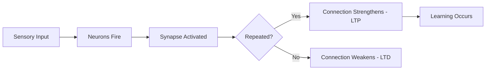
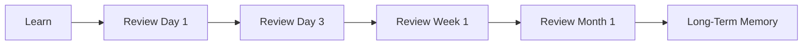
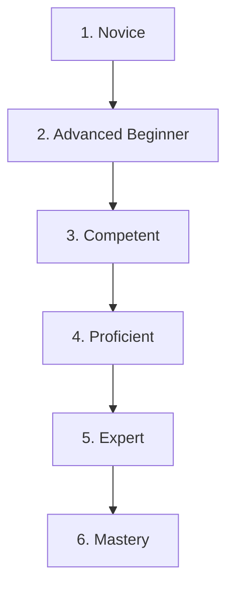
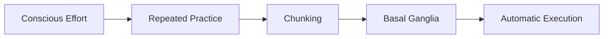
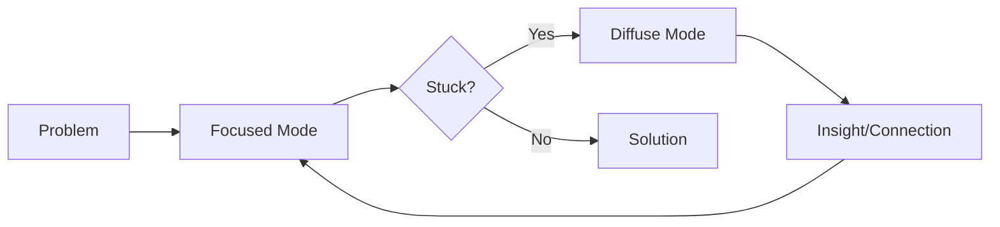

# The Science of How Learning Works

> A comprehensive guide to understanding learning — from neurons to mastery.

---

## 🧠 Part 1: The Brain's Learning Machinery

### How Neurons Learn

Learning = physical changes in the brain. Here's what happens:

**Key Components:**
- **Neurons** — 100 billion brain cells that process information
- **Synapses** — Gaps where neurons communicate via neurotransmitters
- **Neural Pathways** — Networks that strengthen with repeated use

> [!IMPORTANT]
> **"Neurons that fire together, wire together"** — Repeated activation = stronger connections (Long-Term Potentiation)

---

### Neuroplasticity: Your Brain Can Change

The brain reshapes itself throughout life through:

| Mechanism | Description |
|-----------|-------------|
| **Synaptogenesis** | New synaptic connections form |
| **Synaptic Pruning** | Unused connections eliminated |
| **Myelination** | Faster signal transmission with practice |
| **Neurogenesis** | New neurons born (especially in hippocampus) |

**Factors that enhance neuroplasticity:**
- Focused attention
- Deliberate practice
- Sleep
- Exercise
- Novelty and challenge

---

## ⏰ Part 2: Memory & Forgetting

### The Forgetting Curve (Ebbinghaus)

Without review, we forget rapidly:

| Time After Learning | Retention |
|--------------------|-----------|
| 20 minutes | ~60% |
| 1 hour | ~50% |
| 24 hours | ~30% |
| 1 week | ~20% |
| 1 month | ~10% |

### Spaced Repetition: The Solution

Review at increasing intervals to "reset" the forgetting curve:

> [!TIP]
> **Spaced repetition + active recall = 50-60% better retention** compared to cramming.

---

## 🎯 Part 3: Attention & Focus

### The Neuroscience of Attention

| Brain Region | Role |
|--------------|------|
| **Prefrontal Cortex** | Filters distractions, prioritizes focus |
| **Locus Coeruleus** | Releases noradrenaline for alertness |
| **Cholinergic System** | Acetylcholine enables rapid focus |

**Key Insight:** Focused attention triggers neuroplasticity — learning happens when you're paying attention.

### Brain Wave States

| Frequency | State | Best For |
|-----------|-------|----------|
| **Beta (13-30 Hz)** | Alert, focused | Active learning |
| **Alpha (8-12 Hz)** | Relaxed | Creative connections |
| **Gamma (30-150 Hz)** | Intense focus | Peak attention |

---

## 😴 Part 4: Sleep & Learning

### Sleep Consolidates Memory

| Sleep Stage | Memory Type | What Happens |
|-------------|-------------|--------------|
| **Deep Sleep (SWS)** | Declarative (facts, events) | Hippocampus → Cortex transfer |
| **REM Sleep** | Procedural (skills), Emotional | Pattern integration, creativity |

> [!WARNING]
> Sleep deprivation impairs learning, memory consolidation, and creative problem-solving.

**Optimal Learning Strategy:**
1. Study before sleep
2. Get 7-9 hours of quality sleep
3. The brain replays and consolidates during sleep

---

## 💪 Part 5: Exercise & The Brain

### Exercise Boosts Learning

Physical activity increases:
- **BDNF** (Brain-Derived Neurotrophic Factor) — "Miracle-Gro for the brain"
- **Neurogenesis** in the hippocampus
- Blood flow and oxygen to the brain
- Neurotransmitters (dopamine, serotonin)

| Exercise Type | Brain Benefit |
|---------------|---------------|
| **Aerobic** | Strongest BDNF boost, neurogenesis |
| **HIIT** | Rapid cognitive enhancement |
| **Strength Training** | Cognitive benefits via different pathways |

> [!TIP]
> Even a 20-minute walk before studying can improve focus and retention.

---

## ❤️ Part 6: Emotions & Learning

### The Amygdala's Role

| Emotional State | Effect on Learning |
|-----------------|-------------------|
| **Curiosity** | ↑ Dopamine, ↑ Memory formation, ↑ Hippocampus activity |
| **Mild Stress** | Can enhance memory for emotional events |
| **Chronic Stress/Anxiety** | ↓ Learning (blocks info reaching memory circuits) |
| **Fear** | Creates strong memories but can block new learning |

**Key Insight:** Curiosity activates the brain's reward system, making learning enjoyable and memorable.

---

## ❌ Part 7: Learning from Mistakes

### The Brain's Error Processing

| Brain Signal | Timing | Meaning |
|--------------|--------|---------|
| **ERN** (Error-Related Negativity) | Immediate | Unconscious "uh-oh" detection |
| **Pe** (Positivity) | After ERN | Conscious attention to the error |

**Growth Mindset Connection:** People with a growth mindset show larger Pe signals — they pay more attention to errors and learn more from them.

> [!NOTE]
> The brain can identify errors within 1 second and then sustains activity to prevent recurrence.

---

## 📊 Part 8: Deep vs Surface Learning

| Deep Learning | Surface Learning |
|---------------|------------------|
| Understanding meaning | Memorizing facts |
| Connecting to prior knowledge | Isolated information |
| Intrinsic motivation | Extrinsic motivation |
| Long-term retention | Short-term recall |
| Critical thinking | Reproduction |

**How to Promote Deep Learning:**
- Ask "why" and "how" questions
- Connect new info to existing knowledge
- Apply concepts to new situations
- Teach others (Feynman Technique)

---

## 🚫 Part 9: The Learning Styles Myth

> [!CAUTION]
> **VAK (Visual/Auditory/Kinesthetic) learning styles have been debunked.**

**Research findings:**
- No evidence that matching instruction to "learning style" improves learning
- Students don't perform better when taught in their "preferred" style
- Can limit learners by "pigeonholing" them

**What works instead:** Vary teaching methods for ALL learners — use multiple modalities.

---

## 📈 Part 10: Stages of Skill Acquisition

### The Dreyfus Model

| Stage | Characteristics |
|-------|-----------------|
| **Novice** | Follows rules rigidly, needs supervision |
| **Advanced Beginner** | Recognizes patterns, limited independence |
| **Competent** | Plans, prioritizes, takes responsibility |
| **Proficient** | Holistic view, anticipates problems |
| **Expert** | Intuitive, effortless, innovates |
| **Mastery** | Transcends the domain, creates new approaches |

---

## 🔁 Part 11: Chunking & Automaticity

### Chunking: Working Memory's Secret

Working memory holds 3-7 items. **Chunking** groups information into larger meaningful units:

- Phone number: 1-8-0-0-5-5-5-1-2-3-4 → 1-800-555-1234
- Chess: Experts see patterns, novices see pieces

### The Path to Automaticity

**The Habit Loop:**
1. **Cue** — Trigger that initiates behavior
2. **Routine** — The behavior itself
3. **Reward** — Positive outcome that reinforces

> Average time to form a habit: **66 days** (range: 18-254 days)

---

## 🧭 Part 12: Meta-Learning (Learning How to Learn)

### Barbara Oakley's Key Strategies

| Strategy | Description |
|----------|-------------|
| **Focused Mode** | Concentrated attention on a problem |
| **Diffuse Mode** | Relaxed, broad thinking for connections |
| **Pomodoro Technique** | 25 min focus + 5 min break |
| **Active Recall** | Test yourself instead of re-reading |
| **Spaced Repetition** | Review at increasing intervals |
| **Interleaving** | Mix different problem types |

### The Two Modes of Thinking

---

## ⚡ Quick Reference: 20 Evidence-Based Learning Strategies

1. **Space it out** — Distributed practice beats cramming
2. **Test yourself** — Retrieval practice strengthens memory
3. **Interleave topics** — Mix problem types
4. **Elaborate** — Connect to existing knowledge
5. **Use dual coding** — Combine words and visuals
6. **Teach others** — The Feynman Technique
7. **Sleep on it** — Memory consolidates during sleep
8. **Exercise** — Boosts BDNF and neurogenesis
9. **Manage stress** — Chronic stress impairs learning
10. **Cultivate curiosity** — Dopamine enhances memory
11. **Embrace mistakes** — Errors drive learning
12. **Focus attention** — Triggers neuroplasticity
13. **Chunk information** — Reduce cognitive load
14. **Seek deep understanding** — Not surface memorization
15. **Use worked examples** — Then fade support
16. **Practice deliberately** — At the edge of ability
17. **Get feedback** — Immediate and specific
18. **Build metacognition** — Monitor your own learning
19. **Create habits** — Automate good study behaviors
20. **Be patient** — Mastery takes time (~10,000 hours)

---

## 📚 Essential Reading

| Book | Author | Focus |
|------|--------|-------|
| *A Mind for Numbers* | Barbara Oakley | Learning how to learn |
| *Make It Stick* | Brown, Roediger, McDaniel | Science of learning |
| *Mindset* | Carol Dweck | Growth mindset |
| *Peak* | Anders Ericsson | Deliberate practice |
| *Why We Sleep* | Matthew Walker | Sleep and the brain |
| *Spark* | John Ratey | Exercise and the brain |
| *The Talent Code* | Daniel Coyle | Myelin and skill |
| *Moonwalking with Einstein* | Joshua Foer | Memory techniques |

---

## 🔬 Key Researchers

| Researcher | Contribution |
|------------|--------------|
| **Hermann Ebbinghaus** | Forgetting curve |
| **Barbara Oakley** | Learning How to Learn |
| **Anders Ericsson** | Deliberate practice |
| **Carol Dweck** | Growth mindset |
| **John Sweller** | Cognitive load theory |
| **Marton & Säljö** | Deep vs surface learning |
| **Dreyfus Brothers** | Skill acquisition model |
| **Matthew Walker** | Sleep and memory |

---

> **The Big Picture:** Learning is a physical process that changes your brain. It requires attention, repetition, sleep, and the willingness to struggle. The most effective learners understand how learning works and use evidence-based strategies to accelerate their progress. Your brain is plastic — it can change at any age. The key is deliberate, consistent practice with proper rest and recovery.
