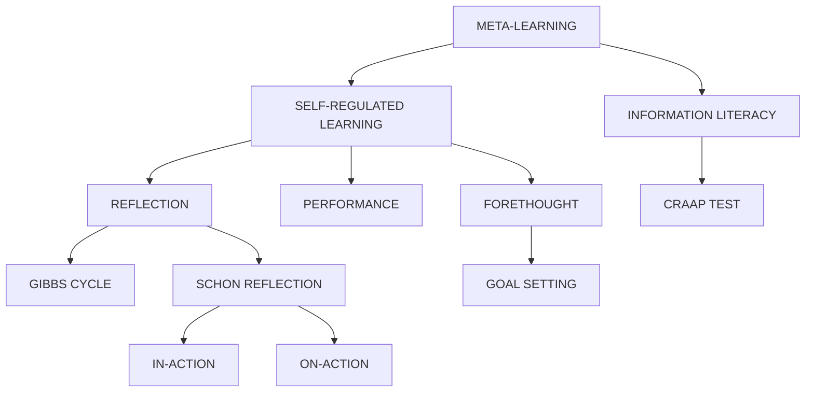

# Meta-Learning: Deep Keyword Research

> In-depth exploration of "learning how to learn" — the self-regulatory and reflective processes that govern effective skill acquisition.

---

## 1. LEARNING HOW TO LEARN (Metacognition)

### What Is It?
Metacognition is "thinking about thinking" or "knowing about knowing." It involves being aware of your own cognitive processes and actively monitoring and regulating them.

### Key Components
1.  **Metacognitive Knowledge**: Knowing *what* strategies exist and *when* to use them (e.g., "I know that flashcards work for vocab but not for essays").
2.  **Metacognitive Regulation**: The active control of learning:
    *   **Planning**: "How will I approach this task?"
    *   **Monitoring**: "Do I understand this? Am I moving fast enough?"
    *   **Evaluating**: "Did that strategy work?"

### Benefit
Learners with strong metacognition can transfer skills to new domains easily because they focus on the *process* of learning, not just the content.

---

## 2. SELF-REGULATED LEARNING (Zimmerman's Model)

### What Is It?
A cyclical process where learners transform their mental abilities into academic skills. It is not a fixed trait but a process that can be developed.

### The 3 Phases (Cyclical)
1.  **Forethought Phase** (Before):
    *   **Task Analysis**: Setting specific goals and planning strategies.
    *   **Self-Motivation**: Beliefs about self-efficacy ("I can do this") and intrinsic interest.
2.  **Performance Phase** (During):
    *   **Self-Control**: Focusing attention, using specific strategies.
    *   **Self-Observation**: Tracking performance (e.g., logging study hours).
3.  **Self-Reflection Phase** (After):
    *   **Self-Judgment**: Comparing performance to a standard.
    *   **Self-Reaction**: Feeling satisfied/dissatisfied, which loops back to influence the *Forethought* of the next cycle.

---

## 3. REFLECTIVE PRACTICE (Gibbs & Schön)

### What Is It?
The ability to reflect on one's actions so as to engage in a process of continuous learning.

### Gibbs' Reflective Cycle (1988)
A structured framework for debriefing an experience:
1.  **Description**: What happened? (Facts only)
2.  **Feelings**: What were you thinking and feeling?
3.  **Evaluation**: What was good and bad about the experience?
4.  **Analysis**: What sense can you make of the situation? (Why did it happen?)
5.  **Conclusion**: What else could you have done?
6.  **Action Plan**: If it arose again, what would you do?

### Schön: Reflection-IN-Action vs. ON-Action
*   **Reflection-IN-Action**: Thinking on your feet. adjusting while the event is happening (e.g., a teacher noticing bored faces and changing the activity instantly).
*   **Reflection-ON-Action**: Retrospective thinking. Analyzing the event after it has finished to improve next time.

---

## 4. INFORMATION LITERACY & THE CRAAP TEST

### What Is It?
The set of integrated abilities encompassing the reflective discovery of information, the understanding of how information is produced and valued, and the use of information in creating new knowledge.

### The CRAAP Test (Evaluating Sources)
A framework for checking the reliability of sources, especially in the digital age.
*   **C - Currency**: Is the information up-to-date?
*   **R - Relevance**: Does it answer your question? Who is the audience?
*   **A - Authority**: Who is the author? What are their credentials?
*   **A - Accuracy**: Is it supported by evidence? Has it been peer-reviewed?
*   **P - Purpose**: Is it to inform, teach, sell, or entertain? Is there bias?

---

## 🔗 Interconnections Map

---

## 📚 Teaching Applications Summary

| Concept | Application |
|---------|-------------|
| **Metacognition** | Ask students "How did you figure that out?" not just "What is the answer?" |
| **Zimmerman's SRL** | Explicitly scaffold the 3 phases: Help students plan (Forethought), monitor (Performance), and debrief (Reflection). |
| **Gibbs' Cycle** | Use this 6-step structure for student journals or post-project reviews. |
| **Reflection-in-Action**| Train novices to notice "surprise" moments where their intuitive plan fails, and pause to pivot. |
| **CRAAP Test** | Have students "grade" a website's reliability before using it as a source. |
