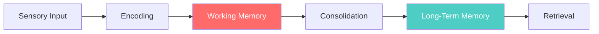
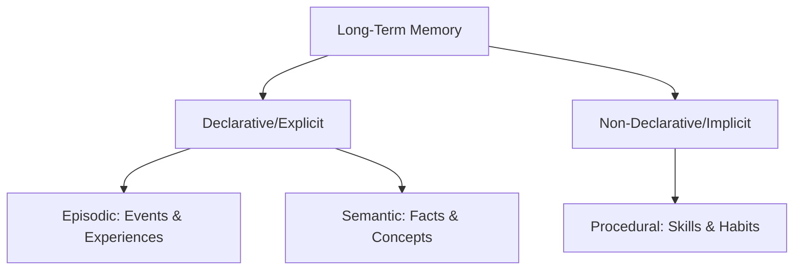
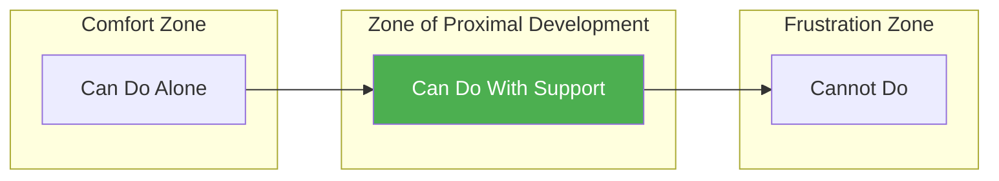
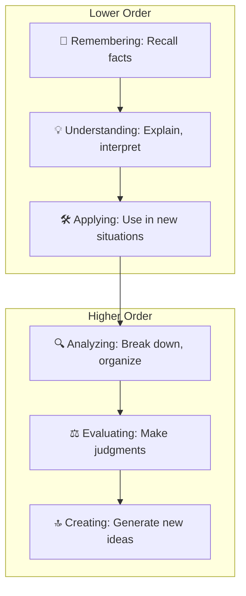
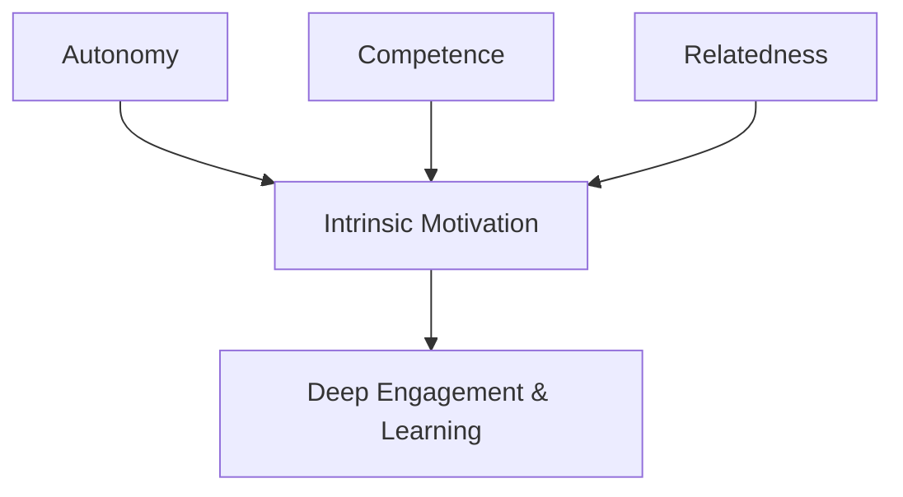
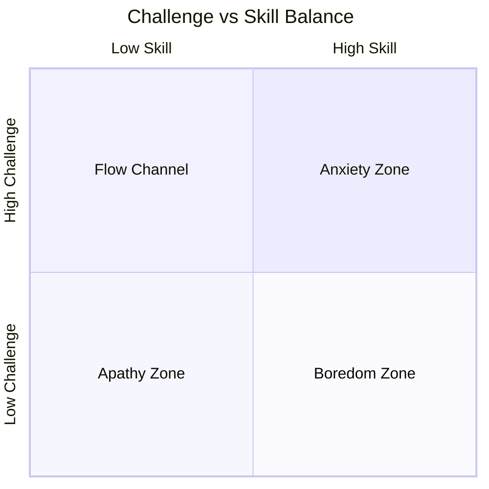
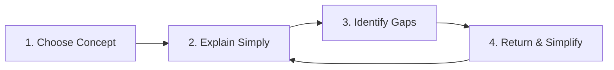
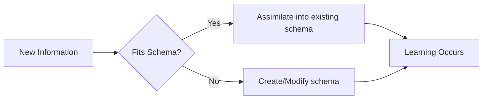
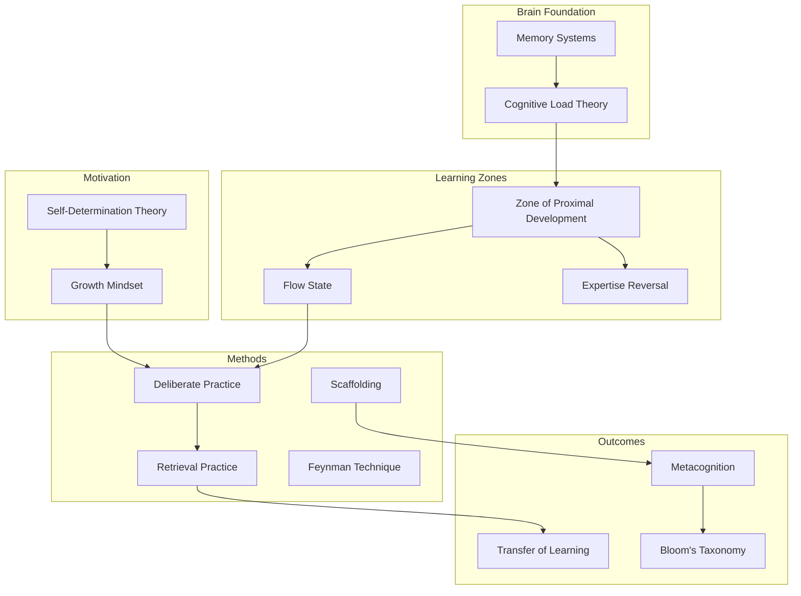

# The Science of Teaching Beginners: Deep Research Guide

> A comprehensive synthesis of interconnected theories, research, and best practices for effective teaching and learning.

---

## 🧠 Part 1: How the Brain Learns

### Memory Systems

Memory is the foundation of all learning. Understanding how it works is essential for effective teaching.

| Memory Type | Capacity | Duration | Role in Learning |
|-------------|----------|----------|------------------|
| **Working Memory** | 3-7 items | 20-30 seconds | Active processing, manipulation |
| **Long-Term Memory** | Unlimited | Permanent | Storage of knowledge & skills |

**Key Brain Structures:**
- **Hippocampus** — Converts experiences into memories
- **Prefrontal Cortex** — Maintains working memory, attention control
- **Synaptic Plasticity** — Strengthens connections through repeated use (LTP)

> [!IMPORTANT]
> **Sleep consolidates learning.** During deep sleep, the brain replays and transfers new information from hippocampus to cortex.

---

### Types of Long-Term Memory

---

## 🧩 Part 2: Core Teaching Frameworks

### Cognitive Load Theory (John Sweller)

The brain's working memory is limited. Teaching must manage three types of load:

| Load Type | Description | Teaching Strategy |
|-----------|-------------|-------------------|
| **Intrinsic** | Inherent difficulty of material | Break into smaller chunks |
| **Extraneous** | Poor instructional design | Remove distractions, integrate info |
| **Germane** | Productive effort building schemas | Encourage connections & elaboration |

**The Expertise Reversal Effect:**
> What helps beginners can HURT experts. Worked examples are great for novices but redundant for experts, causing cognitive overload.

| Learner Level | Optimal Instruction |
|---------------|---------------------|
| **Novice** | Worked examples, step-by-step guidance |
| **Intermediate** | Partial examples, guided practice |
| **Expert** | Open problems, minimal guidance |

---

### Zone of Proximal Development (Vygotsky)

Learning happens in the "sweet spot" between what learners can do alone and what they cannot do even with help.

**Scaffolding Model: "I Do, We Do, You Do"**
1. **I Do** — Teacher demonstrates, thinks aloud
2. **We Do** — Collaborative practice with support
3. **You Do** — Independent practice with faded support

---

### Bloom's Taxonomy (Revised)

A hierarchy of cognitive skills from simple to complex:

> [!TIP]
> For beginners, start at the bottom (remembering, understanding) before moving up. Don't skip levels!

---

## 🎯 Part 3: Motivation & Mindset

### Self-Determination Theory (Deci & Ryan)

Intrinsic motivation requires three basic psychological needs:

| Need | Description | How to Foster |
|------|-------------|---------------|
| **Autonomy** | Feeling in control of choices | Offer options, explain "why" |
| **Competence** | Feeling effective and capable | Optimal challenge, clear feedback |
| **Relatedness** | Feeling connected to others | Collaborative work, supportive environment |

---

### Growth Mindset (Carol Dweck)

| Fixed Mindset | Growth Mindset |
|---------------|----------------|
| Intelligence is static | Intelligence can be developed |
| Avoids challenges | Embraces challenges |
| Gives up easily | Persists through setbacks |
| Sees effort as fruitless | Sees effort as path to mastery |
| Ignores feedback | Learns from criticism |
| Threatened by others' success | Inspired by others' success |

**Teaching Implications:**
- Praise **effort and strategy**, not just intelligence
- Frame mistakes as **learning opportunities**
- Use "yet" language: "You don't understand it *yet*"
- Model your own learning struggles

> [!WARNING]
> Growth mindset is NOT just about effort—it's about **strategic effort** linked to effective learning strategies.

---

### Flow State (Csikszentmihalyi)

Optimal experience occurs when challenge matches skill:

**Flow Conditions:**
- ✅ Clear goals
- ✅ Immediate feedback  
- ✅ Challenge slightly exceeds current skill
- ✅ Full concentration
- ✅ Intrinsic reward

---

## 🔧 Part 4: Effective Learning Strategies

### Retrieval Practice & Spaced Repetition

From **"Make It Stick"** research:

| Strategy | What It Is | Why It Works |
|----------|------------|--------------|
| **Retrieval Practice** | Self-testing, recalling from memory | Strengthens memory pathways |
| **Spaced Repetition** | Review at increasing intervals | Prevents forgetting, builds durability |
| **Interleaving** | Mix different topics/problems | Improves discrimination & transfer |
| **Elaboration** | Connect to prior knowledge | Deepens understanding |
| **Generation** | Try to solve before being taught | Primes brain for learning |

> [!NOTE]
> **Desirable Difficulties:** Learning that feels hard is more effective long-term. Easy fluency often creates "illusion of knowing."

---

### The Feynman Technique

A powerful method for deep understanding:

**The Rule:** If you can't explain something simply, you don't understand it well enough.

---

### Deliberate Practice (Anders Ericsson)

Not all practice is equal:

| Naïve Practice | Deliberate Practice |
|----------------|---------------------|
| Mindless repetition | Purposeful with clear goals |
| Comfort zone | Edge of current abilities |
| No feedback | Immediate, specific feedback |
| Passive | Full concentration required |
| Whole task focus | Break down into components |

---

## 🧭 Part 5: Metacognition & Transfer

### Metacognition: Learning to Learn

"Thinking about thinking" — awareness and regulation of one's own learning.

**Three Components:**
1. **Planning** — Setting goals, choosing strategies
2. **Monitoring** — Tracking comprehension, identifying confusion
3. **Evaluating** — Assessing effectiveness, adjusting approach

> [!TIP]
> Metacognitive strategies can add **7-8 months of extra learning progress** per year.

---

### Transfer of Learning

Applying knowledge from one context to another:

| Type | Description | Example |
|------|-------------|---------|
| **Near Transfer** | Similar contexts, high overlap | Google Sheets → Excel |
| **Far Transfer** | Dissimilar contexts, low overlap | Economics theory → Non-profit management |

**How to Promote Transfer:**
- Emphasize **underlying principles** over surface features
- Provide **varied practice** with different contexts
- Encourage **metacognition** about when to apply knowledge
- Design **real-world relevant** tasks

---

### Constructivism (Piaget)

Learners actively construct knowledge, not passively receive it.

**Key Processes:**
- **Assimilation** — Fitting new info into existing mental frameworks (schemas)
- **Accommodation** — Modifying schemas when new info doesn't fit

**Teaching Implications:**
- Activate **prior knowledge** before new content
- Create **cognitive conflict** to prompt accommodation
- Use **hands-on exploration** and discovery
- Teacher as **facilitator**, not just lecturer

---

## 🔗 Part 6: How Everything Connects

---

## 📚 Essential Reading List

| Book | Author(s) | Focus |
|------|-----------|-------|
| *Make It Stick* | Brown, Roediger, McDaniel | Science of learning |
| *Mindset* | Carol Dweck | Growth vs fixed mindset |
| *Peak* | Anders Ericsson | Deliberate practice |
| *Flow* | Mihaly Csikszentmihalyi | Optimal experience |
| *The Adult Learner* | Malcolm Knowles | Adult learning theory |
| *Why Don't Students Like School?* | Daniel Willingham | Cognitive science for teachers |
| *Design for How People Learn* | Julie Dirksen | Instructional design |
| *Thinking, Fast and Slow* | Daniel Kahneman | Cognitive biases |

---

## ⚡ Quick Reference: 15 Principles for Teaching Beginners

1. **Manage cognitive load** — Small chunks, remove distractions
2. **Teach in the ZPD** — Challenging but achievable with support
3. **Use scaffolding** — I Do, We Do, You Do
4. **Start with worked examples** — Fade as expertise grows
5. **Foster growth mindset** — Praise effort and strategy
6. **Support autonomy, competence, relatedness** — Intrinsic motivation
7. **Create flow conditions** — Match challenge to skill
8. **Use retrieval practice** — Testing beats rereading
9. **Space learning out** — Distributed practice
10. **Interleave topics** — Mix it up
11. **Teach the Feynman way** — Explain simply, find gaps
12. **Build metacognition** — Teach them how to learn
13. **Connect to prior knowledge** — Activate schemas
14. **Design for transfer** — Vary contexts, emphasize principles
15. **Embrace productive struggle** — Difficulty is good

---

## 🔬 Key Researchers & Sources

| Researcher | Contribution |
|------------|--------------|
| **John Sweller** | Cognitive Load Theory |
| **Lev Vygotsky** | Zone of Proximal Development |
| **Jean Piaget** | Constructivism, Schema Theory |
| **Carol Dweck** | Growth Mindset |
| **Anders Ericsson** | Deliberate Practice |
| **Mihaly Csikszentmihalyi** | Flow State |
| **Edward Deci & Richard Ryan** | Self-Determination Theory |
| **Benjamin Bloom** | Bloom's Taxonomy |
| **Henry Roediger & Mark McDaniel** | Retrieval Practice, Make It Stick |
| **Richard Feynman** | Feynman Technique |

---

> **The Big Picture:** Effective teaching integrates understanding of how memory works, managing cognitive load, keeping learners in their zone of proximal development, fostering intrinsic motivation through autonomy and growth mindset, and using evidence-based strategies like retrieval practice and spaced repetition. The goal is to develop not just knowledge, but metacognitive skills that enable lifelong learning.
