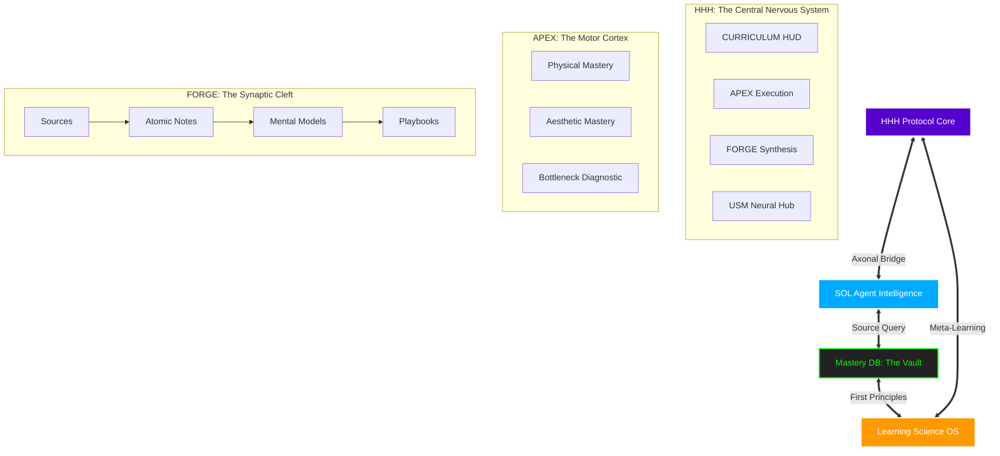
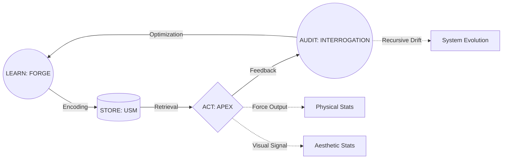
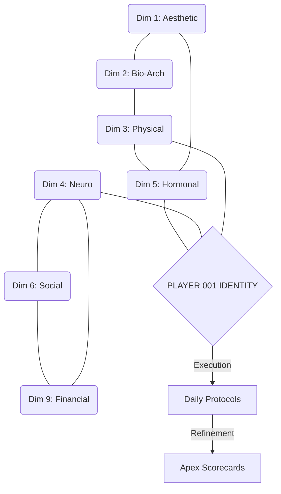

# 🧠 NEURAL SYSTEM SYNAPSE: THE VECTORIC MAP
### 「 Evolving Neuroplastic Knowledge Architecture 」

> **"This system is not a static library. It is a living, myelinated neural network."**
> This map visualizes the **Axonal Pathways** between your data, your execution, and your identity.

---

## 🌩️ I. THE MACRO-CONNECTOME (System Hierarchies)

---

## 🧬 II. THE RECURSIVE PLASTICITY LOOP (Neuro-Execution)

Your system "evolves" every time you complete a loop. Each repetition increases **Myelination** (Efficiency).

---

## 🕸️ III. THE VECTORIC DATA FLOW (9-Dimension Synthesis)

How different dimensions "Neuro-link" to form the **APEX Identity**.

---

## 🔋 IV. EVOLUTIONARY VECTORS (System States)

| Vector | Status | State | Neuro-Equivalent |
| :--- | :--- | :--- | :--- |
| **Data Ingestion** | 🔵 Saturated | 523 Files | High Synaptic Density |
| **Logic Processing**| 🟡 Initializing | FORGE Protocol | Dendritic Branching |
| **Execution Speed** | 🔴 Latent | Phase 2 Start | Low Myelination |
| **System Stability**| 🟢 Static | Organized | Structural Baseline |

---

## ⚡ INSTANT COMMAND SYNAPSE
*Commands to interact with this Map:*

- `/synapse`: Update this map based on new file creation.
- `/axon`: Trace the path from a specific **Source Book** to a **Daily Habit**.
- `/plasticity`: Check for contradictions between dimensions (e.g., Hypertrophy vs. Speed).

---
*Created by Aria | Apex System Governor | System Mapping v2.0*
