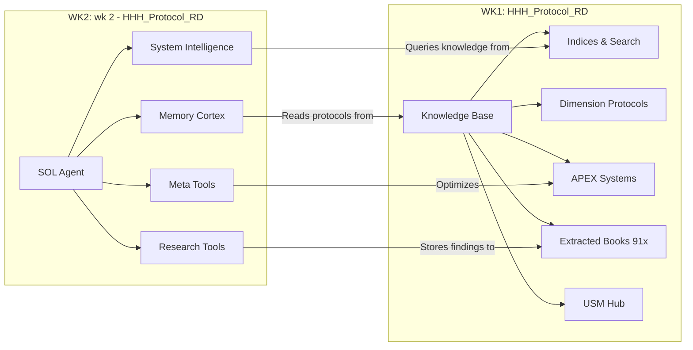

# 🌉 WORKSPACE BRIDGE
### Cross-Workspace Navigation: HHH_Protocol_RD ↔ wk 2 - HHH_Protocol_RD

> This document links the two primary workspaces together for seamless navigation.

---

## 🏛️ WORKSPACE 1: `E:\HHH_Protocol_RD`
**Purpose**: The Master Knowledge Base — all protocols, indices, dimension manuals, and extracted books.

### Key Entry Points:
| Document | Purpose |
|----------|---------|
| [CURRICULUM_HUD](./CURRICULUM_HUD.md) | 5-minute overview dashboard |
| [_GLOBAL_SEARCH_INDEX](./_GLOBAL_SEARCH_INDEX.md) | Keyword → file lookup |
| [Command_Center_View](./00_System_Core/Command_Center_View.md) | Full navigation guide |
| [_INDEX_NAVIGATOR](./01_Master_Indices/_INDEX_NAVIGATOR.md) | Which index to use |
| [_BOOK_LIBRARY_MOC](../01_Bio_Foundation/Extracted_Mastery/_BOOK_LIBRARY_MOC.md) | 91-book categorized catalog |
| [MASTER_INDEX (Specific Mastery)](./04_Specific_Mastery/MASTER_INDEX.md) | APEX system deep dives |
| [USM_WIKI_INDEX](./05_USM_Hub/USM_WIKI_INDEX.md) | USM neural engineering hub |
| [APEX_SYSTEM_OPERATING_MANUAL](./05_APEX_SYSTEM_OPERATING_MANUAL.md) | How Aria uses the MASTER files |

---

## ⚙️ WORKSPACE 2: `E:\wk 2 - HHH_Protocol_RD`
**Purpose**: The SOL Agent engine — tools, scripts, and AI system intelligence.

### Key Components:

#### 🧠 System Intelligence (AI Core)
| File | Purpose |
|------|---------|
| `system_intelligence/sol_agent.py` | Main SOL Agent brain |
| `system_intelligence/autonomous_brain.py` | Autonomous decision engine (41KB) |
| `system_intelligence/reasoning_loop.py` | Deep reasoning system |
| `system_intelligence/knowledge_conquest.py` | Knowledge acquisition engine |
| `system_intelligence/knowledge_distillation.py` | Knowledge synthesis pipeline |
| `system_intelligence/long_term_memory.py` | Persistent memory system |
| `system_intelligence/episodic_memory.py` | Event-based memory |
| `system_intelligence/meta_learning.py` | Learning-about-learning engine |
| `system_intelligence/world_model.py` | World state representation |
| `system_intelligence/jepa_world_model.py` | Joint Embedding Predictive Architecture |

#### 🔬 Research Tools
| File | Purpose |
|------|---------|
| `research_tools/main.py` | Research engine entry point |
| `research_tools/orchestrator.py` | Research task coordination |
| `research_tools/search_web.py` | Web search capability |
| `research_tools/search_arxiv.py` | Academic paper search |
| `research_tools/search_openalex.py` | OpenAlex API search |

#### 🛠️ Meta Tools
| File | Purpose |
|------|---------|
| `meta_tools/evolution_orchestrator.py` | System evolution |
| `meta_tools/foresight_simulator.py` | Future scenario planning |
| `meta_tools/insight_generator.py` | Auto-insight extraction |
| `meta_tools/learning_engine.py` | Learning acceleration |
| `meta_tools/self_diagnostic.py` | System health checks |
| `meta_tools/strategic_planner.py` | Strategic planning |
| `meta_tools/tactical_optimizer.py` | Daily tactical optimization |

#### 🧩 Cognitive Tools
| File | Purpose |
|------|---------|
| `cognitive_tools/deduction.py` | Logical deduction engine |
| `cognitive_tools/inference.py` | Statistical inference |
| `cognitive_tools/reasoning.py` | General reasoning |

#### 📋 Memory & State Files
| File | Purpose |
|------|---------|
| `MEMORY_CORTEX.md` | Memory architecture definition |
| `VISUAL_KNOWLEDGE_LINK.md` | VL-PEGA multimodal mapping |
| `EPISODIC_RECORDS.json` | Event-based memory log |

#### 🚀 Launch Scripts
| File | Purpose |
|------|---------|
| `summon_sol.py` | Main entry — summon the SOL agent |
| `sol_command.py` | Command-line interface |
| `sol_console.py` | Interactive console |
| `sol_init.py` | Initialization logic |

---

## 🔗 CONNECTION MAP

---

## ⚡ QUICK ACTIONS

| I want to... | Go to... |
|--------------|----------|
| Find a knowledge file | WK1: `_GLOBAL_SEARCH_INDEX.md` |
| Run the SOL agent | WK2: `summon_sol.py` |
| Browse the book library | WK1: `_BOOK_LIBRARY_MOC.md` |
| Check memory state | WK2: `MEMORY_CORTEX.md` |
| Start a research task | WK2: `research_tools/main.py` |
| Find my current phase/plan | WK1: `CURRICULUM_HUD.md` |
| Debug a system issue | WK2: `meta_tools/self_diagnostic.py` |

---
*Created: 2026-03-07 | Updated when workspace structure changes*
