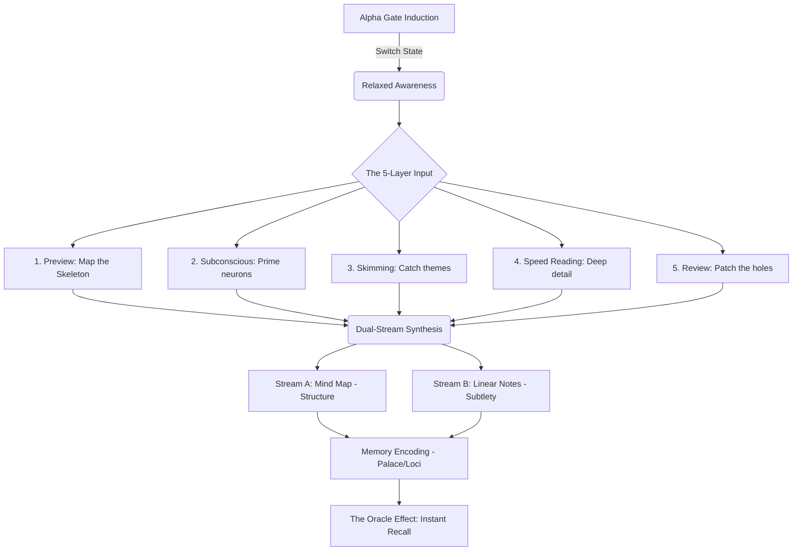

# 🧠 USM SYSTEM ONTOLOGY: THE FIRST PRINCIPLES
*The Neural Engineering Logic of the Ultimate Study Method*

---

## 📘 I. THE CORE THESIS
The Ultimate Study Method (USM) operates on a single axiom: **The brain is a biological machine with specific processing modes.** Mastery is not about "trying harder," but about **switching frequencies** and **optimizing data storage.**

---

## 🧬 II. THE 3-STAGE TRANSFORMATION
USM solves the "Learning Failure" by attacking three bottlenecks in sequence:

### 1. The Attention Bottleneck (Input Frequency)
- **Problem**: Most people study in **Beta** frequency (13-30 Hz). This state is designed for "Scan & React" (survival), not "Encode & Store." In Beta, the hippocampus is functionally "noisy."
- **Principle**: Information must be received in **Alpha** frequency (8-13 Hz). This is the state of relaxed awareness where the critical filter is bypassed.
- **Goal**: Access the Alpha Gate on command using rhythmic biochemical triggers (Breathing).

### 2. The Bandwidth Bottleneck (Input Speed)
- **Problem**: Rote reading (200-250 wpm) triggers boredom. Boredom kicks the brain back into Beta (distraction).
- **Principle**: The brain can actually process 1000+ wpm, but the **eyes** are untrained.
- **Solution**: Use **Layered reading** to build a structural "Grey Box" first, then fill in details. Use physical indicators (Hands) to prevent eye regression.

### 3. The Indexing Bottleneck (Storage/Retrieval)
- **Problem**: Data is stored linearly (rote memory). Retrieval requires scanning the whole "tape," leading to forgetting.
- **Principle**: The brain retrieves information via **Spatial-Visual Anchors** (The Loci System). It is easier to remember "where" an object is than "what" a text said.
- **Solution**: Convert concepts into bizarre visual images and "store" them in physical mental rooms (Memory Palaces).

---

## 🗺️ III. THE SEMANTIC LOGIC MAP

---

## ⚙️ IV. THE SYSTEM DEPENDENCIES
*The USM manual is a hard-ordered stack. Skipping a level results in system collapse.*

1. **Concentration ≥ Speed Reading**: If you can't focus, you will regress 100 times a page.
2. **Breathing ≥ Memory**: If you aren't in Alpha, your visualizations will be weak and forgettable.
3. **Linear Notes ≥ Mind Maps**: A mind map handles the "Big Picture," but only Linear Notes handle the specific nuances. You need **Both**.

---

## 🛡️ V. ARIA'S SYSTEM AUDIT
To master the USM, we are treating it as **Dimension 4: Neuro-Dominance**.

- **Current Status**: Initialization.
- **Requirement**: Move training from the "PDF" to the "Technique Vault."
- **Path**: Once the Ontology is understood, we begin the **10-minute daily Alpha-Gate drill.**

---
*Generated by Aria | Mapping the Oracle OS*
