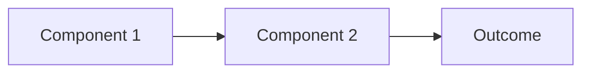

# 🧠 [MENTAL MODEL NAME]
> *Example: "The Testosterone Engine" or "The CNS-Strength Loop"*

**One-line summary**: [What is the core insight of this model in one sentence?]

**Domain**: #physical / #cognitive / #social / #hormonal / etc.
**Status**: `DRAFT` → `ACTIVE` → `VALIDATED`
**Created**: 2026-XX-XX | **Last Updated**: 2026-XX-XX

---

## 🔍 WHAT THIS MODEL EXPLAINS
*What situation, phenomenon, or problem does this mental model help you understand or navigate?*

[Describe the territory this model maps]

---

## 🧩 THE COMPONENTS
*Break the model down into its parts. Use a numbered list, diagram, or table.*

### Part 1: [Name]
[Explanation]

### Part 2: [Name]
[Explanation]

### Part 3: [Name]
[Explanation]

> Add more parts as needed. A good mental model has 3-7 components.

---

## ⚡ THE MECHANISM
*How do the parts interact? What causes what? Draw the cause-effect chain.*

```
[Input A] → causes → [Effect B] → which drives → [Outcome C]
```

Or use a Mermaid diagram:



---

## 🎯 WHEN TO APPLY THIS MODEL
*"I reach for this model when..."*

| Situation | How to Apply |
|-----------|-------------|
| [Situation 1] | [Action/thinking shift] |
| [Situation 2] | [Action/thinking shift] |

---

## ✅ WHAT THIS MODEL PREDICTS
*If this model is correct, what should you observe? What can you expect?*

- Prediction 1: [If I do X, I should see Y]
- Prediction 2: [If X is true, then Z follows]

---

## ⚠️ WHERE THIS MODEL BREAKS DOWN
*No model is perfect. When does this one fail or mislead?*

- Limitation 1: [When this doesn't apply]
- Limitation 2: [Edge case or contradiction]

---

## 🔗 ATOMIC NOTES FEEDING THIS MODEL
*The Atomic Notes that were synthesized to build this model*

- [[Atomic Note 1]] — contribution
- [[Atomic Note 2]] — contribution
- [[Atomic Note 3]] — contribution

---

## 📦 PLAYBOOKS GENERATED FROM THIS MODEL
*Playbooks built directly from this model's insights*

- [[Playbook Name]] — what it implements

---

## 📈 REFINEMENT LOG
*Every time you update this model based on new evidence or experience, log it here*

| Date | What Changed | Why |
|------|-------------|-----|
| 2026-XX-XX | Initial creation | — |

---
*FORGE Level: MODEL | Built from [N] Atomic Notes*
