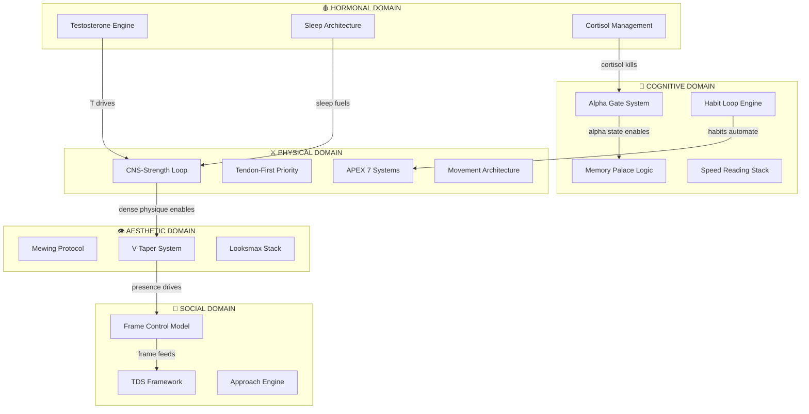

# 🕸️ FORGE CONCEPT MAP
### The Master Web — Everything Connected

> This file is the **nervous system** of FORGE.
> Every Mental Model and Atomic Note cluster appears here.
> Update this whenever a new Model is created.

---

## 🗺️ THE MASTER MAP

> 🛠️ **Edit this diagram as you build new Mental Models.**
> Add nodes for each new Model. Add edges for connections you discover.

---

## 📋 MODEL REGISTRY

| # | Mental Model | Domain | Status | Atomic Notes | Playbooks |
|---|-------------|--------|--------|-------------|----------|
| 1 | [Model name] | — | `DRAFT` | 0 | 0 |

> ➕ Add each new Mental Model here as you create it.

---

## 🔗 KEY CROSS-DOMAIN CONNECTIONS

*These are the most powerful insights — where one domain directly reinforces another.*

| Connection | Mechanism | Strength |
|-----------|-----------|---------|
| Sleep → Testosterone | Deep sleep = GH pulse = T production | ⭐⭐⭐ |
| Alpha State → Memory | Low cortisol = hippocampus encodes better | ⭐⭐⭐ |
| Physical Training → Confidence | Dense physique changes neurotransmitter baseline | ⭐⭐ |
| Habit Loop → All Domains | Kernel-level automation frees conscious RAM | ⭐⭐⭐ |

> Add new connections as you discover them through FORGE.

---

## 🏝️ ISOLATED NOTES (Not Yet Connected)
*Atomic Notes that don't yet link to anything — flag these for synthesis*

- [ ] [Note name] — needs connection to [domain]

---
*Updated: 2026-03-07 | Grows with every forged source*
