# 🌌 OMNI-SYSTEM INTEGRATION ARCHITECTURE: THE COMPLETE INSIGHTS DOSSIER
### *A Systems Engineering Analysis of Sol's Full-Stack Human Operating System and the CQ Mythos AI Exocortex*

> **"Data without implementation is just noise. Systems are the conversion of noise into signal."**  
> **Status:** Active Reference Ledger | **Version:** 5.0 (Omni-Integrated) | **Author:** Antigravity & Aria System Intelligence

---

## 🗺️ 1. GLOBAL WORKSPACE CARTOGRAPHY

The overall R&D Workspace (`C:\Master db\R&D workspace`) is structured as a **multi-week modular transformation pipeline**, designed to progressively build the physical body, cognitive mind, financial base, and autonomous AI exocortex.

```mermaid
graph TD
    %% Styling
    classDef default fill:#111,stroke:#333,stroke-width:1px,color:#eee;
    classDef system fill:#1a1c2e,stroke:#4a5cf8,stroke-width:2px,color:#fff;
    classDef cognitive fill:#1f122b,stroke:#a855f7,stroke-width:2px,color:#fff;
    classDef career fill:#0e241c,stroke:#10b981,stroke-width:2px,color:#fff;

    %% Nodes
    Root["C:\Master db\R&D workspace"]:::system
    
    Wk1["wk 1-Learning science<br>(The Cognitive OS)"]:::cognitive
    Wk2["wk 2 - HHH_Protocol_RD<br>(The Biological & Physical Chassis)"]:::default
    Wk3["wk 3 - Make financial streams<br>(The Financial Engine)"]:::default
    Wk4["wk 4 - characters and powers<br>(Gamification & Archetypes)"]:::cognitive
    Wk5["wk 5 - Book and Mastery<br>(The Raw Library & FORGE Extraction)"]:::default
    Wk6["wk 6 - Aptitude<br>(Placement Quants & DSA)"]:::career
    Wk7["Wk 7 - Carrier mastery and R&D<br>(DAST Scanner & Resume Mastery)"]:::career
    Wk8["wk 8 - knowledge base<br>(Deep Memory Vaults)"]:::default
    
    NEW["NEW<br>(CQ Mythos & OpenMythos)"]:::system
    SYS["SYSTEM<br>(R1-style GRPO Reasoning OS)"]:::system

    %% Connections
    Root --> Wk1
    Root --> Wk2
    Root --> Wk3
    Root --> Wk4
    Root --> Wk5
    Root --> Wk6
    Root --> Wk7
    Root --> Wk8
    Root --> NEW
    Root --> SYS
```



### Folder Registry & Strategic Roles

| Folder Directory | Functional Layer | Strategic Objective | Primary High-Value Assets |
| :--- | :--- | :--- | :--- |
| **`wk 1-Learning science`** | Layer 3: Operating System | Cognitive expansion, Super Memory, and Speed Reading. | Master Learning Protocols, Triadic Dominance Files. |
| [wk 2 - HHH_Protocol_RD](file:///c:/Master%20%20db/R&D%20workspace/wk%202%20-%20HHH_Protocol_RD) | Layers 0, 1, 2, 4, 5, 6 | Core biological resets, physical conditioning, and habit engineering. | `PLAYER_001_IDENTITY_MODEL.md`, `Human_System_Architecture.md`, `APEX DOC.md`. |
| [wk 3 - Make financial streams](file:///c:/Master%20%20db/R&D%20workspace/wk%203%20-%20Make%20financial%20streams) | Layer 6: Applications (Fin) | Dimension 9: Financial Arsenal. Wealth and income engineering. | `Clawdbot Meaning Clarification.md` |
| [wk 4 - characters and powers](file:///c:/Master%20%20db/R&D%20workspace/wk%204%20-%20characters%20and%20powers) | Layer 3: Operating System (Psych) | Detached system-first psychology, character gamification, and TDS integration. | `Kiyotaka_Ayanokoji_Analysis.md`, `Person Systems Breakdown (1).md`. |
| [wk 5 - Book and Mastery](file:///c:/Master%20%20db/R&D%20workspace/wk%205%20-%20Book%20and%20Mastery) | Layer 7: Cloud Storage | Unprocessed source libraries (Baumeister, Greene) and VAHN dashboard adapters. | `The 48 Laws of Power.md`, `vahn_integration_bridge.py`. |
| [wk 6 - Aptitude](file:///c:/Master%20%20db/R&D%20workspace/wk%206%20-%20Aptitude) | Layer 6: Applications (Prep) | Quantitative placement aptitude coaching and mock assessments. | `Cube__40Quants.pdf`, `Qube Mock Quants.pdf`. |
| [Wk 7 - Carrier mastery and R&D](file:///c:/Master%20%20db/R&D%20workspace/Wk%207%20-%20Carrier%20mastery%20and%20R&D) | Layer 5: Software (Career) | Programming DSA/SQL, stealth DAST security utilities, and academic writing. | `stealth_loop.py`, `generate_conference_paper_v22.py`, `Python with DSA`. |
| **`wk 8 - knowledge base`** | Layer 7: Cloud Storage | Deep archives and persistent Mind Palace indexing structures. | Local Second Brain, SQLite stores. |
| [NEW](file:///c:/Master%20%20db/R&D%20workspace/NEW) | Layers 8 & 10: APIs & Security | Speculative Recurrent-Depth OpenMythos model and Multi-Agent Council interfaces. | `cq_mythos_council.py`, `cq_mythos_web.py`, `SYSTEM_INSIGHTS_LOG.md`. |
| **`SYSTEM`** | Layer 10: Security (AI OS) | DeepSeek R1-style GRPO reinforcement learning loop and reasoning pipeline. | `reasoning_loop.py`, `self_play_evolution.py`. |

---

## 🦅 2. THE FULL-STACK HUMAN OPERATING SYSTEM (HHH PROTOCOL)

The **HHH (Human-Hormones-Habits / Height-Looks-Hormones) Protocol** frames human transformation not as a series of motivational tricks, but as a rigid **10-layer systems engineering stack** combined with a **6-Dimensional Architecture**.

### 💻 The 10-Layer Human Transformation Stack

```
┌────────────────────────────────────────────────────────────────────────┐
│  LAYER 10: SECURITY (Defense Systems - Shields, Frame, Env Design)     │
├────────────────────────────────────────────────────────────────────────┤
│  LAYER 9: NETWORK (Social Mesh & Status - Mentors, Peers, TDS)         │
├────────────────────────────────────────────────────────────────────────┤
│  LAYER 8: WEB SERVICES (External Tools - Aria, Claude, Search APIs)    │
├────────────────────────────────────────────────────────────────────────┤
│  LAYER 7: CLOUD STORAGE (External Memory - Obsidian, SQLite Palaces)   │
├────────────────────────────────────────────────────────────────────────┤
│  LAYER 6: APPLICATIONS (Domain-Specific Mastery - Looksmax, Placements)│
├────────────────────────────────────────────────────────────────────────┤
│  LAYER 5: SOFTWARE (Learned Skills - CC Big Six, Speed Reading)        │
├────────────────────────────────────────────────────────────────────────┤
│  LAYER 4: KERNEL (Automated Habits - Mewing, 06:00 Circadian Reset)    │
├────────────────────────────────────────────────────────────────────────┤
│  LAYER 3: OPERATING SYSTEM (The Conscious Mind - USM Alpha-State)      │
├────────────────────────────────────────────────────────────────────────┤
│  LAYER 2: BIOS (Pre-Boot Biochemistry - Testosterone, Lipid Loading)   │
├────────────────────────────────────────────────────────────────────────┤
│  LAYER 1: FIRMWARE (Epigenetics - Environmental Switches, Fasting)     │
├────────────────────────────────────────────────────────────────────────┤
│  LAYER 0: HARDWARE (The Biological Chassis - Bones, CNS Myelination)   │
└────────────────────────────────────────────────────────────────────────┘
```

### 🧬 The 6-Dimensional Transformation Architecture

```
                 D1: Aesthetic Dominance (Forward Maxilla, V-Taper)
                                     ▲
                                    ╱ ╲
           D6: Social Dynamics (TDS)   D2: Biomechanical Arch (Height)
                    │                             │
                    │       [SOL 1.0 CORE]        │
                    │                             │
           D5: Hormonal (1000ng/dL T)  D3: Physical Supremacy (Relative Strength)
                                    ╲ ╱
                                     ▼
                  D4: Neuro-Dominance (USM Memory Palaces)
```

### 🛠️ Core Execution Methodologies

#### 1. The FORGE Knowledge Funnel
Every piece of raw knowledge (books, research papers) must pass through the FORGE funnel to achieve implementation parity:
$$\text{Raw Source} \xrightarrow{\text{Extract}} \text{Atomic Notes} \xrightarrow{\text{Visualize}} \text{Vivid Images} \xrightarrow{\text{Loci}} \text{Memory Palace} \xrightarrow{\text{Action}} \text{Daily Playbook}$$

#### 2. The USM (Universal Speed Memory) Scaling
The conscious mind is expanded by allocating physical "rooms" inside a persistent Memory Palace:
* **Palacio 1: The Bedroom** (Stations 1-10) — Allocated: HHH System Architecture.
* **Palacio 2: The Kitchen** (Stations 11-20) — Unlocking: Biological & Hormonal Data.
* **Palacio 3: The Gym** (Stations 21-30) — Unlocking: Physical & Tendon Mechanics.
* **Palacio 4: The Street** (Stations 31-40) — Locked: Social Dynamics.

#### 3. Joint Alignment & Tendon Hardening (Dimension 2 & 3)
* **Tendon Hardening (Convict Conditioning)**: Utilizing a slow 2-1-2 tempo (2s eccentric, 1s isometric hold, 2s concentric) to build extreme joint integrity and tendon stiffness. Muscle mass is suppressed in favor of **Relative Strength** (Force-to-Bodyweight ratio).
* **Wolff's Law Bone Remodeling**: Microfracture bone loading combined with spinal decompression (daily dead hangs and inversions) to optimize vertical posture and skeletal geometry.
* **Mobility Reboot (Active Phase 0)**: Reclaiming core range of motion through daily joint mobilization prior to implementing heavy resistance protocols.

#### 4. Hormonal BIOS Overclocking (Dimension 5)
* **Lipid Loading**: Consuming $>30\%$ of daily calories from healthy saturated/monounsaturated fats (whole eggs, grass-fed beef, butter) to fuel raw cholesterol-based testosterone synthesis.
* **Zero Plastics & Material Audit**: Relentless elimination of BPA/phthalate-leaching plastics. Transitioning active wardrobe to 100% natural fibers (cotton, wool, silk) to prevent microplastic-induced endocrine disruption.
* **Circadian Resets**: Direct natural sunlight exposure within 30 minutes of waking to trigger the master suprachiasmatic nucleus (SCN) timer, stabilizing melatonin-cortisol curves.

---

## 🤖 3. THE CQ MYTHOS MULTI-AGENT COGNITIVE EXOCORTEX

Developed under the `NEW` subdirectory, the **CQ Mythos (OpenMythos)** system serves as an on-device, multi-agent AI exocortex. It provides Sol with private, high-reasoning capabilities tailored to consumer-grade laptop constraints.

### 🏛️ The Tri-Partite Organism Model

```
                MIND (Aria - E: Drive)
            - Consciousness & Deep Memory
            - GRPO Reinforcement Loop
            - Knowledge Distillation
                     ▲       ▲
                     │       │ (Sync Protocols)
                     ▼       ▼
 BRIDGE (Antigravity) <-----> BODY (Vahn - C: Drive)
 - CLI & Global Syncs          - Action & UI Core
 - IDE Integrations            - Streamlit Dashboards
 - AST Structural Graphs       - Habit Matrices & Journals
```

### 🧠 CQ Mythos Suite Architectural Breakdown

```
┌────────────────────────────────────────────────────────────────────────┐
│                              CQ MYTHOS WEB                             │
│                  (Glassmorphic Dark UI - Port 38888)                   │
├────────────────────────────────────────────────────────────────────────┤
│                           CQ MYTHOS COUNCIL                            │
│           (Researcher ⇆ Planner ⇆ Critic Multi-Agent Debate)           │
├────────────────────────────────────────────────────────────────────────┤
│                       CQ MYTHOS MCP / SEARCH WEB                       │
│             (Stdio Transport Server & Regex Web Scraper)               │
├────────────────────────────────────────────────────────────────────────┤
│                     CQ MYTHOS JEPA / CQ MYTHOS MEM                     │
│         (JEPA Latent Planning & SQLite Episodic Memory Search)         │
├────────────────────────────────────────────────────────────────────────┤
│                            OPENMYTHOS CORE                             │
│          (Recurrent Depth weights, MLA Attention, ACT Halting)         │
└────────────────────────────────────────────────────────────────────────┘
```

#### 1. OpenMythos Core (`cq_mythos_v2.py`)
* **Weight-Sharing Recyclic Transformer**: Shares weights recursively across Transformer layers to achieve the compositional capacity of a dense 2.0B model while using only ~237MB VRAM.
* **Multi-Latent Attention (MLA)**: Utilizes a highly compressed Key-Value (KV) cache bottleneck to drastically reduce memory usage during long context windows.
* **Adaptive Computation Time (ACT)**: Implements hidden mental iterations (up to T=16) prior to token decoding. Harder problems (e.g., quantitative logic, complex algorithms) undergo deep reasoning passes, while easy tasks halt early, visualizing sigmoidal confidence curves.

#### 2. JEPA World Model (`cq_mythos_jepa.py`)
* **Non-Generative Predictive Architecture**: Simulates prospective paths and plan outcomes in abstract, multi-dimensional latent space rather than generating expensive textual tokens.
* **Episodic Self-Play Reinforcement**: Runs internal self-play simulations to test goals against physical hardware constraints, passing optimized prompt anchors directly into the recurrent core.

#### 3. CQ Mythos Mem (`cq_mythos_mem.py`)
* **Episodic Memory Database**: Deploys a persistent, local SQLite database (`claude-mem`) to log chronological conversation contexts and metrics across system restarts.
* **Semantic Workspace Graphing (`graphify`)**: Maps file AST (Abstract Syntax Tree) relationships into a local vector-like graph, enabling the agent to locate imports and structural dependencies on-device.

#### 4. CQ Mythos Council (`cq_mythos_council.py`)
* **Multi-Agent Consensus Engine**: Orchestrates a roles-based debate (Researcher, Planner, Critic) using Karpathy's `llm-council` pattern. 
* **Thermal & Physical Guardrails**: The Critic agent audits plans against SSD limits, VRAM headroom, and GPU thermal states (derived from the **Lenovo LOQ Technical Dossier**) before allowing a consensus vote.

#### 5. Model Context Protocol Server (`cq_mythos_mcp.py`)
* **Stdio Transport**: Natively exposes the local recurrent models, episodic memory queries, and JEPA simulations as standardized MCP tools.
* **Zero-Dependency Web Scraper (`search_web`)**: Integrates a zero-dependency regex-based web fetcher, allowing CQ Mythos to gather live data during recurrent passes without third-party API dependencies.

#### 6. CQ Mythos Web UI (`cq_mythos_web.py`)
* **Glassmorphic Console**: Deploys a responsive, dark-mode glassmorphic control center on port `38888`. Provides an interactive interface for model queries, council debates, web searches, and real-time ACT convergence monitoring.

---

## 🎭 4. THE ARCHETYPE & PHILOSOPHICAL CORE

Sol's transformation architecture leverages dark psychology, shounen philosophy, and high-strategy archetypes to gamify identity, eliminating decision fatigue.

### ♟️ Kiyotaka Ayanokoji (*Classroom of the Elite*) — The Detached Strategist
* **Core Principle**: Systems over feelings. Treating life as a massive chessboard where every action is a calculated move toward structural dominance.
* **Application**: Deep-level compartmentalization, emotional regulation, and non-reactive frame control under social pressure (TDS).

### 👹 Fang Yuan (*Reverend Insanity*) — The Relentless Goal-Seeker
* **Core Principle**: Absolute pragmatism. Utilizing every resource, failure, setback, and interaction solely as data to fuel the core transformation. Absolute disregard for superficial social validation.
* **Application**: Relentless daily execution, unyielding discipline, and strategic patience during long "sleeper build" phases.

### ⚔️ Sung Jin-Woo (*Solo Leveling*) — The Silent Leveling Apex
* **Core Principle**: Incremental, daily growth from nothing. Developing a "sleeper build" that hides immense, dense, functional capability beneath clean, fitted clothing.
* **Application**: Daily quest adherence, incremental progressive overload, and moving in complete silence before striking with precision.

### 📜 Robert Greene & Niccolò Machiavelli — Strategic Realism
* **Core Principle**: Human interaction operates on power dynamics and evolutionary signaling. 
* **Application**: Active study of social psychology, micro-expressions, persuasion, and the Triadic Dominance System (TDS) to establish authentic presence without being naive.

---

## ⚡ 5. STRATEGIC INSIGHTS FOR FUTURE REFERENCE

### 🧠 I. Verbal CoT vs. Hidden Latent Reasoning
Cloud models like DeepSeek-R1 output hundreds of expensive verbal reasoning tokens, which can clutter contexts. CQ Mythos' **recurrent ACT loops** prove that true reasoning can occur **silently within hidden latent space layers** before decoding. For local edge systems, hidden recurrence is the most token-efficient way to execute deep logical deduction.

### 🦾 II. Tendon Stiffness Over Sarcoplasmic Bulk
Traditional "gym-bro" hypertrophy protocols prioritize muscle fluid volume (size) over muscle density, which reduces relative strength. By focusing on **slow eccentric isometrics (Convict Conditioning)** and **fascia elastic recoil (pogos, jump rope)**, Sol optimizes for power-to-weight ratio. This matches the agile "Assassin" physique archetype.

### 💻 III. Hardware-Aware Resource Scaling
High-reasoning local AI requires exact hardware integration. By utilizing the **Lenovo LOQ Technical Dossier** (RTX 3050 6GB, 16GB RAM) as an active exocortex, the system dynamically scales batch sizes and GGUF quantization levels. This prevents local out-of-memory (OOM) failures while maintaining maximum reasoning depth on-device.

### 🔄 IV. The Infinite Self-Supervised Loop
The ultimate destination of the Omni-System is a **continuous feedback loop** where Sol's daily habit logs (`JOURNAL.md`) are fed directly into the episodic memory database (`cq_mythos_mem.py`). The multi-agent council (`cq_mythos_council.py`) audits these logs weekly, updating character stat sheets and dynamically adjusting the difficulty and parameters of the daily protocols. This creates a self-correcting, fully automated path to mastery.

---

> [!IMPORTANT]
> **OPERATIONAL INSTRUCTION FOR FUTURE RUNS**  
> When initiating a new R&D sprint, always load [LIFESTYLE_IMPLEMENTATION_COMMAND.md](file:///c:/Master%20%20db/R&D%20workspace/wk%202%20-%20HHH_Protocol_RD/02_PROTOCOLS/LIFESTYLE_IMPLEMENTATION_COMMAND.md) to review active daily habit rocks, and query [cq_mythos_console.py](file:///c:/Master%20%20db/R%20and%20D%20workspace/NEW/cq_mythos_console.py) to launch the localized multi-agent cognitive exocortex.

---
*Dossier compiled successfully under ARIA Operating Rules v5.0 | All Paths Verified | System Standing By.*
