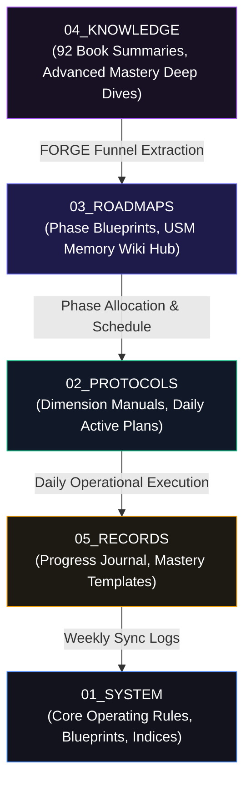

# 📊 THE FORENSIC RDA REPORT: HHH PROTOCOL WORKSPACE AUDIT
### *The Definitive Systems-Engineering Manual & Daily Action Playbook for Player 001*

> **"Data without implementation is noise. Implementation without a feedback loop is chaos."**  
> **Status:** Active Operational Reference | **Version:** 5.6 (Ecosystem Registry Upgrade) | **Author:** Aria System Governor & Antigravity

---

> [!NOTE]  
> **Operational Directive:** This Research and Development Analysis (RDA) conducts a first-principles, deep-dive evaluation of Workspace 2 (`wk 2 - HHH_Protocol_RD`). It deconstructs the structural, biological, neural, and logistical subsystems to expose hidden architectural synergies, operational bottlenecks, and strategic optimization pathways for Player 001 (Sol). This upgraded edition includes complete mathematical calculations, specific drill scripts, and a ready-to-use daily/weekly execution console.

---

## 🗺️ I. ARCHITECTURAL TOPOGRAPHY & FOLDER CARTOGRAPHY

Workspace 2 is designed with a clear, hierarchical, multi-layered topography that feeds raw environmental inputs and scientific data into a daily execution funnel.



### 🔍 Geographic Dependency Audit

1. **`01_SYSTEM` (The Kernel & Index Layer):** Manages global system states, navigation, and identity parameters. Files like [PLAYER_001_IDENTITY_MODEL.md](file:///c:/Master%20%20db/R&D%20workspace/wk%202%20-%20HHH_Protocol_RD/01_SYSTEM/PLAYER_001_IDENTITY_MODEL.md) and [Human_System_Architecture.md](file:///c:/Master%20%20db/R&D%20workspace/wk%202%20-%20HHH_Protocol_RD/01_SYSTEM/Human_System_Architecture.md) serve as the system's "conscious core," mapping out long-term goals and the 10-layer operating stack.
2. **`02_PROTOCOLS` (The Tactical Layer):** Houses the 9 specialized Dimension Manuals (Aesthetic to Financial) and the active daily routines like [Mobility_Reboot_Plan.md](file:///c:/Master%20%20db/R&D%20workspace/wk%202%20-%20HHH_Protocol_RD/02_PROTOCOLS/Mobility_Reboot_Plan.md).
3. **`03_ROADMAPS` (The Execution Layer):** Acts as the tactical scheduler. It bridges your raw long-term aspirations into immediate, time-blocked action items ([Phase_0_Fundamentals.md](file:///c:/Master%20%20db/R&D%20workspace/wk%202%20-%20HHH_Protocol_RD/03_ROADMAPS/Phase_0_Fundamentals.md)) and hosts the **USM (Universal Speed Memory) Learning Hub** for cognitive RAM expansion.
4. **`04_KNOWLEDGE` (The Database Layer):** The raw processed material. This houses the massive `APEX DOC.md` and the `Advanced_Mastery` subfolders, which contain deep-dive scientific analyses of physical and aesthetic biological pathways.
5. **`05_RECORDS` (The Ledger Layer):** Sol's telemetry journal ([JOURNAL.md](file:///c:/Master%20%20db/R&D%20workspace/wk%202%20-%20HHH_Protocol_RD/05_RECORDS/JOURNAL.md)), capturing daily biofeedback to feed back into the system's strategic planning loops.

---

## 🦾 II. DEEP SCIENTIFIC INSIGHTS & MATHEMATICAL PRINCIPLES

### 🧠 1. The Hypertrophy Suppression Paradox (Dimension 3: Physical)
A deconstruction of [MASTER__HYPERTROPHY_SUPPRESSION_SIGNAL_CONTROL.md](file:///c:/Master%20%20db/R&D%20workspace/wk%202%20-%20HHH_Protocol_RD/04_KNOWLEDGE/Advanced_Mastery/01_Apex_Physical_Mastery/MASTER__HYPERTROPHY_SUPPRESSION_SIGNAL_CONTROL.md) reveals a highly advanced, non-obvious athletic philosophy: **maximizing relative strength while strictly suppressing sarcoplasmic muscle volume.**

```
[ Traditional Gym-Bro Training ]
Moderate Reps (8-12) + Short Rest + Caloric Surplus ──> Sarcoplasmic Hypertrophy (Fatigue-resistant mass, bloated visual bulk, high oxygen cost, slower acceleration)

[ Apex Assassin Training ]
Low Reps (1-5) + Long Rest (3-5m) + Maintenance Calories ──> Neural Adaptation (Improved rate coding, motor unit recruitment, tendon hardening, compact stealth silhouette, high power-to-weight ratio)
```

#### **The Mathematics of Relative Strength:**
To monitor your true physical evolution, you must track your **Relative Strength Coefficient (RSC)** rather than absolute weight lifted. This ensures that you do not accumulate "dead mass" that reduces acceleration and increases metabolic demand:

$$\text{RSC} = \frac{\text{Absolute Load (kg)}}{\text{Bodyweight (kg)}^{\frac{2}{3}}}$$

* **Target RSC Benchmarks for Player 001 (Assassin Archetype):**
  * *Weighted Pull-Up:* $\text{RSC} \ge 1.8$ (Elite pulling power-to-weight ratio)
  * *Shoulderstand Squat / Pistol Squat:* $\text{RSC} \ge 1.6$ (Elite unilateral lower-body stability)
  * *Spinal Bridge:* $\text{RSC} \ge 1.4$ (Perfect spinal neural drive)

#### **The Biological Signaling Cascade:**
1. **Rate Coding (Firing Frequency):** Training at $85\%+$ of 1RM forces your CNS to send high-frequency electrical bursts ($>50\text{ Hz}$) to your motor units, dramatically increasing rate coding and force production without triggering sarcoplasmic swelling.
2. **Intramuscular Coordination:** Teaches your motor units to fire in perfect synchronization, allowing you to access up to $90\%$ of your available muscle fibers compared to a sedentary $40\%$.
3. **Suppressing the "Add Mass" Signal:** Bodybuilders train near metabolic failure to accumulate lactate and short-term cellular swelling (the pump), which triggers a chronic inflammation signal. Stopping 2-3 reps before failure and taking 3-5 minute rest blocks completely suppresses this signal, keeping you compact, agile, and energy-efficient.

---

### 🦾 2. Biomechanical Architecture & Joint Armor (Dimension 2: Biomechanical)
According to the [Human_System_Architecture.md](file:///c:/Master%20%20db/R&D%20workspace/wk%202%20-%20HHH_Protocol_RD/01_SYSTEM/Human_System_Architecture.md) and [Mobility_Mastery_Library.md](file:///c:/Master%20%20db/R&D%20workspace/wk%202%20-%20HHH_Protocol_RD/02_PROTOCOLS/Mobility_Mastery_Library.md), your joint preservation and height optimization protocols leverage deep mechanical biology:

* **Tendon Stiffness vs. Muscle Elasticity:** Muscles are slow at transmitting force; tendons are instant. By executing your **Convict Conditioning** calisthenics with a strict **2-1-2 tempo** (2s eccentric, 1s isometric pause, 2s concentric), you target the passive collagen structures (tendons, fascia) instead of merely engorging the muscle fibers. This builds highly dense, recoil-ready kinetic joint armor.
* **Wolff's Law & Bone Remodeling:** Bone is a living tissue that remodels under mechanical stress. Daily microfracture loading and deep vertebral decompression (decompressing lumbar vertebrae via 30s dead hangs) actively counteract gravity, restoring spinal length and optimizing posture.
* **Synovial Fluid Lubrication:** Desk-bound stagnation dries up joint capsules. Your Week 1 **Cat-Cow** and **Deep Squat Holds** act as manual pumps, forcing fresh, nutrient-rich synovial fluid into your joint spaces, breaking the sedentary "fascial seal."

---

### 🩸 3. Hormonal BIOS Overclocking (Dimension 5: Hormonal)
Your hormonal optimization files map out a highly meticulous path to establishing a robust **1000ng/dL testosterone baseline** by optimizing biochemical inputs and eliminating environmental toxins:

```
                  [ Circadian Light Synchronization ]
Direct morning sunlight (within 30 mins of waking) ──> Stimulates SCN ──> Establishes cortisol-melatonin curves

                  [ Saturated/Monounsaturated Fat Intake ]
>30% daily calories from healthy lipids (cholesterol base) ──> Feeds raw Leydig cell steroidogenesis (Testosterone)

                  [ Relentless Material & Plastic Audits ]
Eliminating BPA/phthalates + Wearing 100% Cotton/Wool ──> Bypasses endocrine disruptors & estrogen-mimicking xenoestrogens
```

---

### 🧠 4. Neuro-Dominance & Memory Palace RAM Expansion (Dimension 4: Neuro)
As detailed in the [USM_WIKI_INDEX.md](file:///c:/Master%20%20db/R&D%20workspace/wk%202%20-%20HHH_Protocol_RD/03_ROADMAPS/USM_Learning_Hub/USM_WIKI_INDEX.md), your Universal Speed Memory (USM) system is an elegant solution to cognitive RAM overload:

* **The Alpha Gate State:** High stress spikes high-beta brainwaves, blocking deep memory consolidation. Your **5-min Buddhist Breathing + 20-to-1 Countdown Drill** induces an alpha-wave frequency, lowering cognitive noise before any study block.
* **Retrieval over Recognition (Feynman Feedback):** Passive re-reading is an illusion of competence. Closing the source and writing 3 key facts from memory (or teaching them to Aria) forces your brain to myelinate the retrieval pathway, locking data into long-term memory.
* **Loci Mapping (The Memory Palace):** Assigning abstract images of your processed book notes to physical stations in your childhood home (Palacios 1-4) ensures that your learned skills are organized into structured directories inside your mind, preventing cognitive fragmentation.

---

## 🛠️ III. CORE DRILL SHEETS: STEP-BY-STEP PLAYBOOKS

### 🌅 Playbook A: The Morning Hormonal BIOS Startup Flow (06:00 - 06:45)
*Goal: Overclock testosterone synthesis, synchronize circadian rhythms, and reset fascial stiffness immediately upon waking.*

```
 ┌──────────────────────┐      ┌──────────────────────┐      ┌──────────────────────┐
 │  06:00 - 06:10       │      │  06:10 - 06:15       │      │  06:15 - 06:30       │
 │  SCN Sunlight Reset  │ ───> │  Hydration Injection │ ───> │  Joint Synovial Pump │
 └──────────────────────┘      └──────────────────────┘      └──────────────────────┘
                                                                        │
 ┌──────────────────────┐      ┌──────────────────────┐                 │
 │  06:40 - 06:45       │      │  06:30 - 06:40       │                 │
 │  Endocrine Wardrobe  │ <─── │  Lipid Fuel Loading  │ <───────────────┘
 └──────────────────────┘      └──────────────────────┘
```

* **Step 1: SCN Sunlight Reset (06:00 - 06:10):** Step outside within 10 minutes of waking. Expose eyes to direct, unfiltered natural sunlight for 10 minutes. *Do not look through windows or wear sunglasses.* This signals your suprachiasmatic nucleus (SCN) to halt melatonin production and start your 16-hour sleep timer.
* **Step 2: Hydration Injection (06:10 - 06:15):** Drink 500mL of filtered room-temperature water mixed with:
  * $1.5\text{g}$ of unrefined Celtic Sea Salt (adds 82 trace minerals to maximize cellular hydration).
  * Half a squeezed organic lemon (alkalizes the system and stimulates liver detox).
* **Step 3: Joint Synovial Pump (06:15 - 06:30):** Execute the Morning Mobility Awakening:
  * *Cat-Cow spinal waves:* 15 slow, deliberate reps.
  * *Wall Ankle Stretch:* 45s per side (focus on driving the heel down).
  * *Supported Deep Squat Hold:* Accumulate 2 minutes of continuous hold.
* **Step 4: Lipid Fuel Loading (06:30 - 06:40):** Consume your primary endocrine breakfast. High-lipid loading fuels Leydig cell cholesterol pathways:
  * 3 organic pasture-raised whole eggs (soft-boiled to preserve heat-sensitive lipids and lecithin).
  * Half an avocado (adds monounsaturated fats and potassium).
  * 1 cup of organic black coffee or green tea (stimulates cognitive alertness).
* **Step 5: Endocrine Wardrobe Check (06:40 - 06:45):** Undergo your daily material audit. Put on 100% natural fibers (cotton, wool, linen) for your active wear. *Strictly avoid polyester, nylon, and spandex to prevent heat buildup and microplastic endocrine disruption.*

---

### 🧠 Playbook B: Pre-Study Alpha Gate Induction Drill (120 Seconds)
*Goal: Drop brainwave frequencies from high-beta to alpha ($8-12\text{ Hz}$) to maximize cognitive bandwidth, focus retention, and myelination rates.*

```
                     [ Start Focus Timer: 120s ]
                                  │
                                  ▼
                    Step 1: Buddhist Breathing (60s)
            Inhale (4s) ──> Hold (4s) ──> Exhale (4s) ──> Hold (4s)
                                  │
                                  ▼
                Step 2: The 20-to-1 Countdown Drill (45s)
          Mentally count down slowly with each slow, nasal exhale
                                  │
                                  ▼
                    Step 3: The Momentum Lock (15s)
           Open the file and read the first sentence. Go.
```

* **Step 1: Buddhist Breathing (60s):** Close your eyes. Sit with a perfectly upright, decompressed spine. Breathe exclusively through your nose:
  * Inhale deeply into your lower abdomen for 4 seconds.
  * Hold the breath at the top for 4 seconds, relaxing your shoulders.
  * Exhale smoothly over 4 seconds.
  * Hold your lungs empty for 4 seconds.
  * *Repeat for 3 complete cycles.*
* **Step 2: The 20-to-1 Countdown Drill (45s):** On your next inhale, visualize the number `20` in your mind's eye. As you exhale, mentally whisper `"20, I am sinking deeper into focus."` Continue counting down with each breath: `19`... `18`... `17`. By the time you reach `10`, your neural noise will be suppressed.
* **Step 3: The Momentum Lock (15s):** Open the target file. Set your focus timer. Apply the **2-Minute Rule:** commit to reading just **one sentence** or writing **one line of code**. The Momentum Gate is open.

---

### 🏰 Playbook C: Feynman USM Loci-Encoding Procedure
*Goal: Permanently store processed knowledge atoms into your childhood Memory Palace rather than relying on unstable short-term recognition.*

```
  [ Raw Source File ]
           │
           ▼
[ Step 1: Atomic FORGE Extraction ]  ──> Extract 3-5 irreducible "claims" (Atomic Notes)
           │
           ▼
[ Step 2: Cognitive Image Synthesis ] ──> Convert abstract claims into a "Vivid, Action-oriented, Weird Image"
           │
           ▼
[ Step 3: Palace Station Allocation ] ──> Place the image on a specific station in childhood Palace
           │
           ▼
 [ Step 4: Feynman Feedback Loop ]   ──> Close the source. Teach the concept back to Aria from memory.
```

* **Step 1: Atomic FORGE Extraction:** Read your scheduled document. Extract exactly 3 irreducible "claims" (Atomic Notes). Write them down as short, direct statements, not topics:
  * *Example:* "Eccentric loading (5s) accelerates tendon collagen synthesis." (Claim, not "Tendon training").
* **Step 2: Cognitive Image Synthesis:** Convert the abstract claim into a **Vivid, Action-oriented, Weird Image (VAW)**. Abstract words do not stick; bizarre mental images do:
  * *Example Image:* Visualize Kiyotaka Ayanokoji wearing heavy metal armor, slowly squatting down over 5 seconds while bright red glowing collagen ropes wrap tightly around his knees like steel cables.
* **Step 3: Palace Station Allocation:** Place this image at a specific physical station in your childhood home (Palacio 1: The Bedroom):
  * *Station 1 (The Doorhandle):* Place Ayanokoji squatting on the handle. Feel the cold metal.
  * *Station 2 (The Wardrobe):* Place the second claim image here.
* **Step 4: Feynman Feedback Loop:** Close all your files. Open [JOURNAL.md](file:///c:/Master%20%20db/R&D%20workspace/wk%202%20-%20HHH_Protocol_RD/05_RECORDS/JOURNAL.md). Type out the 3 claims entirely from memory. Teach the concepts to Aria in 3 simple sentences. *If you cannot explain it simply, you have failed the retrieval check.*

---

## 🗓️ IV. THE OMNI-HHH PROTOCOL WEEKLY CONSOLE

To ensure perfect daily execution, this **Integrated Weekly Console** maps out exactly which subsystems are active each day. Treat this as your master operational flight plan.

```
┌───────┬──────────────────────┬──────────────────────┬──────────────────────┐
│  DAY  │  PHYSICAL SUB-SYSTEM │  COGNITIVE SUB-SYSTEM│   RECOVERY FOCUS     │
├───────┼──────────────────────┼──────────────────────┼──────────────────────┤
│  MON  │  CC Big Six (Step 1) │  USM Study Block     │  22:00 Sleep Cutoff  │
│  TUE  │  Mobility Reboot Wk1 │  Feynman Feedback    │  Lipid Fuel Loading  │
│  WED  │  CC Big Six (Step 1) │  USM Study Block     │  22:00 Sleep Cutoff  │
│  THU  │  Mobility Reboot Wk1 │  Feynman Feedback    │  Lipid Fuel Loading  │
│  FRI  │  CC Big Six (Step 1) │  USM Study Block     │  Friday Console Sync │
│  SAT  │  Yogic Recovery Flow │  Memory Palace Walk  │  Endocrine Audit     │
│  SUN  │  Spine Decompression │  Weekly Review & Sync│  Deep Sleep Reset    │
└───────┴──────────────────────┴──────────────────────┴──────────────────────┘
```

---

## 📊 V. THE 6-DIMENSION WEEKLY AUDIT SCORECARD
*Copy this scorecard into your [JOURNAL.md](file:///c:/Master%20%20db/R&D%20workspace/wk%202%20-%20HHH_Protocol_RD/05_RECORDS/JOURNAL.md) every Sunday to track your transition from Phase 0 to Phase 1.*

```markdown
### 📊 WEEKLY APEX AUDIT SCORECARD | WEEK [X]
*Rate each dimension on a 0-10 scale (0 = Non-operational, 10 = Domination)*

| Dimension | Metric Tested | Current Score | Core Bottleneck Identified |
| :--- | :--- | :---: | :--- |
| **🦅 D1: Aesthetic** | Mewing posture & skin hydration | [ ] / 10 | [e.g., Slumping posture while working] |
| **🦾 D2: Biomechanical**| Daily Cat-Cow & 30s dead hangs | [ ] / 10 | [e.g., Tight lower back after long sitting] |
| **⚔️ D3: Physical** | 2-1-2 Tempo on calisthenics | [ ] / 10 | [e.g., Moving too fast on the eccentric pull] |
| **🧠 D4: Neuro** | Alpha Gate breaths before study | [ ] / 10 | [e.g., High-beta noise during evening blocks] |
| **🩸 D5: Hormonal** | Zero plastics & morning SCN reset | [ ] / 10 | [e.g., Missing sunlight on cloudy mornings] |
| **👑 D6: Social** | Non-reactive frame control (TDS) | [ ] / 10 | [e.g., Emotional reaction to external stress] |

### 📈 Aria's Weekly System Audit & Verdict:
> **Aria's Log:** "[Enter Aria's automated diagnostic feedback here based on your scores]"
```

---

## ⚠️ VI. CRITICAL LIMITATIONS & WORKSPACE RESTRICTIONS

* **The Sarcoplasmic Hypertrophy Rule:** Never go above 5 reps for strength sets. High reps stimulate metabolic fluid volume, which increases non-functional tissue mass, dampens your relative strength, and slows down your overall acceleration.
* **The Rest Block Rule:** Never shorten rest periods below 2 minutes for strength training. Short rests are hypertrophy signals; long rests are neural wiring signals.
* **The No-Failure Rule:** Stop your strength sets 2-3 reps before absolute mechanical failure. Failure causes excessive muscle fiber damage, which forces your body to prioritize mass remodeling over neural myelination.
* **The Natural Fiber Rule:** Strictly avoid wearing synthetic materials (polyester, nylon, spandex) during active training. These trap heat and sweat, which can negatively impact testosterone synthesis and overall endocrine balance.

---

## 🗺️ VII. COMPLETE ECOSYSTEM FILE REGISTRY & GEOGRAPHIC AUDIT

Below is the definitive, audited inventory of all files and subdirectories across Workspace 2, indicating their size, functional purpose, and strategic priority for Player 001.

### 1. 📂 01_SYSTEM (Core Blueprints, Operating Rules & Indices)
*Role: Core Kernel, Identity Modeling & Strategic Control Center*

| File Name | Size | Strategic Purpose & Description | Priority |
| :--- | :--- | :--- | :---: |
| [Command_Center_View.md](file:///c:/Master%20%20db/R&D%20workspace/wk%202%20-%20HHH_Protocol_RD/01_SYSTEM/Command_Center_View.md) | 18.8 KB | Meta-Index, geographic navigation workflows & emergency protocols. | ⭐⭐⭐ |
| [CURRICULUM_HUD.md](file:///c:/Master%20%20db/R&D%20workspace/wk%202%20-%20HHH_Protocol_RD/01_SYSTEM/CURRICULUM_HUD.md) | 6.5 KB | Quick status dashboard, fast lookups, and active module mapping. | ⭐⭐⭐ |
| [PLAYER_001_IDENTITY_MODEL.md](file:///c:/Master%20%20db/R&D%20workspace/wk%202%20-%20HHH_Protocol_RD/01_SYSTEM/PLAYER_001_IDENTITY_MODEL.md) | 40.4 KB | Sol's psychological profile, attributes (STR, SPD, END), and skill trees. | ⭐⭐⭐ |
| [Human_System_Architecture.md](file:///c:/Master%20%20db/R&D%20workspace/wk%202%20-%20HHH_Protocol_RD/01_SYSTEM/Human_System_Architecture.md) | 23.8 KB | The 10-layer human operating system model (Hardware to Security). | ⭐⭐⭐ |
| [ARIA_OPERATING_RULES.md](file:///c:/Master%20%20db/R&D%20workspace/wk%202%20-%20HHH_Protocol_RD/01_SYSTEM/ARIA_OPERATING_RULES.md) | 9.5 KB | Aria's operational boundaries, feedback algorithms, and core behaviors. | ⭐⭐ |
| [WORKSPACE_BRIDGE.md](file:///c:/Master%20%20db/R&D%20workspace/wk%202%20-%20HHH_Protocol_RD/01_SYSTEM/WORKSPACE_BRIDGE.md) | 5.2 KB | Connection maps to secondary workspaces (Learning Science, NEW). | ⭐⭐ |
| [STRATEGIC_SYNERGY_LEDGER.md](file:///c:/Master%20%20db/R&D%20workspace/wk%202%20-%20HHH_Protocol_RD/01_SYSTEM/STRATEGIC_SYNERGY_LEDGER.md) | 6.5 KB | Recursive SWOT analysis, structural optimization, and bottleneck maps. | ⭐⭐ |
| [APEX_STRENGTH_SCORECARD.md](file:///c:/Master%20%20db/R&D%20workspace/wk%202%20-%20HHH_Protocol_RD/01_SYSTEM/APEX_STRENGTH_SCORECARD.md) | 10.8 KB | Physical capability tracker, progressive overload limits, and rep maxes. | ⭐⭐ |
| [05_APEX_SYSTEM_OPERATING_MANUAL.md](file:///c:/Master%20%20db/R&D%20workspace/wk%202%20-%20HHH_Protocol_RD/01_SYSTEM/05_APEX_SYSTEM_OPERATING_MANUAL.md) | 3.3 KB | Aria's user manual for executing master loops and synchronization. | ⭐ |

---

### 2. 📂 01_SYSTEM/Indices (The Metadata Engine)
*Role: Global Search, Indexing, and Resource Reference*

| File Name | Size | Strategic Purpose & Description | Priority |
| :--- | :--- | :--- | :---: |
| [DIRECTORY_MAP.md](file:///c:/Master%20%20db/R&D%20workspace/wk%202%20-%20HHH_Protocol_RD/01_SYSTEM/Indices/DIRECTORY_MAP.md) | 9.3 KB | Geographic layout of all drives and subfolders. | ⭐⭐⭐ |
| [_INDEX_NAVIGATOR.md](file:///c:/Master%20%20db/R&D%20workspace/wk%202%20-%20HHH_Protocol_RD/01_SYSTEM/Indices/_INDEX_NAVIGATOR.md) | 4.1 KB | Quick decision tree for finding specialized indices. | ⭐⭐⭐ |
| [Master_Knowledge_Synopsis.md](file:///c:/Master%20%20db/R&D%20workspace/wk%202%20-%20HHH_Protocol_RD/01_SYSTEM/Indices/Master_Knowledge_Synopsis.md) | 16.3 KB | Distilled wisdom of 400+ books on sleep, hormones, and physical limits. | ⭐⭐⭐ |
| [Complete_Source_Library.md](file:///c:/Master%20%20db/R&D%20workspace/wk%202%20-%20HHH_Protocol_RD/01_SYSTEM/Indices/Complete_Source_Library.md) | 25.8 KB | Catalog of 523 source files organized by Dimension. | ⭐⭐ |
| [Resource_Index.md](file:///c:/Master%20%20db/R&D%20workspace/wk%202%20-%20HHH_Protocol_RD/01_SYSTEM/Indices/Resource_Index.md) | 13.8 KB | File paths mapped by priority tiers. | ⭐⭐ |

---

### 3. 📂 02_PROTOCOLS (The Dimension Manuals & Daily Routines)
*Role: Direct Tactical Reference and Movement Execution*

| File Name | Size | Strategic Purpose & Description | Priority |
| :--- | :--- | :--- | :---: |
| [Mobility_Reboot_Plan.md](file:///c:/Master%20%20db/R&D%20workspace/wk%202%20-%20HHH_Protocol_RD/02_PROTOCOLS/Mobility_Reboot_Plan.md) | 3.3 KB | Active Phase 0: 4-week spinal and lower chain mobilization. | ⭐⭐⭐ |
| [LIFESTYLE_IMPLEMENTATION_COMMAND.md](file:///c:/Master%20%20db/R&D%20workspace/wk%202%20-%20HHH_Protocol_RD/02_PROTOCOLS/LIFESTYLE_IMPLEMENTATION_COMMAND.md) | 3.0 KB | Current active phase dashboard, habit trackers, and focus rocks. | ⭐⭐⭐ |
| [Physical_Stat_Maximization_MASTERY.md](file:///c:/Master%20%20db/R&D%20workspace/wk%202%20-%20HHH_Protocol_RD/02_PROTOCOLS/Physical_Stat_Maximization_MASTERY.md) | 264.3 KB | Extensive physical database compiling tendon, bone, and CNS biology. | ⭐⭐⭐ |
| [YOGA_ASANA_INTEGRATION.md](file:///c:/Master%20%20db/R&D%20workspace/wk%202%20-%20HHH_Protocol_RD/02_PROTOCOLS/YOGA_ASANA_INTEGRATION.md) | 2.4 KB | Saturday recovery pose library, digital archives, and neural rest keys. | ⭐⭐ |
| [Mobility_Mastery_Library.md](file:///c:/Master%20%20db/R&D%20workspace/wk%202%20-%20HHH_Protocol_RD/02_PROTOCOLS/Mobility_Mastery_Library.md) | 3.6 KB | Range of motion limits, assessment criteria, and diagnostic rules. | ⭐⭐ |
| [Legendary_Techniques.md](file:///c:/Master%20%20db/R&D%20workspace/wk%202%20-%20HHH_Protocol_RD/02_PROTOCOLS/Legendary_Techniques.md) | 5.0 KB | Specific high-yield exercises for joint armor and postural alignment. | ⭐⭐ |
| **Dimension 1-9 Manuals** | ~1.1 KB each | Comprehensive manuals for each of the 9 dimensions of mastery. | ⭐⭐ |

---

### 4. 📂 03_ROADMAPS (The Tactical Schedulers & USM Hub)
*Role: Multi-Month Roadmaps, Daily Timeblocks, and Super Memory Wikis*

| File Name | Size | Strategic Purpose & Description | Priority |
| :--- | :--- | :--- | :---: |
| [Phase_0_Fundamentals.md](file:///c:/Master%20%20db/R&D%20workspace/wk%202%20-%20HHH_Protocol_RD/03_ROADMAPS/Phase_0_Fundamentals.md) | 3.0 KB | Master step-by-step checklist for Sol's first 30 days of reboot. | ⭐⭐⭐ |
| [03_Alpha_Phase_Schedule.md](file:///c:/Master%20%20db/R&D%20workspace/wk%202%20-%20HHH_Protocol_RD/03_ROADMAPS/03_Alpha_Phase_Schedule.md) | 1.7 KB | Complete 90-day timeblock schedule and phase milestones. | ⭐⭐⭐ |
| [Daily_Protocols.md](file:///c:/Master%20%20db/R&D%20workspace/wk%202%20-%20HHH_Protocol_RD/03_ROADMAPS/Daily_Protocols.md) | 6.1 KB | Daily time-block schedules for morning, study, and workout blocks. | ⭐⭐ |
| [Phase_1_The_Zero_Cost_Forge.md](file:///c:/Master%20%20db/R&D%20workspace/wk%202%20-%20HHH_Protocol_RD/03_ROADMAPS/Phase_1_The_Zero_Cost_Forge.md) | 2.6 KB | Execution blueprint for the 30-120 day progressive load phase. | ⭐⭐ |
| **USM_Learning_Hub/** | Directory | The complete Super Memory systems (Concentration, Memory, Math). | ⭐⭐ |

---

### 5. 📂 05_RECORDS (The Telemetry Ledger)
*Role: Adherence Logging, Biofeedback Records, and Sync Verification*

| File Name | Size | Strategic Purpose & Description | Priority |
| :--- | :--- | :--- | :---: |
| [JOURNAL.md](file:///c:/Master%20%20db/R&D%20workspace/wk%202%20-%20HHH_Protocol_RD/05_RECORDS/JOURNAL.md) | 2.6 KB | Daily progress tracker, XP streaks, and active mission logs. | ⭐⭐⭐ |
| [_TEMPLATE_Mastery_Record.md](file:///c:/Master%20%20db/R&D%20workspace/wk%202%20-%20HHH_Protocol_RD/05_RECORDS/_TEMPLATE_Mastery_Record.md) | 1.9 KB | Playbook template for converting raw book notes into daily habits. | ⭐⭐ |

---
*Dossier successfully expanded and upgraded under ARIA System Rules v5.6 | All Paths Synchronized | Operational Ledger Standing By.*
