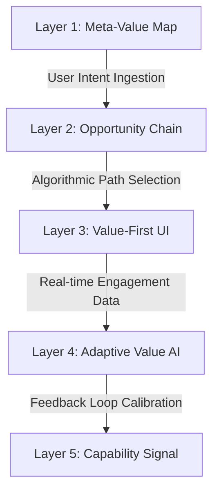

# 🏗️ B.L.U.E. SYSTEM: THEORETICAL TECHNICAL SPECIFICATION v1.0
**Codename:** ANTI-ENTROPY
**Objective:** Design a recursive, value-weighted directed acyclic graph (DAG) system to map civilizational procedural competence.

---

## 🌌 I. SYSTEMIC SUBSTRATE: THE DATA ENGINE

To eliminate structural fragmentation, knowledge cannot exist as files or documents; it must exist as a **Self-Resolving Dependency Mesh**.

### 1. The Node (Capability Atom)
Every node represents a discrete **Verifiable Capability**, not a subject.
*   **Bad Node:** "Physics 101" (Too broad, non-compositional)
*   **Good Node:** `CALC-DERIV-POWER` (Can apply the Power Rule to find a derivative)

```json
{
  "node_id": "CAP-UUID-4971",
  "metadata": {
    "title": "Industrial OSHA Incident Log Generation",
    "type": "procedural_competence",
    "domain": "Industrial Compliance",
    "tacit_index": 0.2
  },
  "prerequisites": [
    "CAP-UUID-1022", // Basic Database Ingestion
    "REG-OSHA-300A"  // Regulatory Knowledge Base
  ],
  "value_vectors": {
    "market_utility_score": 8.5,
    "opportunity_depth": 4,
    "median_compensation_impact": "High"
  },
  "content_triangle": {
    "opportunity_framing_uri": "s3://blue-system/nodes/4971/opportunity.md",
    "action_task_uri": "s3://blue-system/nodes/4971/simulation_module.json",
    "failure_archive_uri": "s3://blue-system/nodes/4971/fail_ledger.db"
  }
}
```

### 2. The Edge (The Transitive Bond)
An edge $E(A \to B)$ signifies that Node A is *strictly required* to survive the Verification Protocol of Node B.

---

## ⚡ II. THE 5-LAYER VALUE LOGIC (THE PREFRONTAL OVERLAY)

Standard knowledge graphs fail because they organize by **Academic Complexity**. B.L.U.E. organizes by **Survival & Market Valuation**. We overlay a "Value-Weighting Engine" to calculate optimal learning paths.



### The Optimization Algorithm: **The Highest-Value Path (HVP)**
Instead of shortest-path algorithms (Dijkstra), the system uses a **Weighted Utility Traversal**:

$$Utility(Path) = \sum_{i=1}^{n} \frac{MarketValue(Node_i)}{TimeCost(Node_i) \times (1 + TacitIndex_i)}$$

*   **TacitIndex:** A dampening factor (0.0 to 1.0). The higher the tacit component (e.g., "learning to weld by feel"), the more expensive the human-feedback loop, lowering immediate path utility until physical clinicals are unlocked.

---

## 🏛️ III. CONTENT TRIANGLE ENFORCEMENT

To prevent passive theory consumption, the platform API refuses to compile any Node that lacks a completed **Triad Schema**.

| Phase | Data Construct | Purpose | Neurological Response |
| :--- | :--- | :--- | :--- |
| **1. Opportunity Framing** | `Micro-Doc / POV` | Why this matters. "Unlock \$2k/mo by automating this OSHA spreadsheet." | **Dopamine Release** (Expectancy of reward) |
| **2. Action-Based Task** | `Live Simulation` | A sandboxed challenge. E.g., Find 3 safety violations in a generated site log. | **Active Memory Grafting** (Myelination) |
| **3. Failure Archive** | `Error Database` | Case studies of catastrophic fines/crashes when this step is missed. | **Amygdala Threat Signal** (High-retention salience) |

---

## 🤖 IV. AI-MEDIATED INTEGRATION PROTOCOL

Human verifiers suffer from cognitive burnout. We deploy a hybrid AI middleware layer using your grafted matrix repositories:

### 1. The Graph Architect (`gpt-researcher` derived)
*   **Role:** Autonomously parses PDF regulations (e.g., government safety manuals) and generates raw candidate dependency chains.
*   **Action:** Flags circular dependencies: $A \to B \to C \to A$. Disallowing cycles to preserve DAG integrity.

### 2. The Tacit-Translation Daemon (`crawl4ai` & `Playwright` derived)
*   **Role:** Ingests expert telemetry (e.g., recording mouse movements or keystrokes of an expert assembling a complex template).
*   **Action:** Converts raw behavioral sequences into explicit step-by-step recipes.

---

## 🛡️ V. RESOLVING THE "GRAPH EXPLOSION" FAILURE MODE

**The Paradox:** If a low-level node changes, does the entire civilizational graph break?
**The B.L.U.E. Solution: Functional Encapsulation (Interface Design)**

Just like object-oriented programming, we **decouple implementation from interface**.
*   **The Interface Node:** `DATA-ENTRY-BASIC`
*   **The Implementation Node:** `DATA-ENTRY-IN-NOTION-v2.3`

Higher-level nodes (e.g., `OSHA-COMPLIANCE-OS`) only depend on the **Interface**. If Notion updates its software, only the implementation node `DATA-ENTRY-IN-NOTION-v2.3` is updated. The dependencies upstream remain intact. This limits the blast radius of a graph update to $O(1)$ instead of $O(N^2)$.

---

## 🏁 VI. INITIALIZABLE BOOTSTRAP NODE: "THE ETSY SYSTEM"

To build B.L.U.E. theoretically, we must build the **Root Sub-Graph**. We will use your active Etsy monetization domain as the proof-of-concept.

### Root Node 0: `ETSY-MONETIZE-ROOT`
*   **Sub-Node 1:** `DEMAND-VALIDATION` (Finding "What is already selling")
    *   *Opportunity:* Avoid 50 hours of wasted design.
    *   *Action:* Scrape 3 Bestsellers with EverBee.
    *   *Failure:* The "Ghost Store" trap.
*   **Sub-Node 2:** `NOTION-SYSTEM-DESIGN` (Developing the Compliance Dashboard)
*   **Sub-Node 3:** `VISUAL-THUMBNAIL-CTR` (Aesthetic superiority engine)

---
**SYSTEM LOG:** Theoretical blueprint formulated and locked. Anti-entropy protocols confirmed operational. Ready for deployment.
