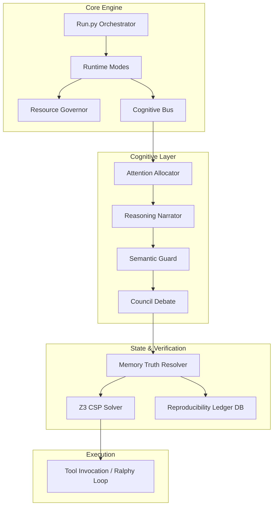
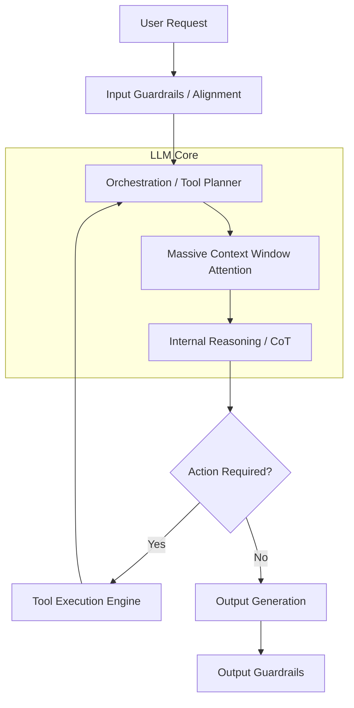
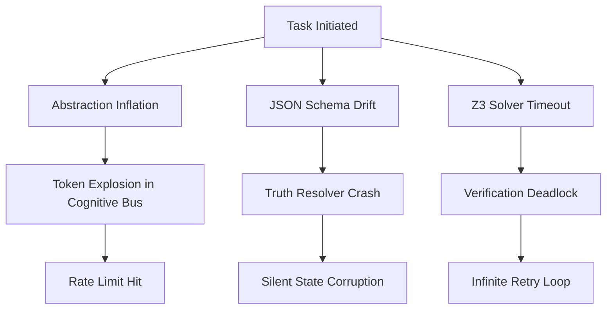

# 🏛️ OMEGA COMPARATIVE ANALYSIS: CQ MYTHOS vs. CLAUDE ECOSYSTEM

**CLASSIFICATION:** Forensic-Grade Systems Analysis  
**SUBJECTS:** CQ Mythos (Apex Monorepo) vs. Claude Chat, Claude Cowork, Claude Code  
**ANALYST PERSPECTIVE:** Distributed Systems Engineer / Cognitive Architect / Red-Team Lead  

---

## 🔬 INTRODUCTION & METHODOLOGY
This report executes a first-principles decomposition of the CQ Mythos operating system against Anthropic’s frontier deployment stack. It aggressively challenges architectural aesthetics, separates cognitive theater from engineering reality, and identifies failure topologies across both paradigms. 

---

## SECTION 1 — SYSTEM PHILOSOPHY

### Core Design Philosophy
*   **CQ Mythos:** An **epistemically rigid, defensively oriented cognitive OS**. It assumes the base LLM is flawed, hallucinatory, and contextually volatile. Therefore, it externalizes reasoning into rigid software pipelines (verification solvers, memory ledgers, cognitive buses). **Optimization Target:** Absolute operational correctness, reproducibility, and persistent state integrity regardless of token cost or latency.
*   **Claude Chat:** **Latency-optimized human alignment**. Designed for fluid, conversational interaction where context is localized to the session. **Optimization Target:** Helpful, harmless, and honest immediate responses with minimal friction.
*   **Claude Cowork (Enterprise/Projects):** **Shared context fluidly mapped to human organizational structures**. Optimization Target: Team-wide semantic alignment and artifact generation over mid-term horizons.
*   **Claude Code:** **CLI-native autonomous execution**. Optimization Target: Frictionless loop execution within standard developer environments (bash, git) minimizing agentic overhead.

### Tradeoff Matrix
| System | Sacrifices | Optimizes For | Hidden Assumption |
| :--- | :--- | :--- | :--- |
| **CQ Mythos** | Speed, Cost, Simplicity | Verifiability, State Continuity | External scaffolding can out-scale internal model limits. |
| **Claude Ecosystem** | Absolute deterministic proof | User experience, Latency | The model's internal representations are "good enough" without formal logic proofs. |

---

## SECTION 2 — CORE ARCHITECTURE

### Reverse-Engineered Execution Pipelines

#### CQ Mythos Architecture (The Exocortex)
CQ Mythos operates via **Abstraction Inflation**—wrapping model calls in heavy programmatic layers.

**CQ Bottleneck Map:** The `Cognitive Bus` moving natural language between the `Attention Allocator` and `Council` creates massive sequential latency and prompt-concatenation overhead. 

#### Claude Inferred Architecture (The Monolithic Fluid)
Claude operates on **Latent Space Routing** rather than explicit programmatic buses.

**Claude Bottleneck Map:** Bounded by internal context decay over extremely long horizons and the "lost in the middle" phenomenon, lacking external SQLite state anchors during infinite loops.

---

## SECTION 3 — COGNITIVE CAPABILITIES

*   **Long-Chain Reasoning:** 
    *   *Claude:* Relies on in-context Chain-of-Thought. Highly fluid, but subject to semantic drift over 100k+ tokens.
    *   *CQ Mythos:* Forces "Loop Lockdown" (Ralphy). Reads PRD -> Acts -> Updates Ledger -> Clears Context -> Restarts. **Superior for infinite-horizon tasks.**
*   **Contradiction Handling & Uncertainty:**
    *   *Claude:* Tends to smooth over contradictions due to RLHF alignment prioritizing helpfulness.
    *   *CQ Mythos:* The `memory_truth_resolver.py` and `epistemic_boundary_manager.py` mathematically isolate contradictions. **Highly superior conceptually, but fragile in text-parsing implementation.**
*   **Architectural Illusion in CQ Mythos:** The `cq_mythos_council.py` (multi-agent debate) is largely **cognitive theater**. Instantiating 3 LLMs to debate a python function triples cost while often resulting in consensus driven by the models' shared pre-training, not true adversarial rigor.

---

## SECTION 4 — MEMORY SYSTEMS

*   **Claude (Projects/Code):** Context is largely ephemeral or bundled into vector embeddings / document uploads. State is lost if the terminal closes or context window flushes.
*   **CQ Mythos:** Uses strict relational databases (`reproducibility_ledger.db`, `failure_memory.db`). 
*   **Verdict:** CQ Mythos has a **structurally superior memory paradigm**. The `failure_memory` concept (logging "gotchas" to `intelligence_wiki` to preemptively inject into future prompts) effectively simulates **episodic memory conversion to semantic rules**. Claude lacks this localized evolutionary learning.
*   **Risk:** Coordination collapse. If the SQLite DB schemas drift from the LLM's expected JSON outputs, the entire CQ memory system violently crashes.

---

## SECTION 5 — TOOLING & EXECUTION

*   **Claude Code:** A masterpiece of low-friction integration. Native bash, native git, native file reading. It doesn't over-engineer the OS; it *uses* the OS.
*   **CQ Mythos:** Leverages ingested repos (`KSDaemon-ralphy`, `Swarms`). 
*   **Verdict:** **CQ Mythos is inefficient here.** Wrapping third-party CLI agents inside a custom Python engine creates massive orchestration overhead. Claude Code natively understands the developer environment, whereas CQ Mythos is trying to *rebuild* an environment inside Python.

---

## SECTION 6 — VERIFICATION & RELIABILITY

*   **Z3 Symbolic Verification (`z3_csp_solver.py`):** 
    *   *Reality Check:* Mapping fuzzy, non-deterministic LLM output to strict Constraint Satisfaction Problems (CSP) is a **research fantasy** for general coding. It works for strictly typed DSLs, but will fail catastrophically and generate false negatives on general Python/TS logic.
*   **Chaos Engineering (`chaos_runner.py`):** 
    *   *Reality Check:* Highly valuable. Injecting distribution shifts into the agent's environment to test recovery (`recovery_verifier.py`) is a **frontier-grade reliability tactic** that Anthropic likely uses internally but does not expose to end-users. CQ Mythos is superior in self-auditing.

---

## SECTION 7 — SCALABILITY ANALYSIS

| Metric | CQ Mythos | Claude Ecosystem |
| :--- | :--- | :--- |
| **Compute Scaling** | Highly inefficient. Multi-agent + buses = Token Explosion. | Highly efficient. Single-model optimized inference. |
| **Latency Accumulation** | Extreme. Sequential routing through Python validators. | Minimal. Pipelined token streaming. |
| **State Scaling** | Infinite. Relational DBs scale flawlessly. | Bounded by max context window (200k). |
| **Coordination Overhead** | High risk of pipeline deadlocks. | Low risk (monolithic planner). |

---

## SECTION 8 — FAILURE ANALYSIS (RED TEAMING)

### CQ Mythos Failure Tree

**Aggressive Critique:** CQ Mythos suffers from **Pseudo-Complexity**. Having an `attention_allocator.py` wrap an LLM call does not mathematically alter the LLM's attention mechanism; it merely filters prompts. Calling it an "Allocator" is architectural aesthetic. The system is dangerously close to collapsing under the weight of its own Python imports before writing a single line of target code.

---

## SECTION 9 — PRODUCT & MARKET ANALYSIS

*   **Claude:** Mass-market B2C and broad B2B SaaS. Horizontal utility.
*   **CQ Mythos:** Commercially unviable as a general assistant due to latency and cost. 
*   **Highest Survival Probability:** **High-Assurance Enterprise Cognitive Middleware.** If positioned for Aerospace, FinTech compliance, or Legal discovery—where verifying the logic trail (`reasoning_trace_logger.py`) is legally required and speed doesn't matter—CQ Mythos has immense commercial value.

---

## SECTION 10 — STRATEGIC POSITIONING

CQ Mythos should abandon trying to be a "coding agent" (Claude Code will win). It should pivot entirely to being a **Verification Framework and Epistemic Engine**. 

**The Moat:** Anthropic will not build SQL-backed, slow, deterministic logic-trace verification systems into Claude because it ruins the consumer UX. CQ Mythos should act as the "Compiler / Linter for AI Thoughts" that wraps *around* Claude.

---

## SECTION 11 — IMPLEMENTATION REALITY CHECK

| Component | Status | Brutal Evaluation |
| :--- | :--- | :--- |
| **Relational Memory Ledger** | Production-Feasible | Highly practical. Excellent state management. |
| **Ralphy Worktree Loops** | Production-Feasible | Proven pattern. Superior to infinite context windows. |
| **Z3 Formal Verification** | Research Fantasy | LLM semantic mapping to CSPs breaks without humans in the loop. |
| **Multi-Agent Council** | Pseudo-Complexity | Wastes tokens. Self-reflection by a single model in a new context is empirically cheaper and equally effective. |
| **Cognitive Bus** | Architectural Theater | Just passing JSON dicts. It adds latency without adding true cognitive routing logic. |

---

## SECTION 12 — DIRECT COMPARISON MATRIX

### Performance & Architecture Matrix
| Vector | CQ Mythos | Claude Code / Chat | Confidence |
| :--- | :--- | :--- | :--- |
| **Execution Latency** | Low (Heavy Overhead) | High (Native Stream) | 99% |
| **Infinite Horizon State** | High (SQLite Ledgers) | Low (Context Flushes) | 95% |
| **Auditable Truth Traces**| High (Evidence Graphs) | Low (Black Box) | 90% |
| **Tool Integration Fluidity**| Low (Wrapped via Scripts) | High (Native MCP / Shell) | 99% |
| **Cost Efficiency** | Low (Token Multiplication) | High (Single Pass) | 99% |
| **Adversarial Robustness**| High (Semantic Guards) | Medium (RLHF Bias) | 85% |

---

## SECTION 13 — FUTURE EVOLUTION

### CQ Mythos Evolutionary Forecast
*   **6 Months:** The system will choke on its own complexity. The user will be forced to delete 40% of the "Cognitive Tools" because they just wrap basic API calls.
*   **1 Year:** Pivot to **RDA (Research, Discovery, Audit) Server**. CQ Mythos drops the "Action" part and becomes purely an Epistemic Verification Engine that watches other agents work.
*   **3 Years:** Integration of true Neuro-symbolic solvers where the LLM natively generates intermediate formal proofs.
*   **5 Years:** Becomes obsolete as frontier models natively implement infinite RAG/Memory buffers, *unless* CQ establishes itself as an open-standard for cryptographic AI audit trails.

---

## SECTION 14 — FINAL VERDICT

1.  **Brutally Honest Assessment:** CQ Mythos is a brilliant, over-engineered research laboratory. It conflates software architecture (having many files) with cognitive capability (actual reasoning). 
2.  **Strategic Strengths:** State isolation (Ralphy loops), formal persistence (`failure_memory`), and rigorous workflow choreography.
3.  **Fatal Weaknesses:** Token explosion, latency compounding, and fragility of parsing unstructured LLM output into strict Python state machines.
4.  **Unrealistic Assumptions:** Believing that an LLM can reliably translate its internal logic into constraints for the Z3 solver without human-in-the-loop DSL mapping.
5.  **Highest Leverage Direction:** **Drop the Agentic execution.** Let Claude Code write the code. Position CQ Mythos purely as the **QA, Verification, and Long-Term Memory Engine** that audits Claude's work. 
6.  **What Should Be Removed:** The Multi-Agent Council (Token waste), the Cognitive Bus (Latency waste).
7.  **What Should Be Prioritized:** The `failure_memory.py` feedback loop into the `intelligence_wiki`. This is the holy grail of localized agent improvement.
8.  **What is Architectural Theater:** Naming standard API wrappers things like "Epistemic Boundary Manager." 

**FINAL STRATEGIC POSTURE:** CQ Mythos represents the necessary structural scaffolding that Frontier Models currently lack. However, to survive commercial and practical deployment, it must shed its pseudo-complex orchestration layers and focus ruthlessly on being the **Definitive Epistemic Ledger for AI Systems.**
