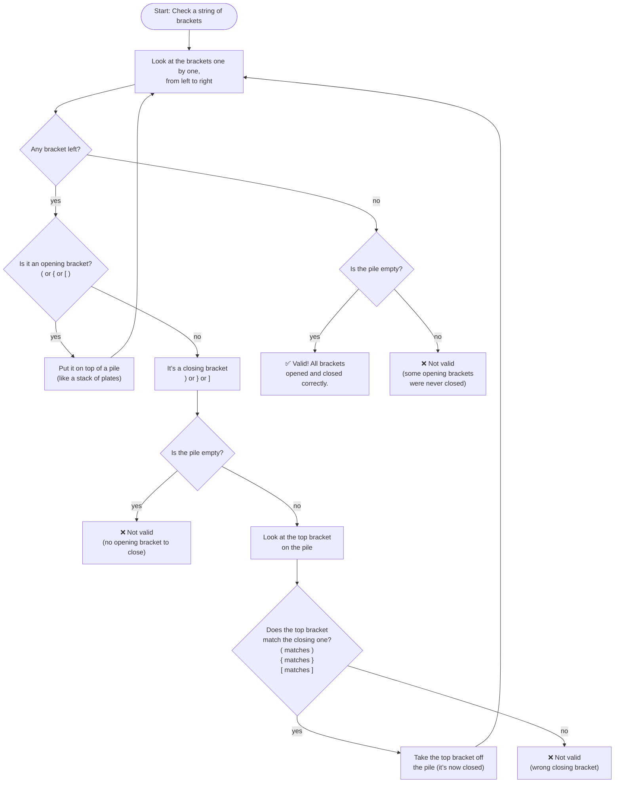
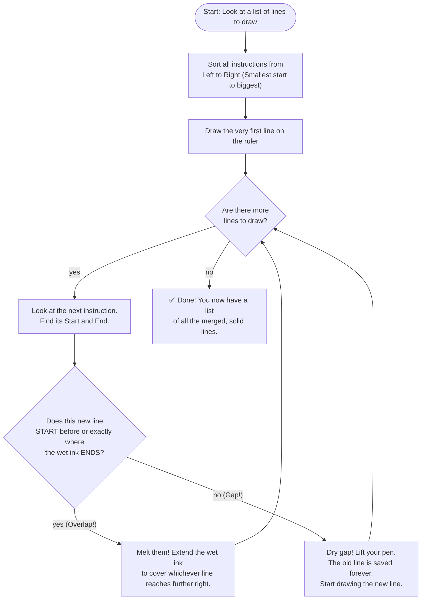

# ⚔️ INFOSYS ROUND 1: HIGH-RIGOR LEARNING PLAYBOOK

### **THE LEARNING PIPELINE**

- **🏁 STEP 1: The Plain English Decryption**
    - *Goal:* Cut through the verbose technical jargon. What exactly is the platform asking for, and what are the absolute boundaries?
- **🧠 STEP 2: The Logical Heartbeat (Core)**
    - *Goal:* Find the underlying math or logical trick that unlocks the problem instantly.
- **📝 STEP 3: The "Paper & Ink" Simulation (No Code)**
    - *Goal:* Imagine this is a physical puzzle sitting on your desk. How would your human brain solve it without using a computer? We identify the manual steps.
- **🐍 STEP 4: Python Toolbox Refresh**
    - *Goal:* Re-learn only the specific Python tools (lists, dictionaries, syntax) required to translate Step 3 into computer language.
- **🚀 STEP 5: The Final Blueprint & Code Build**
    - *Goal:* Construct the optimized code step-by-step and walk through how it executes in memory.

---

## 🧩 MODULE 1: TWO SUM (SINGLE-PASS HASHMAP)

### 🏁 STEP 1: The Plain English Decryption
You have a bag of numbered balls (array `nums`) and a specific `target` number. You need to find **exactly two** balls whose numbers add up to the target, and return their **slot numbers (indices)**.
*   **No Self-Pairing:** You can't use the exact same element twice.
*   **Guaranteed Victory:** Exactly one pair is guaranteed to exist.

### 🧠 STEP 2: The Logical Heartbeat
Instead of addition, think of this as a **Subtraction/Search** problem:
$$\text{Partner} = \text{Target} - \text{Current Value}$$
Holding a card means you know exactly what its complement must look like.

### 📝 STEP 3: The "Paper & Ink" Simulation (No Code)
Imagine cards facedown on a desk. You flip them one by one. You have a notepad.
1.  Flip card.
2.  Calculate the `Partner` you need.
3.  Look at notepad: Is the partner written there?
    *   **NO:** Write down the current card's value and its index. Move to next card.
    *   **YES:** Instantly stop. You win! Grab the partner's index from the notepad and the current index.

### 🐍 STEP 4: Python Toolbox Refresh
*   **`{}` (Dictionary):** Our "Notepad." It stores `Key: Value` pairs. Checking `if X in dict` is instant **O(1) speed**.
*   **`enumerate(nums)`:** A helper that yields both the `index` and the `value` in a single loop pass.

### 🚀 STEP 5: The Final Blueprint & Code Build
```python
def twoSum(nums, target):
    seen_numbers = {} # Value -> Index
    
    for i, num in enumerate(nums):
        partner_needed = target - num
        
        # Instant Win check
        if partner_needed in seen_numbers:
            return [seen_numbers[partner_needed], i]
            
        # Register current
        seen_numbers[num] = i
```
*   **Time Complexity:** $O(N)$ — we read each card exactly once.
*   **Space Complexity:** $O(N)$ — we write up to $N$ entries in the dictionary.

---

## 🧩 MODULE 2: MAXIMUM SUBARRAY (KADANE'S ALGORITHM)

### 🏁 STEP 1: The Plain English Decryption
You are handed an array containing positive and negative numbers. You need to find a **continuous block** (subarray) of numbers that yields the **highest possible sum** when added together, and return just the sum.
*   **Continuous Block:** Cannot skip any numbers within the chosen sequence.

### 🧠 STEP 2: The Logical Heartbeat
The core philosophy: **"If my past makes me poorer, dump it entirely."**
If your current running total drops below **`0`**, it is dead weight. Immediately **reset your running total to zero** and start a fresh block from the next item.

### 📝 STEP 3: The "Paper & Ink" Simulation (No Code)
Stepping on tiles in a game:
*   `Wallet`: Active streak sum.
*   `Record`: Absolute highest wallet value seen so far.
1.  Step on tile $\rightarrow$ Add its value to `Wallet`.
2.  If `Wallet` > `Record` $\rightarrow$ Update `Record`.
3.  If `Wallet` < `0` $\rightarrow$ Reset `Wallet` to `0` (dumping the past).

### 🐍 STEP 4: Python Toolbox Refresh
*   **`-float('inf')` (Negative Infinity):** Essential starting baseline for our `Record` in case all numbers in the list are negative.
*   **Linear Variables:** Simple integer tracking with no complex storage structures.

### 🚀 STEP 5: The Final Blueprint & Code Build
```python
def maxSubArray(nums):
    max_so_far = -float('inf')
    current_max = 0
    
    for x in nums:
        current_max += x
        
        # New record?
        if max_so_far < current_max:
            max_so_far = current_max
            
        # Kadane Reset Rule
        if current_max < 0:
            current_max = 0
            
    return max_so_far
```
*   **Time Complexity:** $O(N)$ — single pass traversal.
*   **Space Complexity:** $O(1)$ — strictly two numbers in memory.


`class Solution:`
    `def maxSubArray(self, nums: List[int]) -> int:`
        `max_so_far = -float('inf')`
        `current_max = 0`

        `for x in nums:`
            `current_max += x`

            `if max_so_far < current_max:`
                `max_so_far = current_max`

            `if current_max < 0:`
                `current_max = 0`

        `return max_so_far`


# **visualization of code execution** 

We'll walk through Kadane's Algorithm step by step, visualizing exactly how the variables evolve. The code solves the classic **Maximum Subarray** problem: find a contiguous subarray within a one-dimensional array of numbers that has the largest sum.

---

## The Algorithm (Kadane’s Algorithm)

```python
def maxSubArray(self, nums: List[int]) -> int:
    max_so_far = -float('inf')   # Best overall sum seen so far
    current_max = 0              # Best sum ending at the current position

    for x in nums:
        current_max += x                     # 1. Extend the current subarray by x

        if max_so_far < current_max:         # 2. Update global maximum if needed
            max_so_far = current_max

        if current_max < 0:                  # 3. Reset if the running sum becomes negative
            current_max = 0

    return max_so_far
```

### Key Idea
- **current_max** tracks the maximum sum of a subarray *ending at the current element*.
- If `current_max` ever drops below 0, we **discard** it (set to 0) because starting fresh from the next element will always yield a larger or equal sum.
- **max_so_far** remembers the highest `current_max` ever achieved.

**Why start max_so_far at -∞?**  
To correctly handle arrays where all numbers are negative. In that case, the best subarray is the single largest element. The reset rule (`current_max = 0`) would otherwise lose that value if we hadn’t captured it before resetting.

---

Now, let’s visualize the execution for each example.

---

## Example 1: `nums = [-2, 1, -3, 4, -1, 2, 1, -5, 4]`

**Initialization:**  
`max_so_far = -∞`  
`current_max = 0`

We trace each iteration:

| Step | `x` | `current_max += x` | `max_so_far` after check | `current_max < 0 ?` → new `current_max` |
|------|-----|--------------------|---------------------------|------------------------------------------|
| 1    | -2  | 0 + (-2) = **-2**  | max(-∞, -2) = **-2**      | -2 < 0 → reset to **0**                  |
| 2    |  1  | 0 + 1 = **1**      | max(-2, 1) = **1**        | 1 ≥ 0 → keep **1**                       |
| 3    | -3  | 1 + (-3) = **-2**  | max(1, -2) = **1**        | -2 < 0 → reset to **0**                  |
| 4    |  4  | 0 + 4 = **4**      | max(1, 4) = **4**         | 4 ≥ 0 → keep **4**                       |
| 5    | -1  | 4 + (-1) = **3**   | max(4, 3) = **4**         | 3 ≥ 0 → keep **3**                       |
| 6    |  2  | 3 + 2 = **5**      | max(4, 5) = **5**         | 5 ≥ 0 → keep **5**                       |
| 7    |  1  | 5 + 1 = **6**      | max(5, 6) = **6**         | 6 ≥ 0 → keep **6**                       |
| 8    | -5  | 6 + (-5) = **1**   | max(6, 1) = **6**         | 1 ≥ 0 → keep **1**                       |
| 9    |  4  | 1 + 4 = **5**      | max(6, 5) = **6**         | 5 ≥ 0 → keep **5**                       |

**Final `max_so_far` = 6**  
(Subarray: [4, -1, 2, 1])

### Visualizing the running sum:
```
Index:   0   1   2   3   4   5   6   7   8
Value:  -2   1  -3   4  -1   2   1  -5   4

current_max (ending at i):
        -2 → 0  (reset)
             1
                -2 → 0  (reset)
                     4
                        3
                           5
                              6
                                 1
                                    5
max_so_far updates: -2 → 1 → (stays) → 4 → (stays) → 5 → 6 → (stays) → (stays)
```

---

## Example 2: `nums = [1]`

**Initialization:**  
`max_so_far = -∞`  
`current_max = 0`

| Step | `x` | `current_max += x` | `max_so_far` after check | `current_max < 0 ?` → new `current_max` |
|------|-----|--------------------|---------------------------|------------------------------------------|
| 1    |  1  | 0 + 1 = **1**      | max(-∞, 1) = **1**        | 1 ≥ 0 → keep **1**                       |

**Final `max_so_far` = 1**

---

## Example 3: `nums = [5, 4, -1, 7, 8]`

**Initialization:**  
`max_so_far = -∞`  
`current_max = 0`

| Step | `x` | `current_max += x` | `max_so_far` after check | `current_max < 0 ?` → new `current_max` |
|------|-----|--------------------|---------------------------|------------------------------------------|
| 1    |  5  | 0 + 5 = **5**      | max(-∞, 5) = **5**        | 5 ≥ 0 → keep **5**                       |
| 2    |  4  | 5 + 4 = **9**      | max(5, 9) = **9**         | 9 ≥ 0 → keep **9**                       |
| 3    | -1  | 9 + (-1) = **8**   | max(9, 8) = **9**         | 8 ≥ 0 → keep **8**                       |
| 4    |  7  | 8 + 7 = **15**     | max(9, 15) = **15**       | 15 ≥ 0 → keep **15**                     |
| 5    |  8  | 15 + 8 = **23**    | max(15, 23) = **23**      | 23 ≥ 0 → keep **23**                     |

**Final `max_so_far` = 23** (the whole array)

---

## Why This Works Perfectly

- **Positive numbers** grow both `current_max` and `max_so_far`.
- **Negative numbers** might be included if they are “worth it” (i.e., the surrounding positives are large enough), otherwise `current_max` is discarded before they drag the sum too low.
- **All-negative arrays** are handled correctly because `max_so_far` captures each element before `current_max` is reset to 0; it ends up holding the maximum single element.

----


## 🧩 MODULE 3: MAXIMUM AVERAGE SUBARRAY I (SLIDING WINDOW)

### 🏁 STEP 1: The Plain English Decryption
You are given a long list of numbers (`nums`) and an integer window size `k`. You must find a **continuous sequence of exactly `k` numbers** that has the largest possible sum (and thus the largest average), and return its average value.
*   **Fixed Length:** The size must be *exactly* `k` numbers.
*   **Contiguous:** You can't skip around; elements must be touching.

### 🧠 STEP 2: The Logical Heartbeat
Rookies recalculate the sum from scratch every time the window moves, taking $O(N \times k)$ operations. 
The elite insight is the **Sliding Window Principle**:
To get the new sum of the window, you only need the **Entering Element** (at the front) and the **Leaving Element** (at the back).
$$\text{New Sum} = \text{Old Sum} + \text{Entering} - \text{Leaving}$$
This reduces the computational cost to a blistering **O(N) speed**.

### 📝 STEP 3: The "Paper & Ink" Simulation (No Code)
*   **Example:** `nums = [1, 12, -5, -6, 50, 3]`, `k = 4`
1.  **Form Initial Window:** Take the first 4 elements: `[1, 12, -5, -6]`.
    *   Sum = `2`. Store this as `Record Sum`.
2.  **Slide Right:**
    *   **Step 1:** Entering = `50` (index 4), Leaving = `1` (index 0).
        *   New Sum = `2 + 50 - 1 = 51`.
        *   `51 > 2`? Yes! `Record Sum` becomes `51`.
    *   **Step 2:** Entering = `3` (index 5), Leaving = `12` (index 1).
        *   New Sum = `51 + 3 - 12 = 42`.
        *   `42 > 51`? No. `Record Sum` stays `51`.
3.  **Calculate Average:** Take final `Record Sum` and divide by `k`: `51 / 4 = 12.75`.

### 🐍 STEP 4: Python Toolbox Refresh
*   **`sum(nums[:k])`:** Python Slicing creates the initial window and sums it.
*   **`for i in range(k, len(nums)):`** The loop starts at index `k` (the first entering element) and slides to the end.
*   **Lookback Pointer (`i - k`):** Calculates the index of the element that just got pushed out the back door.

### 🚀 STEP 5: The Final Blueprint & Code Build
```python
class Solution:
    def findMaxAverage(self, nums: List[int], k: int) -> float:
        # 1. Initialize current sum with first k elements
        current_sum = sum(nums[:k])
        max_sum = current_sum
        
        # 2. Slide down from index k to the end of array
        for i in range(k, len(nums)):
            # Front enters at i, Back leaves at (i - k)
            current_sum += nums[i] - nums[i - k]
            
            # Update highest sum seen
            if current_sum > max_sum:
                max_sum = current_sum
                
        # 3. Return float average
        return max_sum / k
```
---
## 🛠️ DETAILED POINTER & CPU VISUALIZATION (DEEP DIVE)
   
Let's examine how the CPU and memory registers look during each tick of execution for:
**Input:** `nums = [1, 12, -5, -6, 50, 3]`, `k = 4`

### Step-by-Step State Trace:

**Initialization Phase:**
1. Read `nums[:k]` $\rightarrow$ `[1, 12, -5, -6]`
2. Calculate `sum` $\rightarrow$ `2`
3. Set `current_sum = 2`
4. Set `max_sum = 2`

```
[ 1,  12, -5, -6,  50,  3 ]
  ↑            ↑
 Back(0)     Front(3)
```

---

**Loop Tick 1: `i = 4`**
*   **Entering Element:** `nums[4] = 50`
*   **Leaving Element:** `nums[4 - 4] = nums[0] = 1`
*   **Arithmetic Equation:** `2 + 50 - 1 = 51`
*   **State Change:** `current_sum` becomes `51`.
*   **Comparison:** Is `51 > max_sum (2)`? **YES.** `max_sum` updates to `51`.

```
[ 1,  12, -5, -6,  50,  3 ]
      ↑            ↑
     Back(1)     Front(4)
```
*CPU Insight:* Notice the window physically slid right. `1` is left behind, `50` is swallowed.

---

**Loop Tick 2: `i = 5`**
*   **Entering Element:** `nums[5] = 3`
*   **Leaving Element:** `nums[5 - 4] = nums[1] = 12`
*   **Arithmetic Equation:** `51 + 3 - 12 = 42`
*   **State Change:** `current_sum` becomes `42`.
*   **Comparison:** Is `42 > max_sum (51)`? **NO.** `max_sum` remains `51`.

```
[ 1,  12, -5, -6,  50,  3 ]
          ↑            ↑
         Back(2)     Front(5)
```
*CPU Insight:* The loop hits `len(nums)` and terminates.

---

**Final Stage:**
*   Calculate `max_sum / k` $\rightarrow$ `51 / 4 = 12.75`
*   Return `12.75`.

### Why This Design Prevents TLE (Time Limit Exceeded):
*   For $N=100,000$ and $k=20,000$: Brute force requires **1,600,000,000 operations** (fatal).
*   With Sliding Window: You only ever perform **1 addition and 1 subtraction** per step. Total operations $\approx$ **200,000** (milliseconds).

---

## 🧩 MODULE 4: VALID PARENTHESES (STATE-TRANSITION PROOF)

### 🏁 STEP 1: The Mathematical Formulation
Let us formalize the vocabulary of our string evaluation system using Set Theory.

*   Let $\Sigma$ represent the universal alphabet of our input string:
    $$\Sigma = \{ \text{'(', ')', '[', ']', '{', '}'} \}$$
*   We partition $\Sigma$ into two disjoint subsets:
    *   **Openers ($O$):** $O = \{ \text{'(', '[', '{'} \}$
    *   **Closers ($C$):** $C = \{ \text{')', ']', '}' \}$
    *   *Invariant:* $O \cup C = \Sigma$ and $O \cap C = \emptyset$
*   We define a mapping function $f: C \to O$ to pair closers with their appropriate openers:
    $$f(\text{')'}) = \text{'('}, \quad f(\text{']'}) = \text{'['}, \quad f(\text{'}'}) = \text{'{'}$$

### 🧠 STEP 2: The Stack State ($T$)
We represent our memory structure as an ordered sequence (tuple) $T$:
*   Let $T = (t_1, t_2, \dots, t_m)$ represent a stack of depth $m$.
*   **Top Selector:** $\text{top}(T) = t_m$
*   **Push Operator ($\oplus$):** $T \oplus x = (t_1, t_2, \dots, t_m, x)$
*   **Pop Operator ($\ominus$):** $T \ominus \text{top}(T) = (t_1, t_2, \dots, t_{m-1})$

### 📝 STEP 3: Conditional Transition Rules
Let $S = (s_1, s_2, \dots, s_n)$ represent our input sequence of length $n$, and $T_i$ represent the state of the stack at iteration $i$, starting with $T_0 = ()$.

For each index $i$ from $1$ to $n$:

$$\begin{array}{l}
\textbf{if } s_i \in O: \\
\quad T_i = T_{i-1} \oplus s_i \\
\textbf{else if } s_i \in C: \\
\quad \textbf{if } T_{i-1} = (): \\
\quad \quad \text{Halt with System Failure (False)} \\
\quad \textbf{else if } \text{top}(T_{i-1}) = f(s_i): \\
\quad \quad T_i = T_{i-1} \ominus \text{top}(T_{i-1}) \\
\quad \textbf{else}: \\
\quad \quad \text{Halt with System Failure (False)}
\end{array}$$

#### The Final Validation Postulate:
$$S \text{ is Valid} \iff T_n = ()$$

### 🚀 STEP 4: Python Code Engine
```python
def isValid(s: str) -> bool:
    pairs = {")": "(", "}": "{", "]": "["}
    stack = []
    
    for char in s:
        if char not in pairs:  # Equivalent to: char in O
            stack.append(char)
        else:                  # Equivalent to: char in C
            top = stack.pop() if stack else '#'
            if pairs[char] != top:
                return False   # Triggers System Failure
                
    return not stack          # True if T_n == ()
```

---

## 🛠️ ITERATIVE STATE TRANSITION MATRIX

### Case 1: Valid Nesting — $S = \text{"([])"}$ ($n=4$)

| State Step ($i$) | Character ($s_i$) | Predicate Condition | Mathematical Operation | State $T_i$ |
| :--- | :--- | :--- | :--- | :--- |
| **$T_0$** | - | Initial State | - | $()$ |
| **$T_1$** | `'('` | $s_1 \in O$ | $T_0 \oplus \text{'('}$ | $(\text{'('})$ |
| **$T_2$** | `'['` | $s_2 \in O$ | $T_1 \oplus \text{'['}$ | $(\text{'('}, \text{'['})$ |
| **$T_3$** | `']'` | $\text{top}(T_2) = f(s_3)$ | $T_2 \ominus \text{'['}$ | $(\text{'('})$ |
| **$T_4$** | `')'` | $\text{top}(T_3) = f(s_4)$ | $T_3 \ominus \text{'('}$ | $()$ |

*Output: $T_4 = () \rightarrow$ **True***

---

### Case 2: Mismatched Nesting — $S = \text{"([)]"}$ ($n=4$)

| State Step ($i$) | Character ($s_i$) | Predicate Condition | Mathematical Operation | State $T_i$ |
| :--- | :--- | :--- | :--- | :--- |
| **$T_0$** | - | Initial State | - | $()$ |
| **$T_1$** | `'('` | $s_1 \in O$ | $T_0 \oplus \text{'('}$ | $(\text{'('})$ |
| **$T_2$** | `'['` | $s_2 \in O$ | $T_1 \oplus \text{'['}$ | $(\text{'('}, \text{'['})$ |
| **$T_3$** | `')'` | $\text{top}(T_2) \neq f(s_3)$ | **Halt (Condition 2c Mismatch)** | **False** |

*Output: **False***

---

### Case 3: Empty Stack Underflow — $S = \text{"()}"}$ ($n=3$)

| State Step ($i$) | Character ($s_i$) | Predicate Condition | Mathematical Operation | State $T_i$ |
| :--- | :--- | :--- | :--- | :--- |
| **$T_0$** | - | Initial State | - | $()$ |
| **$T_1$** | `'('` | $s_1 \in O$ | $T_0 \oplus \text{'('}$ | $(\text{'('})$ |
| **$T_2$** | `')'` | $\text{top}(T_1) = f(s_2)$ | $T_1 \ominus \text{'('}$ | $()$ |
| **$T_3$** | `'}'` | $T_2 = ()$ | **Halt (Condition 2a Underflow)** | **False** |

*Output: **False***

---
**[PLAYBOOK UPDATED: MODULE 4 UPGRADED TO RIGOROUS PROOF]**

---

## 🎨 MODULE 4 VISUAL PLAYBOOK (FOR INTUITIVE UNDERSTANDING)

### 1. The 12-Year-Old's Intuitive Logic
*   Imagine you have three shapes of **openers**: round `(`, curly `{`, square `[`.  
    And three matching **closers**: `)`, `}`, `]`.
*   You go through the string left to right.
*   When you see an **opener**, you put it onto a **pile** (like stacking plates). Only the top one matters.
*   When you see a **closer**, it must “match” the opener that is currently on top of the pile:
    *   If the pile is empty, it’s a mistake — you’re trying to close something that was never opened.
    *   If the top of the pile is not the correct opener, it’s also a mistake — the brackets are mismatched.
    *   If it matches, you **remove** the top opener from the pile (like closing that pair) and continue.
*   At the very end, if the pile is completely empty, everything was perfectly opened and closed. If something is left on the pile, some opener was never closed — also a mistake.

This is exactly what your `isValid` code does, but described without any programming words like “stack”, “pop”, or “return False”.

### 2. The Logic Flowchart



---
---

## 🧩 MODULE 5: MERGE INTERVALS (SORTING & GREEDY RANGES)

### 🏁 STEP 1: The Plain English Decryption
You have a "Messy Calendar" where several meetings were booked by different people. Some meetings **overlap** in time. You need to merge all overlapping meetings into a single unified timeline.
*   **Example:** Meeting A (1pm - 3pm) and Meeting B (2pm - 6pm) become one single block: **1pm - 6pm**.

### 🧠 STEP 2: The Logical Heartbeat
This problem is impossible to solve efficiently unless the intervals are **Sorted by Start Time**. 
*   **The Golden Rule:** If the `Start` of a new interval is **less than or equal to** the `End` of the previous one, a collision has occurred. They must be merged.

### 📝 STEP 3: The "Paper & Ink" Simulation (Timeline Art)
Imagine drawing these on a ruler: `[[1, 3], [2, 6], [8, 10]]`
```text
Time:  1---2---3---4---5---6---7---8---9---10
M1:    [=======]
M2:        [===============]
M3:                                [=======]
```
1.  **M1 & M2:** M2 starts at `2`, which is *before* M1 ends at `3`. They are "shaking hands." Merge them!
2.  **The New Range:** It now spans from the very beginning (`1`) to the latest end (`6`).
3.  **M3:** Starts at `8`. This is *after* the current range ends at `6`. It stands alone.

### 🐍 STEP 4: Python Toolbox Refresh
*   **`intervals.sort()`**: Automatically sorts a list of lists by the first element (`[0]`).
*   **`res[-1]`**: The standard way to look at the "Last successful meeting" we saved.
*   **`max(a, b)`**: Used during a merge to ensure we take the latest possible finish time.

### 🚀 STEP 5: The Final Blueprint & Code Build
```python
def merge(intervals):
    # 1. SORT is mandatory for the Greedy approach
    intervals.sort()
    
    # 2. Start with the first meeting
    merged = [intervals[0]]
    
    for curr in intervals[1:]:
        # Get the end time of the last meeting in our result list
        last_end = merged[-1][1]
        
        # 3. Collision Logic
        if curr[0] <= last_end:
            # Overlap! Extend the last meeting's end time
            merged[-1][1] = max(last_end, curr[1])
        else:
            # Gap found! Start a brand new meeting block
            merged.append(curr)
            
    return merged
```

---

## 🛠️ MECHANICAL AUTOPSY: COLLISION LOGIC TABLE

Let's visualize the "Brain" of the code during execution:

| Step | Current `curr` | `merged[-1][1]` (Last End) | Check: `curr[0] <= LastEnd` | Action |
| :--- | :--- | :--- | :--- | :--- |
| 1 | `[1, 3]` | - | - | Initialize `merged = [[1, 3]]` |
| 2 | `[2, 6]` | `3` | `2 <= 3`? **YES** | Merge: `[[1, 6]]` (using `max(3, 6)`) |
| 3 | `[8, 10]` | `6` | `8 <= 6`? **NO** | Append: `[[1, 6], [8, 10]]` |

### 💡 MASTERY HACKS: THE "WHY"
*   **Why `max(last_end, curr[1])`?** 
    Because of cases like `[[1, 10], [2, 5]]`. If you just took the second end time (`5`), you would accidentally *shrink* your meeting! Using `max()` ensures you keep the longest duration.
*   **Why `intervals[1:]`?**
    Because we already used `intervals[0]` to initialize the list. We don't want to compare the first meeting against itself.

---

## 🎨 MODULE 5 VISUAL PLAYBOOK (FOR INTUITIVE UNDERSTANDING)

### 1. The 12-Year-Old's Intuitive Logic (The "Magic Marker" Rule)
*   Imagine you have a long, blank ruler and a magic marker. Your friends give you instructions on where to draw lines on the ruler (for example, "Draw from 1 to 3", then "Draw from 2 to 6").
*   Because it's a magic marker, if you draw a new line that **touches or overlaps** a line you already drew, the wet ink melts together, creating one giant, continuous line!
*   **The Problem:** Your friends hand you these instructions completely out of order (e.g., 8-to-10, then 1-to-3, then 2-to-6).
*   **The Solution:**
    1.  First, you **sort** the instructions so you are drawing from left to right on the ruler. This is the most important step!
    2.  You draw the very first line.
    3.  You look at the next instruction. You ask yourself: *"Does this new line start before my current wet ink ends?"*
        *   **If Yes:** The ink melts! You stretch your current line to cover whichever one goes further right.
        *   **If No:** There is a dry gap. The old line is done. You lift your marker and start drawing a new line.

### 2. The Logic Flowchart



### 3. Forensic Edge Cases (What can go wrong?)

| Case Type | Input Example | Why it Merges / Fails |
| :--- | :--- | :--- |
| **Typical Merge** | `[[1, 3], [2, 6]]` | `2` starts before `3` ends $\rightarrow$ Melts into `[[1, 6]]` |
| **Exact Touch** | `[[1, 4], [4, 5]]` | Second line starts *exactly* where the first ends ($4$) $\rightarrow$ Melts into `[[1, 5]]` |
| **Swallowed Whole** | `[[1, 10], [3, 5]]` | `3` starts before `10` ends, but `5` is smaller than `10` $\rightarrow$ Keeps longest: `[[1, 10]]` |
| **Out-of-Order Trap** | `[[8, 10], [1, 3], [2, 6]]` | Breaks without sorting. Sorted to `[[1, 3], [2, 6], [8, 10]]` $\rightarrow$ Melts to `[[1, 6], [8, 10]]` |

---
**[PLAYBOOK UPDATED: MODULE 5 COMPLETED (TIMELINE LOGIC)]**

---

## 🧠 META-LEARNING: THE "UNDERSTAND ANY CODE" WORKFLOW

This section contains the exact workflow and prompt templates used to reverse-engineer complex algorithms into child-like intuition. **Use this exact sequence whenever you hit a wall.**

### 🧩 The 5-Step Reusable Workflow

```text
CODE
 │
 ├── 1. Get a visual map of the code’s logic
 │       → "Create a diagram with this code to understand and learn"
 │
 ├── 2. Translate that diagram into a completely non-coding analogy
 │       → "Make it easy for a 12-year-old, no fantasy, purely logical"
 │
 ├── 3. Explore what can go right and what can go wrong
 │       → "What are the edge cases that are valid and invalid?"
 │
 ├── 4. Extract the core rules you must keep in mind *before* writing any code
 │       → "Simple I have to consider before I solve this problem"
 │
 └── 5. Reflect: "What workflow did I just use?" → cements it as a repeatable method.
```

---

### 🧰 THE REUSABLE PROMPT ARSENAL

#### 1. The "12-Year-Old Diagram" Prompt
Use this when you need to understand the logic without getting bogged down by syntax.

```text
Create a Mermaid flowchart that explains the logic of the following code in a way a 12-year-old can understand.  
Rules for the explanation and diagram:
- Use everyday language and simple analogies (like stacking plates, matching shapes, etc.).  
- Do NOT use any programming terms (no “stack”, “pop”, “return”, “function”, “loop”, etc.).  
- No fantasy, no stories, just a clear, logical step-by-step process.  
- The diagram should be in Mermaid flowchart syntax, with plain-English labels.  
- Map each part of the code to the corresponding plain-English step, but translate it completely.  

Here is the code:  
[PASTE YOUR CODE HERE]
```

#### 2. The "Forensic Edge Case" Prompt
Use this to build tests and ensure your logic covers every possible breaking point.

```text
I have a coding problem and its solution. I need to understand all the edge cases I should consider when testing or reasoning about it.

Please list the edge cases divided into two groups:
- ✅ Valid cases (where the code should accept/return true/be correct)
- ❌ Invalid cases (where the code should reject/return false/detect an error)

For each case, provide:
- A short, concrete example 
- A plain-English, jargon-free explanation of why it is valid or invalid. Use simple analogies if helpful. Do not use programming terms like "stack", "pop", "return" unless absolutely necessary.

The problem / code is:
[PASTE YOUR CODE OR DESCRIBE THE PROBLEM HERE]
```

#### 3. The "Pre-Solving Mental Model" Prompt
Use this *before* you write a single line of code to lock in your strategy.

```text
I need to understand a coding problem deeply before I start solving it. Please give me:

1. A simple everyday analogy or mental model for the core logic.
2. A small set of basic rules (3–5) I must always remember, explained without any programming jargon.
3. A short list of questions I should ask myself before writing any code, to catch edge cases early.

The problem is:
[PASTE YOUR PROBLEM DESCRIPTION HERE]
```
